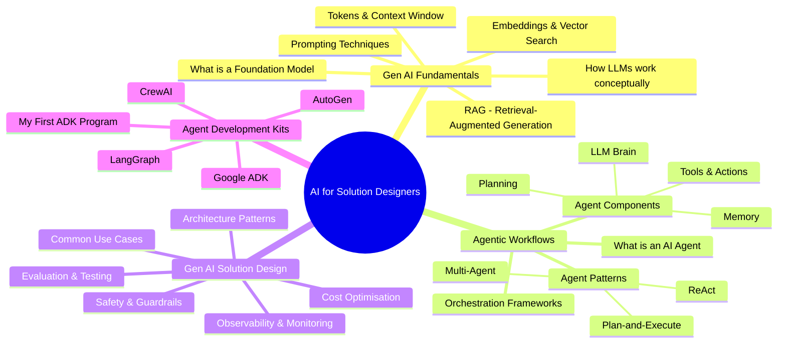
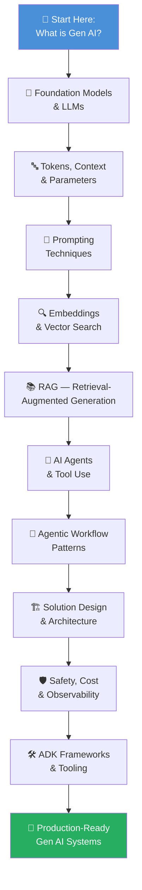

# 🤖 Artificial Intelligence — Consumer & Solution Designer Reference

> **Audience:** Engineers, architects, and product builders who consume Gen AI and Agentic workflows to design and build AI-powered solutions — not focused on ML theory or model training internals.  
> **Goal:** A top-down, practical reference — from foundational concepts to advanced solution patterns — with visual diagrams throughout.

---

## 📋 Table of Contents

| # | Topic | File |
|---|-------|------|
| 1 | [Gen AI Fundamentals](#gen-ai-fundamentals) | [gen-ai-fundamentals.md](./gen-ai-fundamentals.md) |
| 2 | [Agentic Workflows](#agentic-workflows) | [agentic-workflows.md](./agentic-workflows.md) |
| 3 | [Gen AI Solution Design](#gen-ai-solution-design) | [gen-ai-solution-design.md](./gen-ai-solution-design.md) |
| 4 | [Agent Development Kits (ADK)](#agent-development-kits-adk) | [adk/README.md](./adk/README.md) |

---

## 🗺️ The AI Landscape — Consumer Perspective

---

## 🔭 Top-Down Learning Path

---

## Gen AI Fundamentals

**File:** [gen-ai-fundamentals.md](./gen-ai-fundamentals.md)

Covers the essential concepts every solution designer must know when working with Large Language Models and generative AI services:

- What foundation models are and how they differ from traditional AI
- Tokens, context windows, and what they mean for your application
- Temperature, top-p, and other inference parameters that control output
- Prompting strategies: zero-shot, few-shot, chain-of-thought, system prompts
- Embeddings and semantic search
- Retrieval-Augmented Generation (RAG) — the most important pattern for production apps
- Multimodal models and their capabilities

---

## Agentic Workflows

**File:** [agentic-workflows.md](./agentic-workflows.md)

Deep-dives into AI agents — autonomous systems that can plan, use tools, and complete multi-step tasks:

- The anatomy of an AI agent (LLM + Tools + Memory + Planning)
- The ReAct loop: Reason → Act → Observe → Repeat
- Tool use and function calling
- Memory types: short-term, long-term, episodic
- Multi-agent architectures: orchestrator-worker, peer-to-peer
- Human-in-the-loop patterns
- Popular frameworks: LangGraph, AutoGen, CrewAI

---

## Gen AI Solution Design

**File:** [gen-ai-solution-design.md](./gen-ai-solution-design.md)

Architectural guidance for building reliable, cost-effective, and safe Gen AI solutions:

- Decision framework: when to use which AI pattern
- Core architectural patterns: RAG, fine-tuning, prompt chaining, router chains
- Evaluation and testing strategies (LLM-as-judge, evals pipelines)
- Safety, guardrails, and responsible AI practices
- Cost optimisation techniques
- Observability, tracing, and monitoring in production
- Reference architectures for common use cases

---

## Agent Development Kits (ADK)

**Folder:** [adk/](./adk/)

A comprehensive principal-engineer-level reference covering the major ADK frameworks — the SDKs and platforms used to build, orchestrate, and deploy production AI agents:

| File | Framework | What It Covers |
|------|-----------|----------------|
| [adk/README.md](./adk/README.md) | All frameworks | Landscape overview, comparison matrix, principal engineer decision guide |
| [adk/google-adk.md](./adk/google-adk.md) | Google ADK | Architecture, session state, multi-agent, A2A protocol, Vertex AI deployment |
| [adk/langgraph.md](./adk/langgraph.md) | LangGraph | Graph state machines, checkpoints, human-in-the-loop, multi-agent patterns |
| [adk/autogen.md](./adk/autogen.md) | Microsoft AutoGen | Conversational agents, code execution, team patterns, MagenticOne |
| [adk/crewai.md](./adk/crewai.md) | CrewAI | Role-based crews, Flows DSL, built-in tools, memory and knowledge |
| [adk/my-first-adk-program.md](./adk/my-first-adk-program.md) | All frameworks | Step-by-step first agent tutorial with full code and explanations |

---

## 🔑 Key Concepts at a Glance

| Concept | One-line Definition |
|---------|---------------------|
| **LLM** | Large Language Model — a neural network trained on vast text to predict and generate language |
| **Foundation Model** | A large pre-trained model adaptable to many tasks via prompting or fine-tuning |
| **Token** | The basic unit of text an LLM processes (~¾ of a word on average) |
| **Context Window** | Maximum tokens the model can "see" at once (input + output combined) |
| **Prompt** | The input text you send to a model |
| **Embedding** | A numerical vector representing the semantic meaning of text |
| **RAG** | Pattern that retrieves relevant documents and injects them into the prompt |
| **AI Agent** | An LLM that can reason, plan, and use tools to complete multi-step tasks |
| **Tool / Function Calling** | Ability for the LLM to invoke external APIs, code, or databases |
| **Agentic Workflow** | A pipeline where one or more agents autonomously complete a task |
| **Guardrails** | Input/output validation layers that enforce safety and quality |
| **Hallucination** | When a model generates confident but factually incorrect content |
| **Fine-tuning** | Further training a model on domain-specific data to specialise behaviour |
| **Inference** | Running the model to generate output (as opposed to training) |
| **Latency / TTFT** | Time-to-First-Token — a key responsiveness metric for streaming apps |
| **ADK** | Agent Development Kit — a framework/SDK for building, orchestrating, and deploying AI agents |
| **LangGraph** | Graph-based agent orchestration where nodes are work units and edges are transitions |
| **AutoGen** | Microsoft's multi-agent framework where agents collaborate via structured conversation |
| **CrewAI** | Role-based multi-agent framework modelling agents as a team with assigned tasks |
| **A2A Protocol** | Agent-to-Agent — Google-led standard for inter-agent communication across frameworks |
| **MCP** | Model Context Protocol — Anthropic-led standard for connecting LLMs to tools and data |
