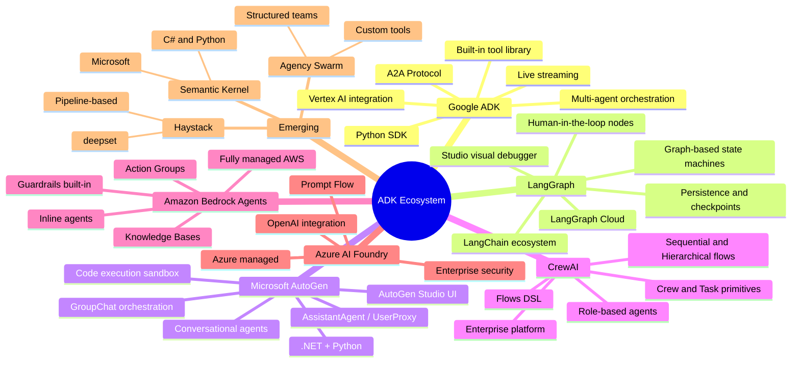
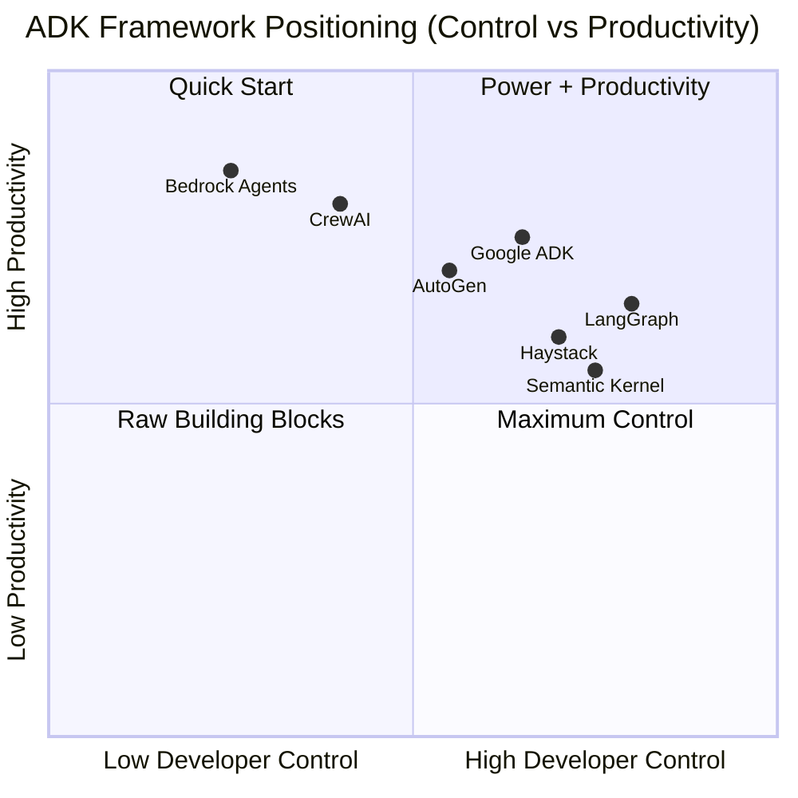
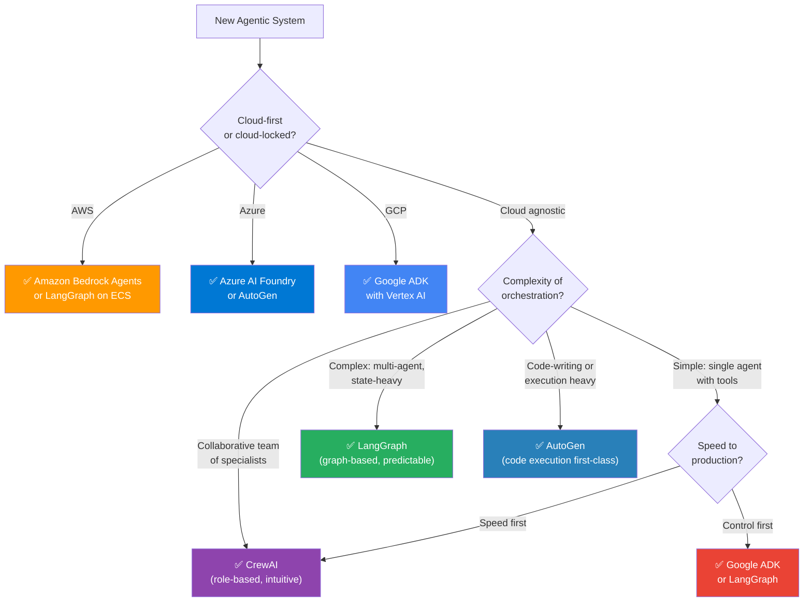
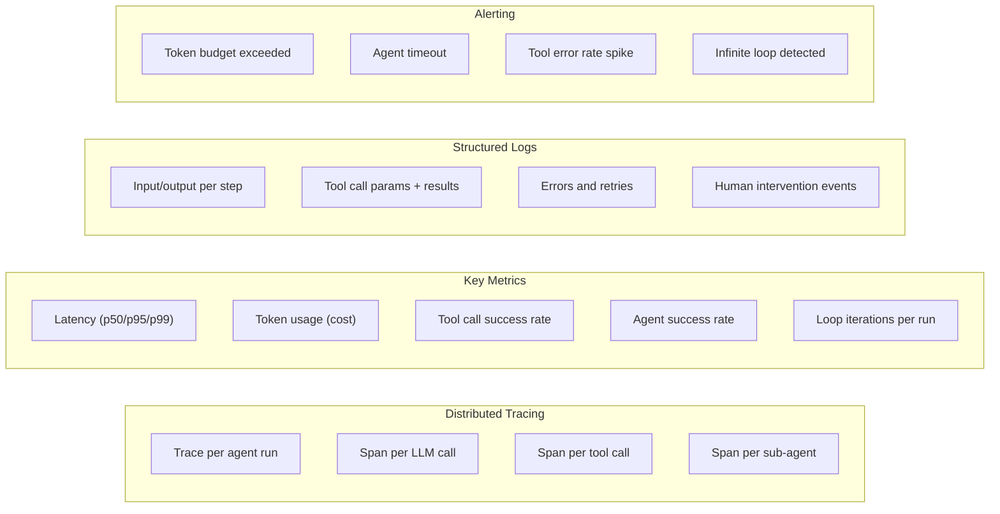
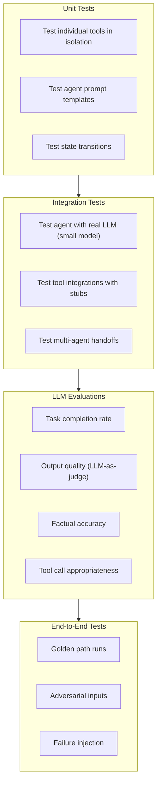
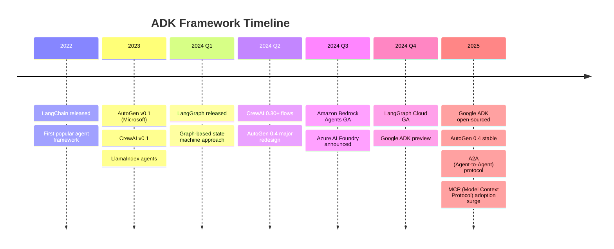
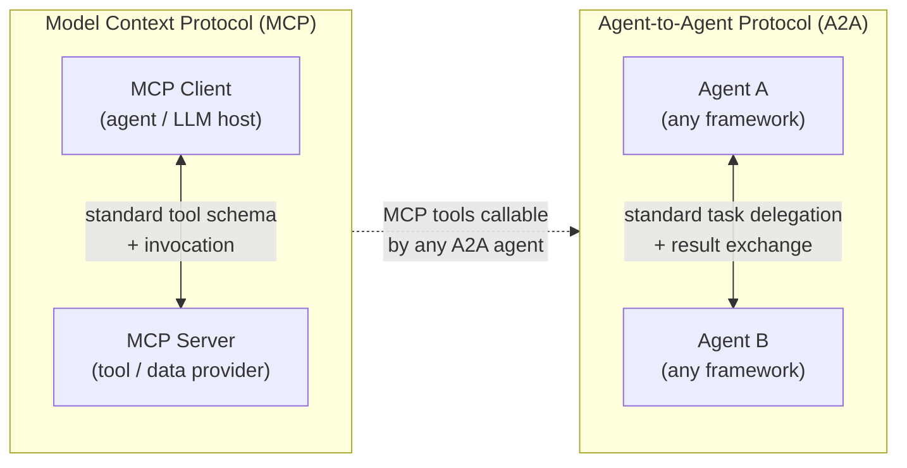

# 🛠️ Agent Development Kits (ADK) — Principal Engineer Reference

> **Audience:** Principal engineers, staff engineers, and solution architects designing, building, and governing production-grade agentic AI systems.  
> **Goal:** A comprehensive, opinionated reference covering the ADK landscape, architectural trade-offs, and engineering decisions — going beyond "how to use" into "when, why, and what to watch out for".

---

## 📋 Table of Contents

| # | Topic | File |
|---|-------|------|
| 1 | [ADK Landscape Overview](#1-adk-landscape-overview) | This file |
| 2 | [Google ADK](#2-google-adk) | [google-adk.md](./google-adk.md) |
| 3 | [LangGraph](#3-langgraph) | [langgraph.md](./langgraph.md) |
| 4 | [Microsoft AutoGen](#4-microsoft-autogen) | [autogen.md](./autogen.md) |
| 5 | [CrewAI](#5-crewai) | [crewai.md](./crewai.md) |
| 6 | [My First ADK Program](#6-my-first-adk-program) | [my-first-adk-program.md](./my-first-adk-program.md) |

---

## 1. ADK Landscape Overview

An **Agent Development Kit (ADK)** is a framework, SDK, or platform that provides the building blocks — abstractions, runtime, tooling, and orchestration primitives — for constructing, running, and managing AI agents in production.

```
ADK ≠ just a library
ADK = opinionated system that defines:
  ✓ How agents are defined and composed
  ✓ How state flows between steps
  ✓ How tools are registered and invoked
  ✓ How agents communicate with each other
  ✓ How humans intervene in automated loops
  ✓ How runs are observed, traced, and debugged
```

---

## 🗺️ ADK Ecosystem Mindmap



---

## 2. Framework Positioning Map



---

## 3. Principal Engineer Decision Framework

### Which ADK to Choose?



---

## 4. Framework Comparison Matrix

| Dimension | Google ADK | LangGraph | AutoGen | CrewAI |
|-----------|-----------|-----------|---------|--------|
| **Primary abstraction** | Agent + Tool | Graph node + edge | Conversational agent | Role + Task |
| **State management** | Session state | Graph state (typed) | Conversation history | Task context |
| **Multi-agent** | ✅ First-class | ✅ Subgraphs | ✅ GroupChat | ✅ Crew |
| **Human-in-the-loop** | ✅ Built-in | ✅ Interrupt nodes | ✅ UserProxy | ✅ Human input |
| **Code execution** | 🔶 Via tools | 🔶 Via tools | ✅ First-class | 🔶 Via tools |
| **Streaming** | ✅ Live streaming | ✅ astream_events | 🔶 Partial | 🔶 Partial |
| **Observability** | Cloud Trace / ADK | LangSmith | AutoGen Studio | CrewAI Plus |
| **Persistence** | Cloud Firestore | Checkpointer (Postgres, Redis) | File / DB | DB via flows |
| **Cloud-managed option** | Vertex AI Agent Engine | LangGraph Cloud | Azure AI | CrewAI Enterprise |
| **Language** | Python | Python | Python / .NET | Python |
| **Learning curve** | Medium | Medium-High | Low-Medium | Low |
| **Production readiness** | ✅ High | ✅ High | 🔶 Medium | 🔶 Medium |
| **Open source** | ✅ Apache 2 | ✅ MIT | ✅ CC BY 4.0 | ✅ MIT |
| **Ideal for** | Google/GCP shops, streaming agents | Complex state machines, enterprise | Code agents, research | Rapid prototyping, teams |

---

## 5. Common ADK Architecture Layers

Every production ADK deployment has the same fundamental layers regardless of framework choice:

```mermaid
flowchart TD
    subgraph Presentation["🖥️ Presentation Layer"]
        UI["Web / Mobile UI"]
        API_GW["REST / WebSocket API"]
        CLI["CLI / SDK Client"]
    end

    subgraph Orchestration["🎭 Orchestration Layer"]
        ORCH["Agent Orchestrator\n(LangGraph / Google ADK / AutoGen)"]
        STATE["State Manager\n(in-memory / DB / Redis)"]
        SCHED["Task Scheduler\n(async / event-driven)"]
    end

    subgraph Agent["🤖 Agent Layer"]
        A1["Agent 1\n(Researcher)"]
        A2["Agent 2\n(Analyst)"]
        A3["Agent 3\n(Writer)"]
        HITL["Human-in-the-Loop\nCheckpoint"]
    end

    subgraph Tools["🛠️ Tool Layer"]
        SEARCH["Search / RAG"]
        CODE["Code Execution"]
        APIs["External APIs"]
        DB_TOOL["Database Tools"]
        MEM["Memory Store"]
    end

    subgraph Models["🧠 Model Layer"]
        LLM1["Primary LLM\n(GPT-4o / Gemini / Claude)"]
        LLM2["Specialised LLM\n(code, vision, etc.)"]
        EMB["Embedding Model"]
    end

    subgraph Infra["⚙️ Infrastructure Layer"]
        VECTOR["Vector DB\n(Pinecone / Weaviate / pgvector)"]
        RELDB["Relational DB\n(Postgres)"]
        QUEUE["Message Queue\n(Pub/Sub / SQS / Kafka)"]
        TRACE["Observability\n(LangSmith / Cloud Trace / OTEL)"]
    end

    Presentation --> Orchestration
    Orchestration --> Agent
    Agent --> Tools
    Tools --> Models
    Models --> Infra
    Orchestration --> Infra

    style Presentation fill:#EBF5FB
    style Orchestration fill:#FEF9E7
    style Agent fill:#EAFAF1
    style Tools fill:#FDEDEC
    style Models fill:#F4ECF7
    style Infra fill:#FDFEFE
```



---

## 6. Principal Engineer Considerations

### 6.1 Architecture & Design

```
✓ State design is the most critical architecture decision
  - What state does each agent need?
  - Where does state live (in-context vs external)?
  - How is state serialised and restored on failure?

✓ Define your agent boundaries carefully
  - One agent per responsibility domain
  - Avoid agents that "know too much"
  - Contracts (input/output schemas) between agents

✓ Plan for failure from day one
  - Every tool call can fail — design retry and fallback
  - Partial state recovery: can you resume mid-workflow?
  - Idempotency: is re-running an agent safe?

✓ Control the blast radius
  - Principle of least privilege: agents get only the tools they need
  - Sandboxed code execution (not on your prod servers)
  - Review gates before irreversible actions
```

### 6.2 Observability (Non-Negotiable in Production)



### 6.3 Cost Engineering

```
Token cost model per agent run:
  Total cost = Σ (input_tokens × input_rate + output_tokens × output_rate) per LLM call

Cost levers:
  1. Model selection   — Use smaller models for sub-tasks (classification, routing)
  2. Context pruning   — Don't stuff full history into every call
  3. Caching           — Cache identical tool results (semantic cache for LLM calls)
  4. Batching          — Parallelise independent agent tasks
  5. Token budgets     — Hard limits per run; alert before limit
  6. Prompt efficiency — Concise system prompts, compressed few-shots

Rule of thumb: profile a single agent run end-to-end before scaling
```

### 6.4 Security Posture

| Risk | Mitigation |
|------|-----------|
| **Prompt injection via tool output** | Sanitise and validate tool outputs before injecting into context |
| **Agent exfiltrating data** | Audit trail of all tool calls; data egress controls |
| **Privilege escalation** | Agents operate under scoped IAM / API keys with minimal permissions |
| **Runaway agent costs** | Per-run token budget + cost alerts + circuit breakers |
| **PII in traces** | Redact sensitive fields in observability pipelines |
| **Dependency supply chain** | Pin ADK versions; vet third-party tool integrations |

### 6.5 Testing Strategy



---

## 7. ADK Evolution Timeline



---

## 8. Emerging Standards: A2A & MCP

Two cross-framework protocols are becoming foundational:



**MCP (Model Context Protocol)** — Anthropic-led standard for how LLMs connect to tools and data sources. Supported by Google ADK, LangGraph, and growing ecosystem.

**A2A (Agent-to-Agent)** — Google-led standard for inter-agent communication across frameworks and clouds. Enables heterogeneous multi-agent systems.

---

## 9. Quick Start Links

| Framework | File | Quick Summary |
|-----------|------|---------------|
| **Google ADK** | [google-adk.md](./google-adk.md) | Google's open-source ADK, Vertex AI integration, streaming, A2A |
| **LangGraph** | [langgraph.md](./langgraph.md) | Graph-based state machines, best for complex orchestration |
| **AutoGen** | [autogen.md](./autogen.md) | Microsoft's conversational multi-agent, code execution |
| **CrewAI** | [crewai.md](./crewai.md) | Role-based crews, fastest to prototype |
| **First Program** | [my-first-adk-program.md](./my-first-adk-program.md) | Build your first agent step-by-step |
