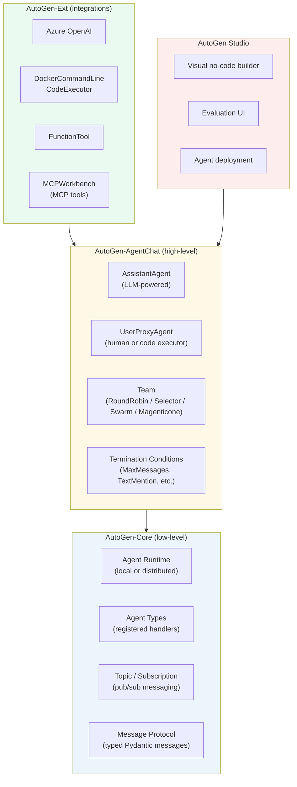
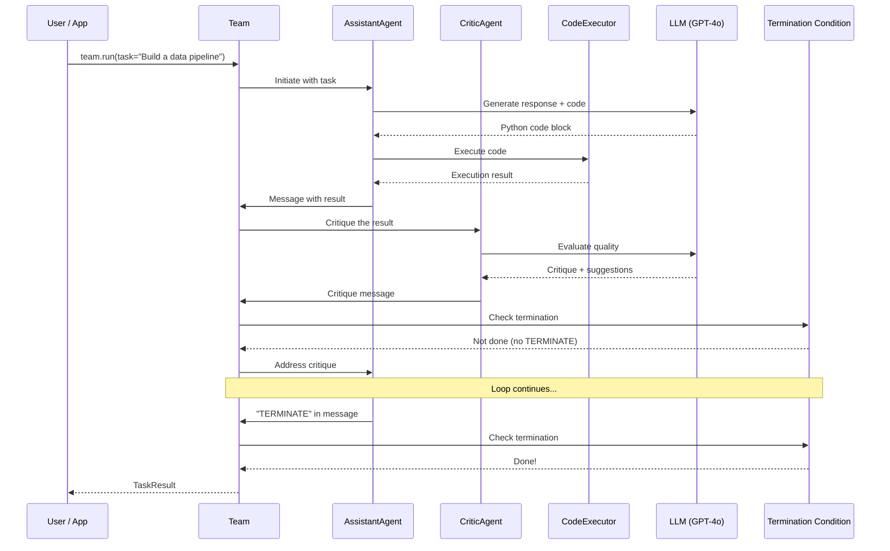
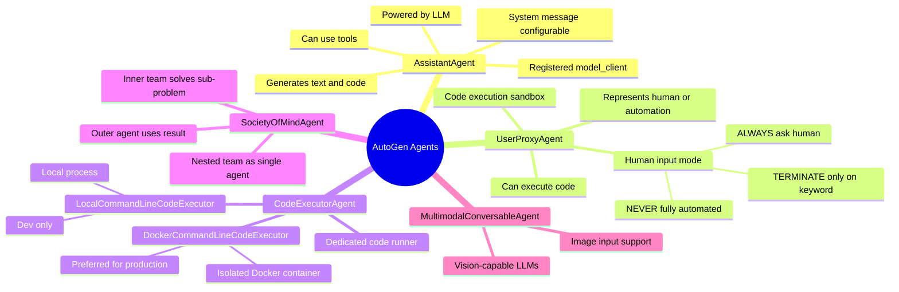
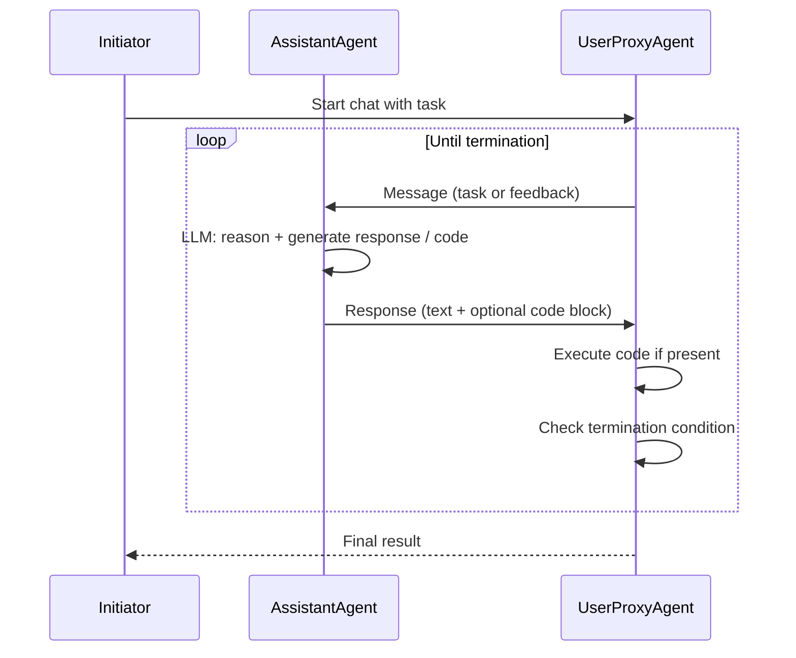
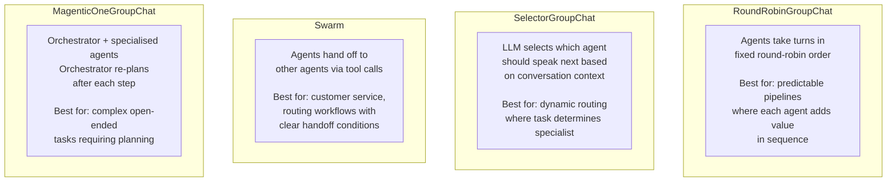
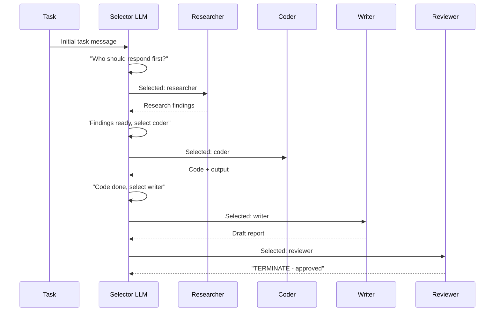
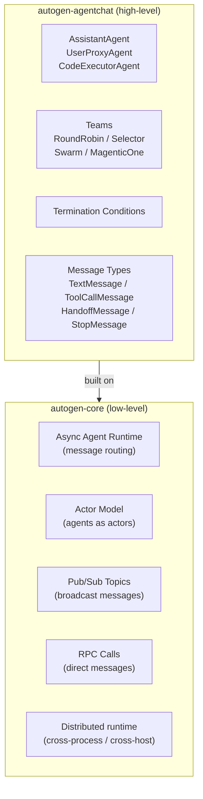
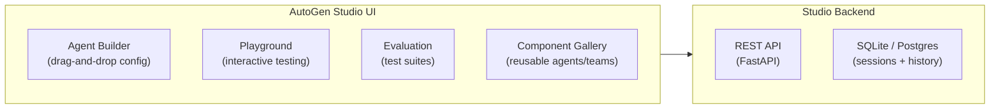
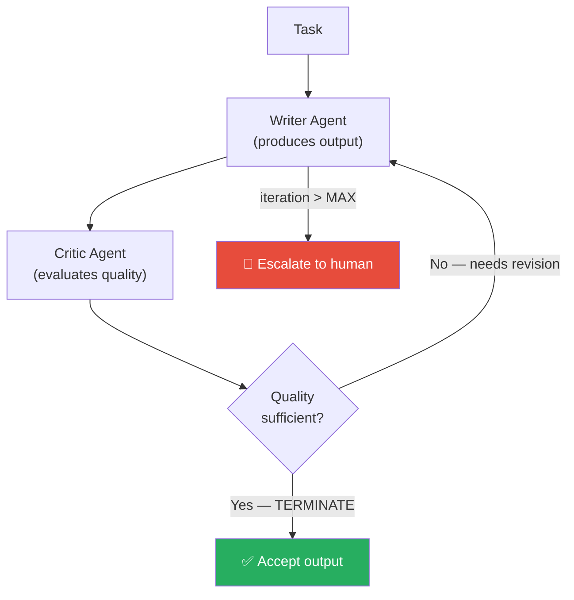

# 🔵 Microsoft AutoGen — Principal Engineer Reference

> **Principal Engineer Reference** — Architecture, patterns, and production guidance for Microsoft's AutoGen multi-agent framework.

---

## 📋 Table of Contents

| # | Section |
|---|---------|
| 1 | [What is AutoGen?](#1-what-is-autogen) |
| 2 | [Architecture Overview](#2-architecture-overview) |
| 3 | [Core Agent Types](#3-core-agent-types) |
| 4 | [Conversation Patterns](#4-conversation-patterns) |
| 5 | [Code Execution](#5-code-execution) |
| 6 | [Multi-Agent Team Patterns](#6-multi-agent-team-patterns) |
| 7 | [Tool Use](#7-tool-use) |
| 8 | [AutoGen 0.4: AgentChat & Core](#8-autogen-04-agentchat--core) |
| 9 | [Observability & AutoGen Studio](#9-observability--autogen-studio) |
| 10 | [Principal Engineer Patterns](#10-principal-engineer-patterns) |
| 11 | [Quick Reference](#11-quick-reference) |

---

## 1. What is AutoGen?

AutoGen is Microsoft Research's **open-source multi-agent framework** that enables multiple AI agents to **converse with each other** to solve complex tasks. Its defining characteristic is treating agent-to-agent conversation as the primary orchestration mechanism.

```
AutoGen's key insight:
  Complex tasks solved by structured conversations among specialised agents.
  
  vs. LangGraph:  Graph edges replace direct conversation
  vs. CrewAI:     Roles assigned, but conversation is implicit task delegation
  vs. Google ADK: Tool-first, AutoGen is conversation-first

AutoGen strengths:
  ✓ Natural multi-agent collaboration via chat
  ✓ Code writing + execution as first-class capability
  ✓ Flexible termination conditions
  ✓ Strong research pedigree (GPT-4 research team)
  ✓ .NET SDK + Python SDK
  ✓ Active research community
```

---

## 2. Architecture Overview

### AutoGen 0.4 Architecture



### Request Lifecycle (AgentChat)



---

## 3. Core Agent Types

### Agent Mindmap



### Agent Configuration

```python
import asyncio
from autogen_agentchat.agents import AssistantAgent, CodeExecutorAgent
from autogen_agentchat.conditions import TextMentionTermination, MaxMessageTermination
from autogen_ext.models.openai import OpenAIChatCompletionClient
from autogen_ext.code_executors.docker import DockerCommandLineCodeExecutor

# Model client
model_client = OpenAIChatCompletionClient(
    model="gpt-4o",
    api_key="sk-...",
)

# Assistant agent — the LLM-powered brain
assistant = AssistantAgent(
    name="assistant",
    model_client=model_client,
    system_message="""You are an expert data engineer.
    When you write code, always include error handling.
    When the task is fully complete, respond with TERMINATE.""",
    tools=[search_tool, database_tool],
)

# Code executor agent — runs code produced by assistant
code_executor = CodeExecutorAgent(
    name="code_executor",
    code_executor=DockerCommandLineCodeExecutor(
        image="python:3.11-slim",
        work_dir="/workspace",
        timeout=60,
    ),
)
```

---

## 4. Conversation Patterns

### Two-Agent Conversation



```python
from autogen_agentchat.teams import RoundRobinGroupChat
from autogen_agentchat.conditions import TextMentionTermination

termination = TextMentionTermination("TERMINATE")

team = RoundRobinGroupChat(
    participants=[assistant, code_executor],
    termination_condition=termination,
)

result = await team.run(
    task="Write a Python script to analyse sales data from sales.csv and produce a bar chart."
)
```

### Termination Conditions

```python
from autogen_agentchat.conditions import (
    TextMentionTermination,    # Stop when agent says "TERMINATE"
    MaxMessageTermination,     # Stop after N messages
    StopMessageTermination,    # Stop on StopMessage type
    HandoffTermination,        # Stop when agent hands off
    TimeoutTermination,        # Stop after N seconds
    TokenUsageTermination,     # Stop after N tokens
    ExternalTermination,       # Stop via external signal
)

# Combine conditions with OR / AND
from autogen_agentchat.conditions import (
    TerminationCondition
)

termination = (
    TextMentionTermination("TERMINATE") |
    MaxMessageTermination(20) |          # safety limit
    TokenUsageTermination(max_total_token=10_000)
)
```

---

## 5. Code Execution

Code execution is AutoGen's **standout feature** — agents can write, share, and execute code in a loop.

### Code Execution Architecture

```mermaid
flowchart TD
    subgraph Writing["Code Writing"]
        LLM["AssistantAgent\n(LLM writes code)"]
        CODE_BLOCK["```python\n# generated code\n```\nMarked code block in message"]
    end

    subgraph Execution["Code Execution"]
        DETECT["CodeExecutorAgent\ndetects code blocks"]
        SANDBOX["Execution Sandbox"]
        RESULT["stdout / stderr\n+ return value"]
    end

    subgraph Sandboxes["Sandbox Options"]
        DOCKER["DockerCommandLine\nCodeExecutor\n✅ Recommended for prod\nIsolated, disposable"]
        LOCAL["LocalCommandLine\nCodeExecutor\n⚠️ Dev only\nRuns on your machine"]
        JUPYTER["JupyterCodeExecutor\nInteractive sessions\nGood for data science"]
        AZURE_CA["AzureContainerApps\nCodeExecutor\nManaged cloud sandbox"]
    end

    Writing --> Execution
    SANDBOX --> Sandboxes
    RESULT -->|"appended to conversation"| LLM

    style DOCKER fill:#27AE60,color:#fff
    style LOCAL fill:#E74C3C,color:#fff
```

### Docker Code Executor Setup

```python
from autogen_ext.code_executors.docker import DockerCommandLineCodeExecutor

# Production-grade isolated execution
async with DockerCommandLineCodeExecutor(
    image="python:3.11-slim",
    work_dir="/tmp/agent_workspace",
    timeout=120,                      # max 2 minutes per execution
    auto_remove=True,                 # clean up container after use
    bind_dir=None,                    # no host filesystem access
) as executor:
    
    code_agent = CodeExecutorAgent(
        name="executor",
        code_executor=executor,
    )
    
    # Now code_agent can safely run any Python the assistant generates
```

### Security Considerations

```
⚠️  NEVER use LocalCommandLineCodeExecutor in production.
    It runs code directly on your server with your process's permissions.

✅  Use DockerCommandLineCodeExecutor with:
    - Minimal base image (no cloud credentials)
    - No volume mounts to sensitive directories
    - Network isolation (--network=none for offline code)
    - Resource limits (CPU + memory constraints)
    - Short timeouts (prevent runaway loops)

✅  Review generated code patterns:
    - Agents will write file system operations
    - Agents may attempt network calls
    - Add allowlist/denylist for imports if needed
```

---

## 6. Multi-Agent Team Patterns

### Team Types



### SelectorGroupChat (Dynamic Routing)



```python
from autogen_agentchat.teams import SelectorGroupChat

team = SelectorGroupChat(
    participants=[researcher, coder, writer, reviewer],
    model_client=model_client,
    termination_condition=TextMentionTermination("TERMINATE"),
    selector_prompt="""You are coordinating a team of specialists.
    Based on the conversation, select the most appropriate agent to contribute next.
    Available agents: {participants}
    Conversation so far: {history}
    Select one of: {participants}""",
    allow_repeated_speaker=False,     # prevent one agent monopolising
)
```

### Swarm with Handoffs

```python
from autogen_agentchat.teams import Swarm
from autogen_agentchat.messages import HandoffMessage

# Agents transfer control to each other
triage_agent = AssistantAgent(
    name="triage",
    model_client=model_client,
    system_message="""Classify customer issues.
    Transfer billing issues to billing_agent.
    Transfer technical issues to tech_agent.""",
    handoffs=["billing_agent", "tech_agent"],
)

billing_agent = AssistantAgent(
    name="billing_agent",
    model_client=model_client,
    system_message="Handle billing and payment issues. Transfer back to triage if not billing.",
    handoffs=["triage"],
)

swarm_team = Swarm(
    participants=[triage_agent, billing_agent, tech_agent],
    termination_condition=TextMentionTermination("TERMINATE"),
)
```

---

## 7. Tool Use

```python
from autogen_agentchat.agents import AssistantAgent
from autogen_core.tools import FunctionTool

# Define tools as Python functions with type hints
def search_web(query: str, max_results: int = 5) -> list[dict]:
    """
    Search the web for information.
    
    Args:
        query: Search query string
        max_results: Maximum number of results to return
    
    Returns:
        List of result dicts with 'title', 'url', and 'snippet'
    """
    # implementation
    return [{"title": "...", "url": "...", "snippet": "..."}]

def run_sql(query: str, database: str = "production") -> dict:
    """
    Execute a read-only SQL query.
    
    Args:
        query: SQL SELECT statement (read-only)
        database: Target database name
    
    Returns:
        Dict with 'columns' and 'rows'
    """
    # implementation
    return {"columns": ["id", "name"], "rows": [[1, "Alice"]]}

# Wrap and register with agent
search = FunctionTool(search_web, description="Search the web for current information")
sql    = FunctionTool(run_sql, description="Query the production database")

analyst_agent = AssistantAgent(
    name="analyst",
    model_client=model_client,
    tools=[search, sql],
    system_message="You are a data analyst. Use tools to gather data, then analyse it.",
)
```

### MCP Tool Integration

```python
from autogen_ext.tools.mcp import MCPWorkbench, StdioServerParams

# Connect any MCP-compatible tool server
async with MCPWorkbench(
    server_params=StdioServerParams(
        command="npx",
        args=["-y", "@modelcontextprotocol/server-brave-search"],
        env={"BRAVE_API_KEY": "..."},
    )
) as workbench:
    tools = await workbench.list_tools()
    
    agent = AssistantAgent(
        name="search_agent",
        model_client=model_client,
        workbench=workbench,     # all MCP tools available
    )
```

---

## 8. AutoGen 0.4: AgentChat & Core

AutoGen 0.4 introduced a major redesign. Understanding both layers is essential.

### Two-Layer Architecture



### When to Use Core vs. AgentChat

```
AgentChat (high-level):
  ✓ Most use cases — start here
  ✓ Pre-built agent types and teams
  ✓ Simpler API, less boilerplate
  ✓ Good for business logic

autogen-core (low-level):
  ✓ Custom agent runtime behaviour
  ✓ Cross-process or distributed agents
  ✓ Custom message routing
  ✓ Embedding agents into larger systems
  ✓ Advanced pub/sub patterns
```

---

## 9. Observability & AutoGen Studio

### AutoGen Studio

AutoGen Studio is a **no-code UI** for building, testing, and managing AutoGen agents.



```bash
# Install and run AutoGen Studio
pip install autogenstudio

# Start the UI
autogenstudio ui --port 8081 --appdir ~/.autogenstudio
# Open: http://localhost:8081
```

### Tracing with OpenTelemetry

```python
from opentelemetry import trace
from opentelemetry.sdk.trace import TracerProvider
from opentelemetry.sdk.trace.export import ConsoleSpanExporter, SimpleSpanProcessor

# Set up OTEL tracing
provider = TracerProvider()
provider.add_span_processor(SimpleSpanProcessor(ConsoleSpanExporter()))
trace.set_tracer_provider(provider)

# AutoGen 0.4 integrates with OTEL automatically when configured
# All agent messages, tool calls, and LLM invocations are traced
```

---

## 10. Principal Engineer Patterns

### Pattern 1: Critic-Revision Loop



```python
writer = AssistantAgent(
    name="writer",
    model_client=model_client,
    system_message="""Write high-quality content as requested.
    When satisfied with your revision, include TERMINATE.""",
)

critic = AssistantAgent(
    name="critic",
    model_client=model_client,
    system_message="""You are a strict quality reviewer.
    Give specific, actionable feedback.
    Only when the output is excellent, say: "Approved. TERMINATE".""",
)

team = RoundRobinGroupChat(
    [writer, critic],
    termination_condition=(
        TextMentionTermination("TERMINATE") |
        MaxMessageTermination(10)
    ),
)
```

### Pattern 2: Specialised Expert Team

```python
# Each agent is a specialised expert
security_reviewer = AssistantAgent(
    name="security_reviewer",
    system_message="Review code exclusively for security vulnerabilities (OWASP Top 10).",
    model_client=model_client,
)

performance_reviewer = AssistantAgent(
    name="performance_reviewer",
    system_message="Review code exclusively for performance issues and optimisation opportunities.",
    model_client=model_client,
)

lead_engineer = AssistantAgent(
    name="lead_engineer",
    system_message="""Synthesise all reviews into a final decision.
    Accept the code if issues are minor, reject if critical issues exist.
    End with TERMINATE and either APPROVED or REJECTED.""",
    model_client=model_client,
)

code_review_team = RoundRobinGroupChat(
    [security_reviewer, performance_reviewer, lead_engineer],
    termination_condition=TextMentionTermination("TERMINATE"),
)
```

### Pattern 3: Async Task Execution

```python
import asyncio
from autogen_agentchat.teams import RoundRobinGroupChat

async def run_analysis(topic: str) -> str:
    """Run agent team asynchronously."""
    team = RoundRobinGroupChat(
        participants=[researcher, analyst],
        termination_condition=TextMentionTermination("TERMINATE"),
    )
    
    result = await team.run(task=f"Analyse: {topic}")
    return result.messages[-1].content

# Run multiple analyses in parallel
async def run_all():
    topics = ["market trends", "competitor analysis", "technical risks"]
    results = await asyncio.gather(*[run_analysis(t) for t in topics])
    return dict(zip(topics, results))

results = asyncio.run(run_all())
```

---

## 11. Quick Reference

```
Install:
  pip install autogen-agentchat autogen-ext[openai,docker]

Key packages:
  autogen-agentchat     High-level agents and teams
  autogen-core          Low-level runtime
  autogen-ext           Integrations (models, executors, tools)
  autogenstudio         No-code UI

Key classes:
  AssistantAgent(name, model_client, system_message, tools)
  CodeExecutorAgent(name, code_executor)
  DockerCommandLineCodeExecutor(image, work_dir, timeout)
  RoundRobinGroupChat(participants, termination_condition)
  SelectorGroupChat(participants, model_client, termination_condition)
  Swarm(participants, termination_condition)
  MagenticOneGroupChat(participants, model_client)

Termination:
  TextMentionTermination("TERMINATE")
  MaxMessageTermination(n)
  TokenUsageTermination(max_total_token=n)
  condition1 | condition2   (OR — either triggers stop)
  condition1 & condition2   (AND — both must trigger)

Running:
  result = await team.run(task="...")
  async for msg in team.run_stream(task="..."): ...

Docs:   https://microsoft.github.io/autogen
GitHub: https://github.com/microsoft/autogen
```
