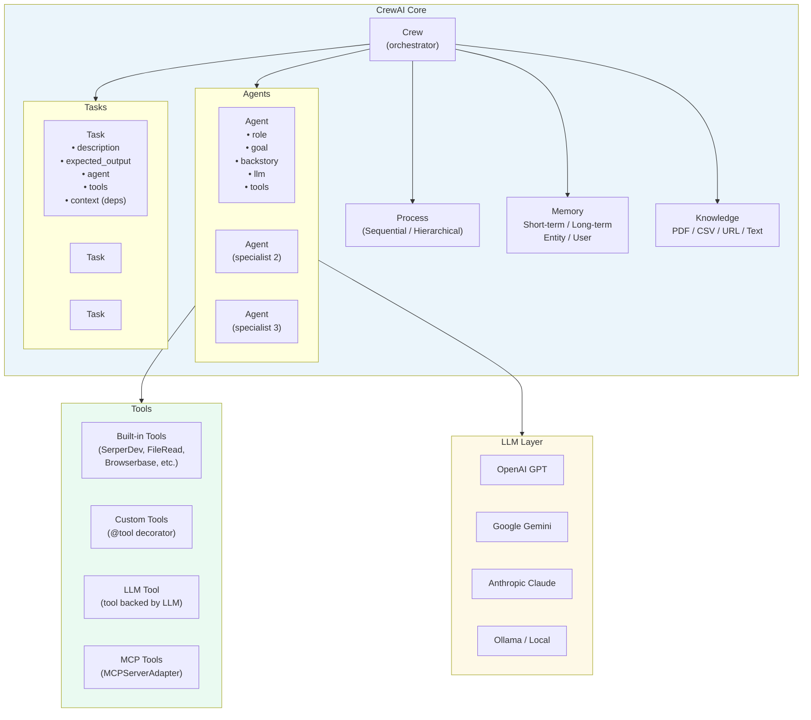
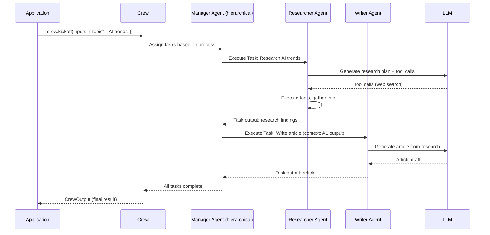
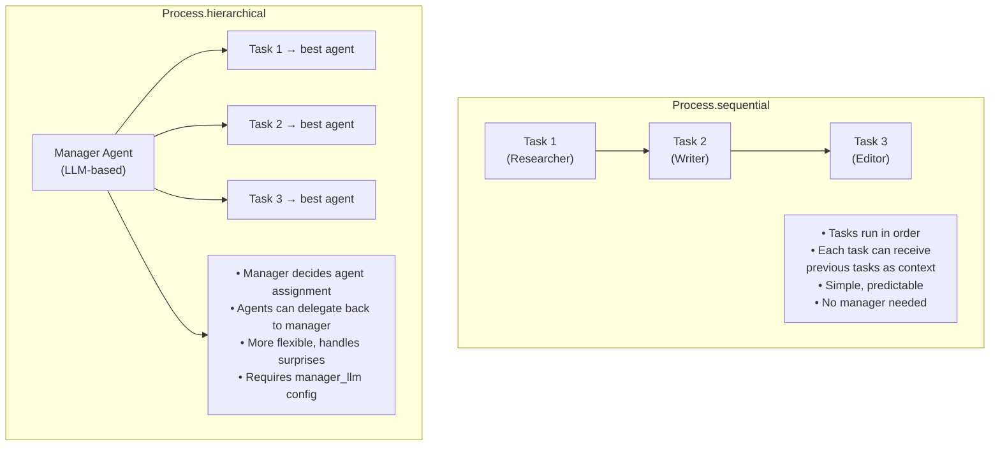
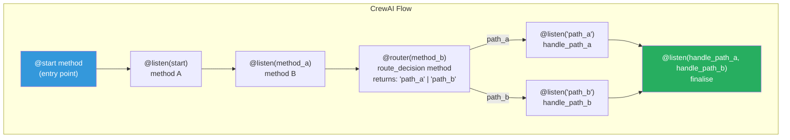
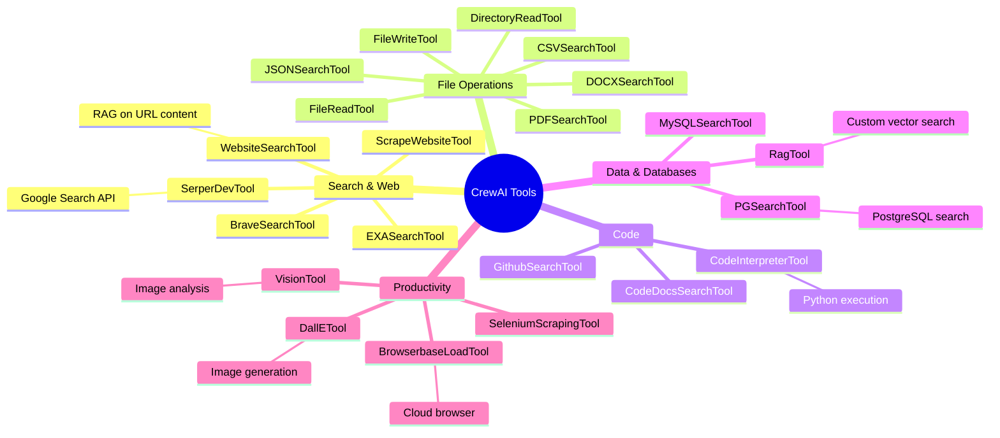
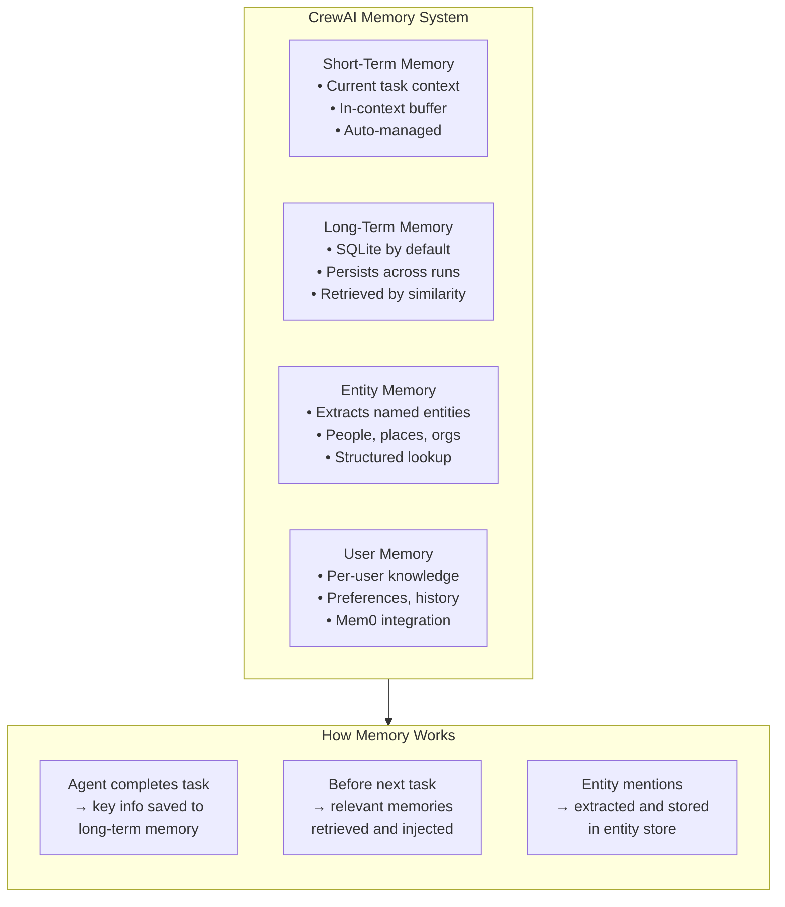
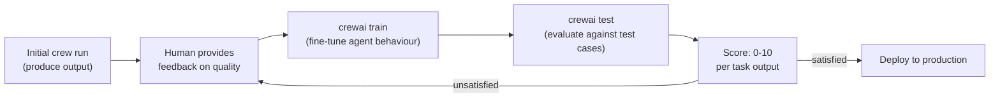

# 🟣 CrewAI — Principal Engineer Reference

> **Principal Engineer Reference** — Architecture, patterns, and production guidance for CrewAI's role-based multi-agent framework.

---

## 📋 Table of Contents

| # | Section |
|---|---------|
| 1 | [What is CrewAI?](#1-what-is-crewai) |
| 2 | [Architecture Overview](#2-architecture-overview) |
| 3 | [Core Primitives](#3-core-primitives) |
| 4 | [Process Types](#4-process-types) |
| 5 | [CrewAI Flows](#5-crewai-flows) |
| 6 | [Tool System](#6-tool-system) |
| 7 | [Memory & Knowledge](#7-memory--knowledge) |
| 8 | [Training & Evaluation](#8-training--evaluation) |
| 9 | [Principal Engineer Patterns](#9-principal-engineer-patterns) |
| 10 | [CrewAI vs. Other Frameworks](#10-crewai-vs-other-frameworks) |
| 11 | [Quick Reference](#11-quick-reference) |

---

## 1. What is CrewAI?

CrewAI is an **open-source Python framework** that models multi-agent collaboration as a **crew of role-based agents working on assigned tasks**. It is inspired by how human teams operate:

```
Human team analogy:
  CEO (orchestrator) → assigns work to specialists
  Marketing Manager → writes content
  Data Analyst     → interprets numbers
  Developer        → writes code
  
CrewAI maps this to:
  Crew            → the team
  Agent           → an individual with a role, goal, backstory
  Task            → a unit of work with description and expected output
  Process         → how tasks are assigned (sequential, hierarchical)
  Tool            → capabilities agents can use
```

**Why CrewAI stands out:**
- ✅ Fastest time to first working multi-agent system
- ✅ Highly intuitive — reads like a project brief
- ✅ Rich built-in tool library
- ✅ Flows DSL for deterministic orchestration
- ✅ CrewAI Enterprise for production management

---

## 2. Architecture Overview

### CrewAI System Architecture



### Execution Flow



---

## 3. Core Primitives

### Agent

```python
from crewai import Agent
from crewai_tools import SerperDevTool, WebsiteSearchTool

search_tool = SerperDevTool()
web_tool    = WebsiteSearchTool()

researcher = Agent(
    role="Senior Research Analyst",
    goal="Uncover comprehensive, accurate insights on {topic} from authoritative sources.",
    backstory="""You are a seasoned research analyst with 15 years of experience 
    in technology trends. You are known for thorough, unbiased analysis and 
    always citing credible sources.""",
    
    # LLM configuration
    llm="gpt-4o",                 # or LLM object for custom config
    
    # Tools available to this agent
    tools=[search_tool, web_tool],
    
    # Behaviour controls
    verbose=True,                 # print reasoning steps
    allow_delegation=False,       # can this agent delegate to others?
    max_iter=15,                  # max reasoning iterations
    max_rpm=10,                   # rate limit: max requests/minute
    memory=True,                  # enable memory for this agent
    
    # Guardrails
    max_retry_limit=3,            # retry on failure
)
```

### Task

```python
from crewai import Task

research_task = Task(
    description="""Research the top 5 trends in {topic} for {year}.
    For each trend:
    1. Explain what it is and why it matters
    2. Provide specific examples and data points
    3. Identify key players and companies
    4. Assess business impact (1-10 scale with reasoning)
    
    Focus on developments from the last 6 months. Use authoritative sources.""",
    
    expected_output="""A structured report with:
    - Executive summary (2-3 paragraphs)
    - 5 trend sections (each 300-400 words)
    - Sources list (minimum 10 citations)
    Format: Markdown""",
    
    agent=researcher,             # which agent handles this task
    tools=[search_tool],          # task-level tool override (optional)
    
    # Dependencies — this task's output becomes context for dependent tasks
    context=[],                   # list of Task objects this depends on
    
    # Output handling
    output_file="research_output.md",   # optionally save to file
    
    # Guardrails
    guardrail=validate_output_fn,       # custom validation function (optional)
)

writing_task = Task(
    description="""Write a professional article about {topic} based on the research provided.
    The article should be suitable for a business audience.
    Tone: authoritative but accessible. Length: 1500-2000 words.""",
    
    expected_output="A polished Markdown article with headline, subheadings, and conclusion.",
    agent=writer,
    context=[research_task],       # use researcher's output as context
)
```

### Crew Assembly

```python
from crewai import Crew, Process

content_crew = Crew(
    agents=[researcher, writer, editor],
    tasks=[research_task, writing_task, editing_task],
    
    process=Process.sequential,       # sequential or hierarchical
    verbose=True,
    memory=True,                      # enable crew-level memory
    
    # Manager for hierarchical process
    manager_llm="gpt-4o",            # required for hierarchical
    
    # Callbacks
    step_callback=on_step,            # called after each task step
    task_callback=on_task_complete,   # called after each task
    
    # Cost controls
    max_rpm=20,                       # crew-level rate limit
)

# Run synchronously
result = content_crew.kickoff(inputs={"topic": "Quantum Computing", "year": "2025"})
print(result.raw)
print(result.token_usage)

# Run asynchronously
result = await content_crew.kickoff_async(inputs={"topic": "..."})

# Run for multiple input sets
results = content_crew.kickoff_for_each(
    inputs=[{"topic": "AI"}, {"topic": "Blockchain"}, {"topic": "Web3"}]
)
```

---

## 4. Process Types



---

## 5. CrewAI Flows

**Flows** are CrewAI's answer to deterministic orchestration — a Python-based DSL for complex multi-crew workflows with conditional logic, loops, and state.

### Flow Architecture



### Flow Implementation

```python
from crewai.flow.flow import Flow, listen, start, router, and_
from pydantic import BaseModel

class ContentPipelineState(BaseModel):
    topic: str = ""
    research: str = ""
    content_type: str = ""  # "blog" or "whitepaper"
    draft: str = ""
    final: str = ""

class ContentPipelineFlow(Flow[ContentPipelineState]):
    
    @start()
    def classify_request(self):
        """Classify the request to determine content type."""
        result = classify_crew.kickoff(inputs={"topic": self.state.topic})
        self.state.content_type = result.raw.strip()
        return self.state.content_type
    
    @listen(classify_request)
    def research_topic(self):
        """Research the topic regardless of content type."""
        result = research_crew.kickoff(inputs={"topic": self.state.topic})
        self.state.research = result.raw
    
    @router(research_topic)
    def route_by_type(self):
        """Route to different writing crews based on content type."""
        if self.state.content_type == "whitepaper":
            return "write_whitepaper"
        return "write_blog"
    
    @listen("write_blog")
    def write_blog_post(self):
        result = blog_crew.kickoff(inputs={"research": self.state.research})
        self.state.draft = result.raw
    
    @listen("write_whitepaper")
    def write_whitepaper(self):
        result = whitepaper_crew.kickoff(inputs={"research": self.state.research})
        self.state.draft = result.raw
    
    @listen(write_blog_post, write_whitepaper)  # waits for either
    def edit_and_publish(self):
        result = editor_crew.kickoff(inputs={"draft": self.state.draft})
        self.state.final = result.raw
        return self.state.final

# Run the flow
flow = ContentPipelineFlow()
result = flow.kickoff(inputs={"topic": "AI in healthcare"})
```

---

## 6. Tool System

### Built-in Tool Library



### Custom Tool with @tool

```python
from crewai.tools import tool
from pydantic import BaseModel

class AnalysisInput(BaseModel):
    data_source: str
    metric: str
    start_date: str
    end_date: str

@tool("Business Analytics Tool")
def analyse_business_metrics(
    data_source: str,
    metric: str,
    start_date: str,
    end_date: str,
) -> str:
    """
    Analyse business metrics from our data warehouse.
    
    Args:
        data_source: Name of the data source (e.g., 'sales', 'marketing', 'ops')
        metric: The metric to analyse (e.g., 'revenue', 'cac', 'churn_rate')
        start_date: Start date in YYYY-MM-DD format
        end_date: End date in YYYY-MM-DD format
    
    Returns:
        JSON string with metric data and trends
    """
    # implementation
    return '{"metric": "revenue", "value": 1250000, "trend": "+12%"}'

# Use in agent
analyst = Agent(
    role="Business Analyst",
    goal="Derive actionable insights from business data",
    backstory="Expert data analyst with deep knowledge of business KPIs.",
    tools=[analyse_business_metrics],
    llm="gpt-4o",
)
```

### MCP Tool Integration

```python
from crewai_tools import MCPServerAdapter

# Connect a remote MCP server
mcp_tools = MCPServerAdapter(
    server_params={
        "url": "https://my-mcp-server.example.com/sse",   # SSE transport
        "transport": "sse",
    }
)

tools = mcp_tools.tools  # List[BaseTool] — all tools from the server

agent = Agent(
    role="Data Engineer",
    goal="Use MCP tools to build data pipelines",
    backstory="...",
    tools=tools,
    llm="gpt-4o",
)
```

---

## 7. Memory & Knowledge

### Memory Architecture



```python
# Enable all memory types
crew = Crew(
    agents=[...],
    tasks=[...],
    memory=True,                          # enables short + long-term + entity
    memory_config={
        "provider": "mem0",               # use Mem0 for user memory
        "config": {"user_id": "user-123"},
    },
    embedder={
        "provider": "openai",
        "config": {"model": "text-embedding-3-small"},
    },
)
```

### Knowledge Sources

```python
from crewai.knowledge.source.pdf_knowledge_source import PDFKnowledgeSource
from crewai.knowledge.source.text_knowledge_source import TextKnowledgeSource
from crewai.knowledge.source.csv_knowledge_source import CSVKnowledgeSource
from crewai import Knowledge

# Build knowledge base from multiple sources
knowledge = Knowledge(
    sources=[
        PDFKnowledgeSource(file_paths=["product_manual.pdf", "api_docs.pdf"]),
        TextKnowledgeSource(content="Company overview: We build AI solutions..."),
        CSVKnowledgeSource(file_paths=["product_catalogue.csv"]),
    ],
    embedder_config={
        "provider": "openai",
        "config": {"model": "text-embedding-3-small"},
    },
)

# Attach to crew — agents can search knowledge base
crew = Crew(
    agents=[support_agent],
    tasks=[support_task],
    knowledge=knowledge,
)
```

---

## 8. Training & Evaluation

### Training Workflow



```bash
# Train the crew with human feedback (n iterations)
crewai train -n 5 --filename training_data.pkl

# Test the crew and get quality scores
crewai test -n 3 --model gpt-4o-mini

# Replay a specific task run
crewai replay -t <task_id>
```

---

## 9. Principal Engineer Patterns

### Pattern 1: Guard Output Quality with Guardrails

```python
from typing import Tuple

def validate_research_output(result) -> Tuple[bool, str]:
    """Validate that research output meets quality standards."""
    content = result.raw if hasattr(result, 'raw') else str(result)
    
    # Must have minimum length
    if len(content) < 500:
        return False, "Output too short — must be at least 500 characters."
    
    # Must have sources
    if "source" not in content.lower() and "http" not in content.lower():
        return False, "Output must include sources or URLs."
    
    # Must not have placeholder text
    if "[PLACEHOLDER]" in content or "TODO" in content:
        return False, "Output contains placeholder text — complete the research."
    
    return True, ""

research_task = Task(
    description="Research {topic} comprehensively.",
    expected_output="Detailed research report with sources.",
    agent=researcher,
    guardrail=validate_research_output,  # task retries until guardrail passes
)
```

### Pattern 2: Async Parallel Crew Execution

```python
import asyncio

async def run_market_analysis(markets: list[str]) -> dict:
    """Run separate crews for each market in parallel."""
    
    async def analyse_market(market: str) -> tuple[str, str]:
        crew = Crew(
            agents=[market_researcher, analyst],
            tasks=[
                Task(description=f"Research {market} market...", agent=market_researcher),
                Task(description=f"Analyse {market} data...", agent=analyst),
            ],
            process=Process.sequential,
        )
        result = await crew.kickoff_async(inputs={"market": market})
        return market, result.raw
    
    results = await asyncio.gather(*[analyse_market(m) for m in markets])
    return dict(results)

market_results = asyncio.run(
    run_market_analysis(["North America", "Europe", "Asia Pacific"])
)
```

### Pattern 3: Dynamic Crew Composition

```python
def create_analysis_crew(complexity: str, domain: str) -> Crew:
    """Dynamically compose a crew based on task complexity."""
    
    base_agents = [researcher, analyst]
    base_tasks = [research_task, analysis_task]
    
    if complexity == "high":
        # Add specialist for complex tasks
        specialist = Agent(
            role=f"{domain} Domain Expert",
            goal=f"Provide deep {domain}-specific insights",
            backstory=f"15 years experience in {domain}",
            llm="gpt-4o",
        )
        base_agents.append(specialist)
        base_tasks.append(
            Task(
                description=f"Apply {domain} expertise to the analysis",
                agent=specialist,
                context=[analysis_task],
            )
        )
    
    return Crew(
        agents=base_agents,
        tasks=base_tasks,
        process=Process.sequential,
        verbose=True,
    )

crew = create_analysis_crew(complexity="high", domain="fintech")
result = crew.kickoff(inputs={"topic": "DeFi regulations"})
```

---

## 10. CrewAI vs. Other Frameworks

| Dimension | CrewAI | LangGraph | AutoGen | Google ADK |
|-----------|--------|-----------|---------|------------|
| **Learning curve** | 🟢 Lowest | 🔴 Highest | 🟡 Medium | 🟡 Medium |
| **Time to first prototype** | Hours | Days | Hours-Days | Days |
| **State management** | Via task context | Typed graph state | Conversation history | Session state |
| **Determinism** | 🟡 Medium (Flows = high) | 🟢 High | 🔴 Low (conversational) | 🟡 Medium |
| **Streaming** | 🔶 Partial | ✅ Full | 🔶 Partial | ✅ Full |
| **Human-in-the-loop** | 🔶 Via human tool | ✅ Native interrupts | ✅ UserProxy | ✅ Callbacks |
| **Code execution** | 🔶 Via tool | 🔶 Via tool | ✅ First-class | 🔶 Via tool |
| **Production maturity** | 🟡 Growing | ✅ Mature | 🟡 Growing | 🟡 Growing |
| **Best for** | Rapid prototyping, role-based teams | Complex state machines | Code agents, research | Google/GCP, streaming |

---

## 11. Quick Reference

```
Install:
  pip install crewai crewai-tools

Project scaffold:
  crewai create crew my_project
  cd my_project
  crewai install          # install deps
  crewai run              # run the crew

Key classes:
  Agent(role, goal, backstory, llm, tools, memory, max_iter)
  Task(description, expected_output, agent, context, guardrail)
  Crew(agents, tasks, process, memory, verbose, manager_llm)
  Flow[StateModel]

Process types:
  Process.sequential      ordered tasks, left to right
  Process.hierarchical    manager LLM assigns tasks

Running a crew:
  result = crew.kickoff(inputs={...})
  result = await crew.kickoff_async(inputs={...})
  results = crew.kickoff_for_each(inputs=[...])

Output access:
  result.raw              final string output
  result.pydantic         if output_pydantic set
  result.json_dict        if output_json set
  result.token_usage      cost metrics

CLI commands:
  crewai create crew <name>   scaffold new project
  crewai run                  run default crew
  crewai train -n 5           train with feedback
  crewai test -n 3            evaluate quality
  crewai replay -t <id>       replay a task

Docs:   https://docs.crewai.com
GitHub: https://github.com/crewAIInc/crewAI
```
