# 🔵 Google Agent Development Kit (ADK)

> **Principal Engineer Reference** — Architecture, internals, production patterns, and hands-on guidance for Google's open-source Agent Development Kit.

---

## 📋 Table of Contents

| # | Section |
|---|---------|
| 1 | [What is Google ADK?](#1-what-is-google-adk) |
| 2 | [Architecture Overview](#2-architecture-overview) |
| 3 | [Core Concepts](#3-core-concepts) |
| 4 | [Agent Types & Composition](#4-agent-types--composition) |
| 5 | [Tool System](#5-tool-system) |
| 6 | [Session & State Management](#6-session--state-management) |
| 7 | [Multi-Agent with A2A Protocol](#7-multi-agent-with-a2a-protocol) |
| 8 | [Streaming & Live Agents](#8-streaming--live-agents) |
| 9 | [Deployment: Vertex AI Agent Engine](#9-deployment-vertex-ai-agent-engine) |
| 10 | [Observability & Evaluation](#10-observability--evaluation) |
| 11 | [Principal Engineer Patterns](#11-principal-engineer-patterns) |
| 12 | [Quick Reference](#12-quick-reference) |

---

## 1. What is Google ADK?

Google ADK (Agent Development Kit) is Google's **open-source Python framework** for building, composing, evaluating, and deploying AI agents. Released in 2025, it is designed to be:

- **Model-agnostic** — works with Gemini, GPT-4o, Claude, and any Vertex AI model
- **Deployment-agnostic** — run locally, on Cloud Run, or on Vertex AI Agent Engine
- **Framework-agnostic** — integrates with LangGraph, CrewAI via the A2A protocol
- **Production-grade** — built-in session management, streaming, evaluation, and tracing

```
google-adk (core)
├── Agents           — LlmAgent, SequentialAgent, ParallelAgent, LoopAgent
├── Tools            — FunctionTool, built-in tools, MCP tools, OpenAPI tools
├── Sessions         — InMemorySessionService, VertexAI session service
├── Runners          — InProcessRunner, VertexAI runner
├── Evaluation       — AgentEvaluator, eval datasets
└── CLI              — adk web, adk run, adk eval, adk deploy
```

---

## 2. Architecture Overview

### High-Level Architecture

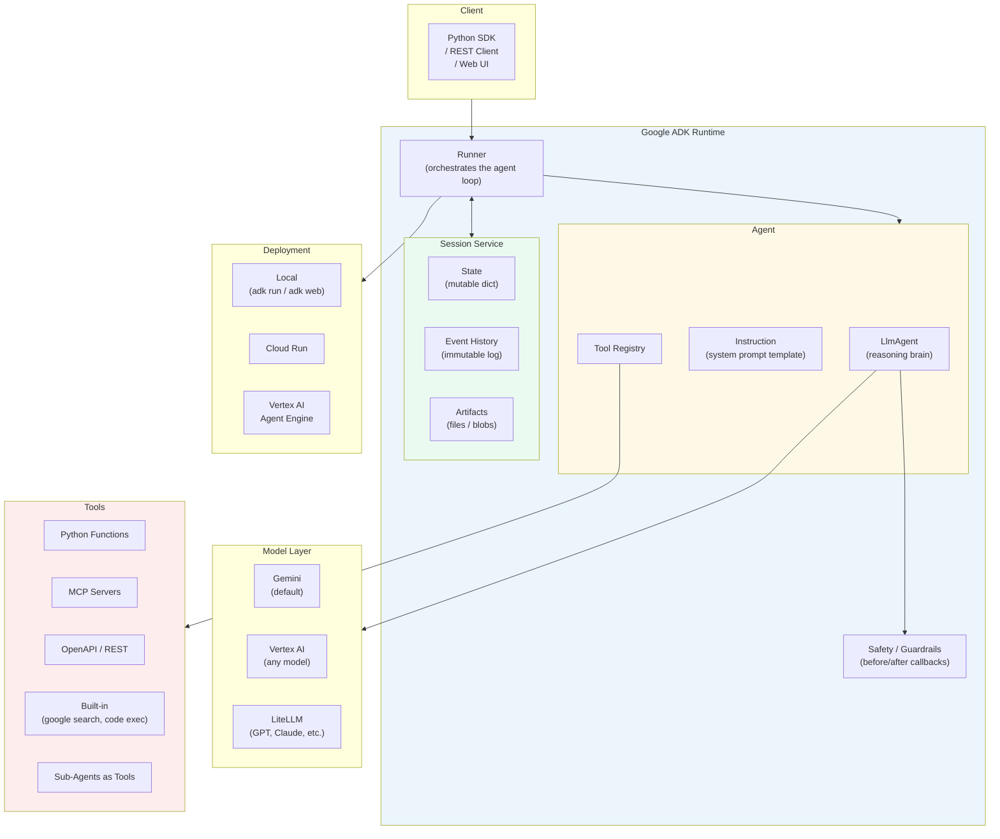

### Request Lifecycle

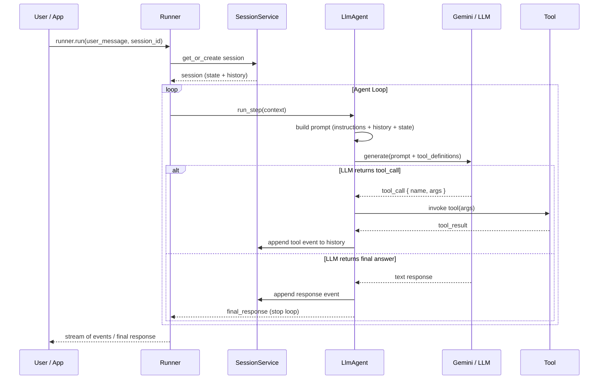

---

## 3. Core Concepts

### ADK Concept Map

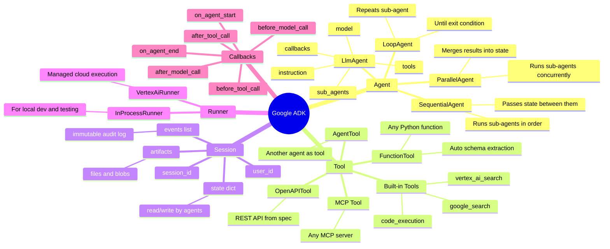

### Event System

ADK models all agent activity as an ordered stream of **events**. This is key to traceability and streaming.

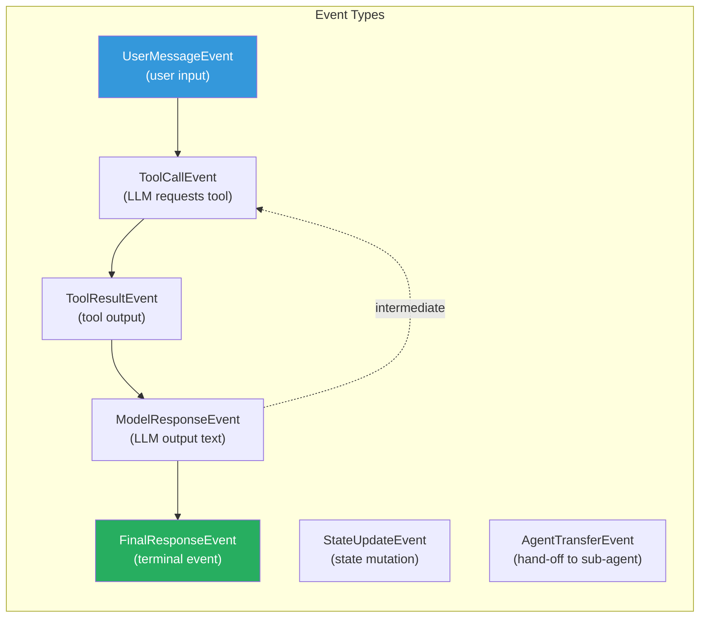

---

## 4. Agent Types & Composition

### Four Native Agent Types

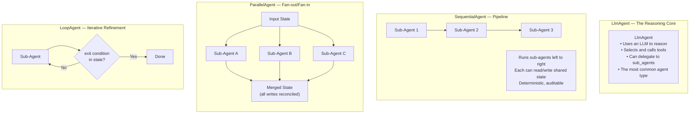

### Composition Example: Research Pipeline

```python
from google.adk.agents import LlmAgent, SequentialAgent, ParallelAgent

# Leaf agents
researcher = LlmAgent(
    name="researcher",
    model="gemini-2.0-flash",
    instruction="Research the given topic and populate state['research_notes'].",
    tools=[google_search_tool],
)

analyst = LlmAgent(
    name="analyst",
    model="gemini-2.0-flash",
    instruction="Analyse state['research_notes'] and write insights to state['analysis'].",
)

writer = LlmAgent(
    name="writer",
    model="gemini-2.0-pro",
    instruction="Write an executive report from state['analysis']. Save to state['report'].",
)

# Compose into a pipeline
pipeline = SequentialAgent(
    name="research_pipeline",
    sub_agents=[researcher, analyst, writer],
)
```

---

## 5. Tool System

### Tool Architecture

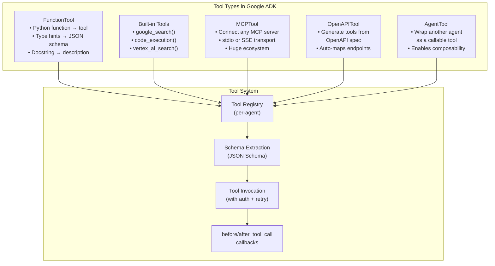

### Defining a Function Tool

```python
from google.adk.tools import FunctionTool

def get_weather(city: str, units: str = "celsius") -> dict:
    """
    Get current weather for a city.

    Args:
        city: The city name (e.g., "London", "Tokyo")
        units: Temperature units: "celsius" or "fahrenheit"

    Returns:
        dict with temperature, condition, humidity
    """
    # implementation
    return {"city": city, "temperature": 22, "condition": "Sunny", "humidity": 55}

weather_tool = FunctionTool(func=get_weather)
# ADK auto-extracts the JSON schema from type hints and docstring
```

### Connecting an MCP Server

```python
from google.adk.tools.mcp_tool import MCPToolset, StdioServerParameters

# Connect to any MCP-compatible tool server
mcp_tools = MCPToolset(
    connection_params=StdioServerParameters(
        command="npx",
        args=["-y", "@modelcontextprotocol/server-filesystem", "/workspace"],
    )
)

# Use in an agent
file_agent = LlmAgent(
    name="file_agent",
    model="gemini-2.0-flash",
    instruction="You can read and write files in the workspace.",
    tools=[mcp_tools],
)
```

---

## 6. Session & State Management

### State Scope Prefixes

Google ADK has a powerful **scoped state** system using key prefixes:

```
state["key"]              → Session scope   (current session only)
state["user:key"]         → User scope      (persists across user's sessions)
state["app:key"]          → App scope       (shared across all users)
state["temp:key"]         → Temp scope      (this agent step only, not persisted)
```

### State Flow in Multi-Agent Systems

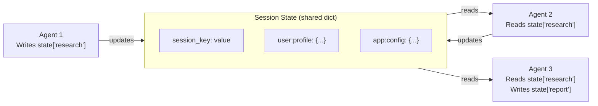

### Session Persistence Options

| Service | Use Case | Persistence |
|---------|----------|------------|
| `InMemorySessionService` | Local dev, unit tests | None — lost on restart |
| `VertexAiSessionService` | Production on GCP | Firestore-backed, durable |
| `DatabaseSessionService` | Self-hosted production | Your own DB |

```python
from google.adk.sessions import InMemorySessionService, VertexAiSessionService

# Development
session_service = InMemorySessionService()

# Production
session_service = VertexAiSessionService(
    project="my-project",
    location="us-central1",
)
```

---

## 7. Multi-Agent with A2A Protocol

### Agent-to-Agent (A2A) Protocol

A2A is a Google-led **open standard** for agent interoperability. It allows agents built on different frameworks (ADK, LangGraph, CrewAI) to communicate via a standard HTTP API.

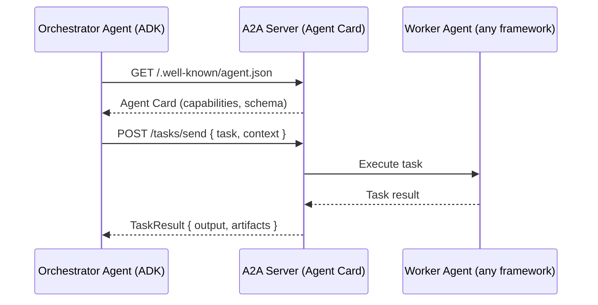

### A2A Agent Card

Every A2A-compatible agent exposes a `/.well-known/agent.json` describing itself:

```json
{
  "name": "weather-agent",
  "description": "Fetches real-time weather for any location",
  "url": "https://weather-agent.example.com",
  "version": "1.0.0",
  "capabilities": {
    "streaming": true,
    "pushNotifications": false
  },
  "skills": [
    {
      "id": "get-weather",
      "name": "Get Weather",
      "description": "Returns current weather for a city",
      "inputModes": ["text"],
      "outputModes": ["text", "data"]
    }
  ]
}
```

### Calling a Remote A2A Agent

```python
from google.adk.agents import LlmAgent
from google.adk.tools.agent_tool import AgentTool
from google.adk.a2a import A2AClient

# Wrap a remote agent as a local tool
remote_weather_agent = AgentTool(
    agent=A2AClient(agent_url="https://weather-agent.example.com"),
    name="get_weather_from_remote",
    description="Get weather from the remote weather agent service",
)

orchestrator = LlmAgent(
    name="orchestrator",
    model="gemini-2.0-flash",
    instruction="Help users with travel planning using available tools.",
    tools=[remote_weather_agent],
)
```

---

## 8. Streaming & Live Agents

### Streaming Architecture

Google ADK supports **bidirectional real-time streaming** via Gemini's Live API — enabling voice-in/voice-out and live video understanding.

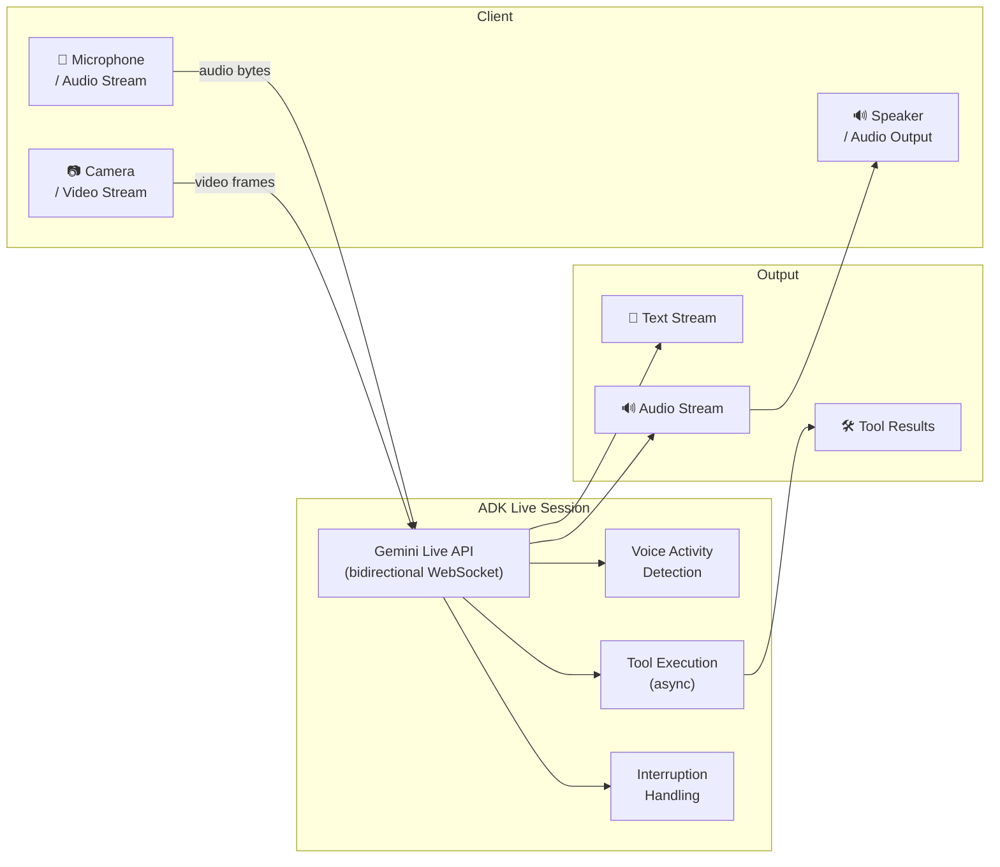

### Text Streaming Example

```python
from google.adk.runners import InProcessRunner

runner = InProcessRunner(agent=my_agent, session_service=session_service)

# Streaming — yields events as they arrive
async for event in runner.run_async(
    user_message="Research the latest trends in quantum computing",
    session_id="session-001",
):
    if event.is_text_chunk():
        print(event.text, end="", flush=True)
    elif event.is_tool_call():
        print(f"\n[Tool: {event.tool_name}({event.args})]")
    elif event.is_final():
        print("\n[Done]")
```

---

## 9. Deployment: Vertex AI Agent Engine

### Deployment Architecture

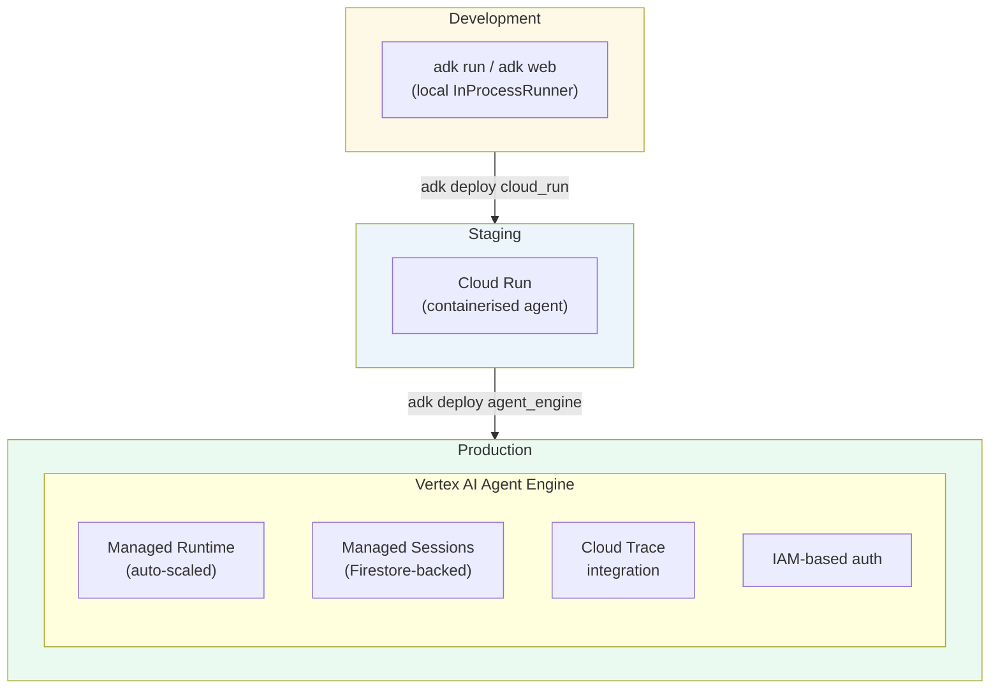

### Deploying to Agent Engine

```python
from google.adk.deploy import VertexAiAgentEngineDeployer

deployer = VertexAiAgentEngineDeployer(
    project="my-gcp-project",
    location="us-central1",
    agent=my_agent,
    session_service=VertexAiSessionService(...),
    display_name="My Production Agent",
    description="Customer support agent for ACME Corp",
)

# Deploy — returns a managed agent endpoint
endpoint = deployer.deploy()
print(f"Agent deployed at: {endpoint.resource_name}")
```

---

## 10. Observability & Evaluation

### Evaluation Framework

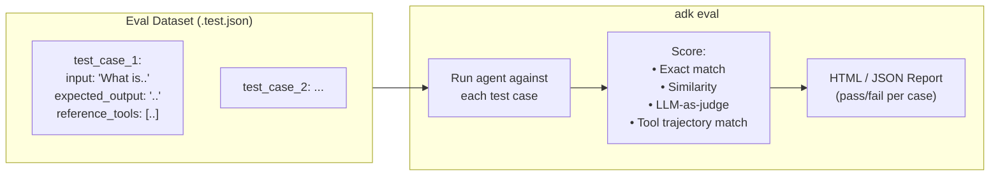

### Eval Dataset Format

```json
[
  {
    "query": "What is the weather in Tokyo?",
    "expected_tool_use": [
      {
        "tool_name": "get_weather",
        "tool_input": { "city": "Tokyo" }
      }
    ],
    "reference_final_response": "The current weather in Tokyo is..."
  }
]
```

```bash
# Run evaluation
adk eval \
  --agent_module my_agent.agent \
  --eval_set tests/weather_eval.test.json \
  --output_dir reports/
```

---

## 11. Principal Engineer Patterns

### Pattern 1: Hierarchical Agent Delegation

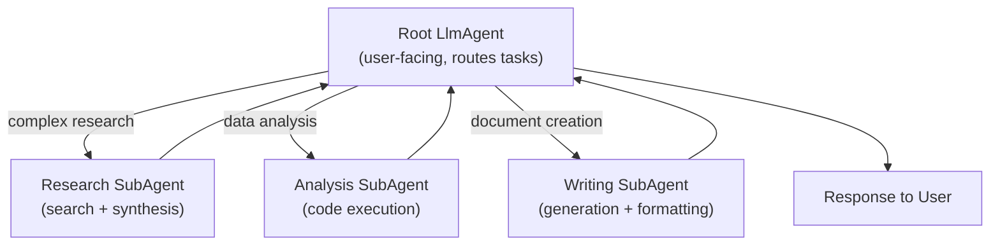

```python
research_agent = LlmAgent(name="researcher", ...)
analysis_agent = LlmAgent(name="analyst", ...)
writing_agent  = LlmAgent(name="writer", ...)

# Root agent delegates via sub_agents list
root_agent = LlmAgent(
    name="root",
    model="gemini-2.0-flash",
    instruction="""
    You are a helpful assistant. For complex tasks, delegate:
    - Research tasks → researcher agent
    - Data analysis  → analyst agent
    - Document creation → writer agent
    """,
    sub_agents=[research_agent, analysis_agent, writing_agent],
)
```

### Pattern 2: Guardrail Callbacks

```python
from google.adk.agents import CallbackContext
from google.adk.models import LlmResponse

def safety_check_before_model(ctx: CallbackContext, llm_request) -> LlmResponse | None:
    """Block if user asks about competitor products."""
    user_text = ctx.user_message.text or ""
    blocked_terms = ["competitor_a", "competitor_b"]
    
    if any(term in user_text.lower() for term in blocked_terms):
        return LlmResponse(
            text="I can only assist with questions about our products.",
        )
    return None  # Allow the call to proceed

def cost_guard_before_model(ctx: CallbackContext, llm_request):
    """Limit context window to control cost."""
    # Trim history if too long
    if len(ctx.session.events) > 50:
        llm_request.messages = llm_request.messages[-20:]  # Keep last 20
    return None

my_agent = LlmAgent(
    name="safe_agent",
    model="gemini-2.0-flash",
    instruction="You are a helpful assistant.",
    before_model_callback=safety_check_before_model,
)
```

### Pattern 3: Stateful Workflow with SequentialAgent

```python
from google.adk.agents import SequentialAgent, LlmAgent

# Each agent reads/writes shared state keys
step1 = LlmAgent(
    name="extractor",
    instruction="Extract key facts from the document in state['document'] and write to state['facts'].",
)

step2 = LlmAgent(
    name="classifier",
    instruction="Classify each fact in state['facts'] by category. Write to state['classified_facts'].",
)

step3 = LlmAgent(
    name="summariser",
    instruction="Create an executive summary from state['classified_facts']. Write to state['summary'].",
)

doc_pipeline = SequentialAgent(
    name="document_pipeline",
    sub_agents=[step1, step2, step3],
)

# Set initial state
session = session_service.create_session(
    app_name="doc-processor",
    user_id="user-1",
    initial_state={"document": "Annual report text here..."},
)
```

---

## 12. Quick Reference

```
Install:
  pip install google-adk

Key classes:
  LlmAgent(name, model, instruction, tools, sub_agents, callbacks)
  SequentialAgent(name, sub_agents)
  ParallelAgent(name, sub_agents)
  LoopAgent(name, sub_agents, max_iterations)
  FunctionTool(func)
  InProcessRunner(agent, session_service)
  InMemorySessionService()

CLI commands:
  adk run   <agent_module>          — run agent in terminal
  adk web   <agent_module>          — launch web UI at localhost:8080
  adk eval  --agent_module ... --eval_set ...
  adk deploy cloud_run ...
  adk deploy agent_engine ...

State scopes:
  state["key"]       → session
  state["user:key"]  → user
  state["app:key"]   → app-wide
  state["temp:key"]  → single-step only

Default model: gemini-2.0-flash
Docs:          https://google.github.io/adk-docs
GitHub:        https://github.com/google/adk-python
```
