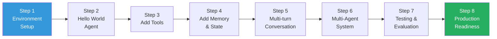
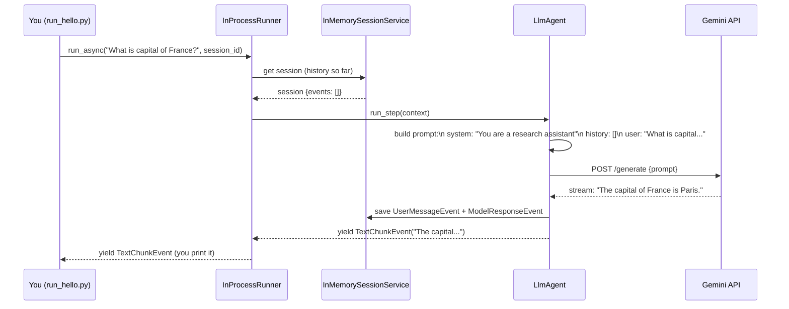
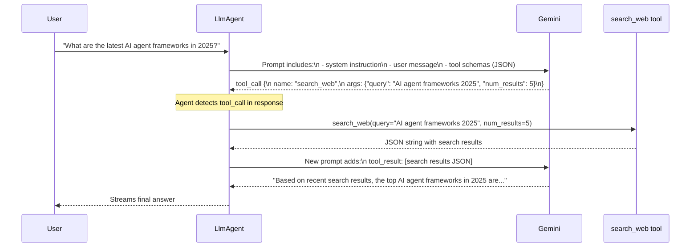
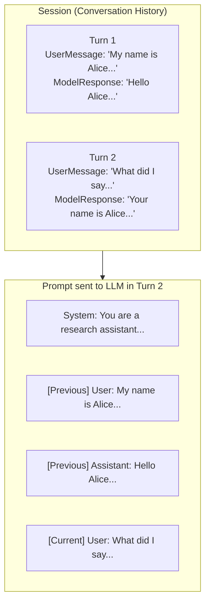
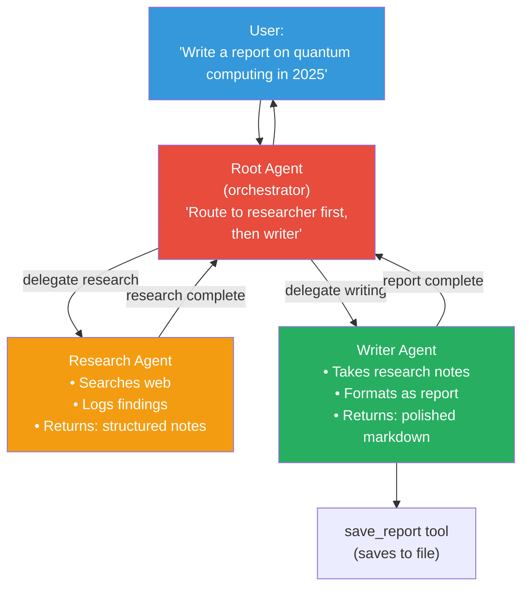
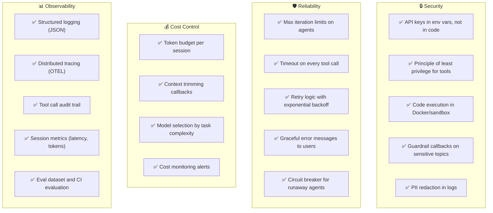
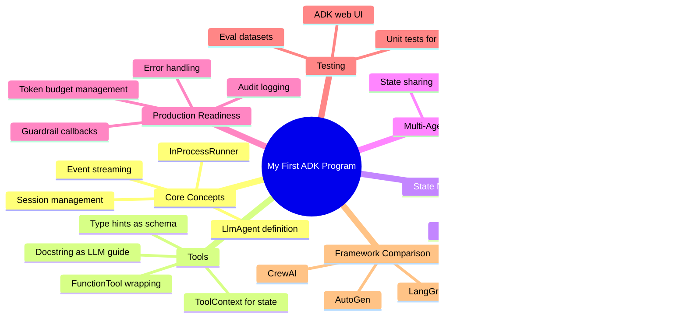

# 🚀 My First ADK Program — Step-by-Step Tutorial

> **Goal:** Build a fully working AI agent from scratch, understand every line of code, and learn the core concepts hands-on. By the end of this tutorial you will have a **research assistant agent** that can search the web, execute Python code, and produce structured reports.
>
> **Framework:** Google ADK (easiest local dev experience)  
> **Parallel examples** for LangGraph, AutoGen, and CrewAI are included at each major step.

---

## 📋 What We're Building

```
Research Assistant Agent
  ✓ Accepts a topic from the user
  ✓ Searches the web for current information  
  ✓ Executes Python code to analyse data
  ✓ Produces a structured markdown report
  ✓ Supports follow-up questions (multi-turn)
  ✓ Streams responses in real-time
```

---

## 🗺️ Tutorial Roadmap



---

## Step 1: Environment Setup

### Prerequisites

```
✓ Python 3.10+
✓ A Google AI Studio API key (free tier available)
  OR an OpenAI / Anthropic API key
✓ Basic Python knowledge
```

### Install Google ADK

```bash
# Create and activate a virtual environment (recommended)
python -m venv .venv
source .venv/bin/activate       # Linux/Mac
# .venv\Scripts\activate        # Windows

# Install Google ADK
pip install google-adk

# Verify installation
python -c "import google.adk; print('ADK installed successfully')"
```

### Set Up API Keys

```bash
# Create a .env file in your project root
cat > .env << 'EOF'
# Google AI Studio key (get from https://aistudio.google.com/apikey)
GOOGLE_API_KEY=your_google_api_key_here

# Optional: OpenAI key (if using GPT models)
# OPENAI_API_KEY=your_openai_key_here

# Optional: Serper API key for web search (https://serper.dev)
# SERPER_API_KEY=your_serper_key_here
EOF
```

### Project Structure

```
my_research_agent/
├── .env                    ← API keys (never commit to git)
├── .gitignore
├── requirements.txt
├── agent.py                ← Main agent definition
├── tools.py                ← Custom tool functions
├── tests/
│   └── test_agent.py
└── eval/
    └── research_eval.test.json
```

---

## Step 2: Hello World Agent

Let's build the simplest possible agent and understand every component.

### The Simplest Agent

```python
# agent.py

from google.adk.agents import LlmAgent
from google.adk.sessions import InMemorySessionService
from google.adk.runners import InProcessRunner

# ─────────────────────────────────────────────────
# 1. Define the agent
# ─────────────────────────────────────────────────
# An LlmAgent is an AI agent powered by a Large Language Model.
# It receives instructions (the system prompt) and responds to user messages.

root_agent = LlmAgent(
    name="research_assistant",       # unique name (used in logs and tracing)
    model="gemini-2.0-flash",        # the LLM to use
    instruction="""
    You are a helpful research assistant.
    You answer questions clearly, concisely, and accurately.
    When you are unsure, say so rather than guessing.
    """,
)

# ─────────────────────────────────────────────────
# 2. Set up the session service
# ─────────────────────────────────────────────────
# The session service stores conversation history and state.
# InMemorySessionService is for development — data is lost when the process stops.
# In production, use VertexAiSessionService or DatabaseSessionService.

session_service = InMemorySessionService()

# ─────────────────────────────────────────────────
# 3. Create a runner
# ─────────────────────────────────────────────────
# The runner orchestrates the agent loop:
#   1. Takes user input
#   2. Builds the full prompt (system + history + new message)
#   3. Calls the LLM
#   4. Handles tool calls if any
#   5. Returns the response

runner = InProcessRunner(
    agent=root_agent,
    session_service=session_service,
    app_name="my_research_app",      # logical app name
)
```

### Running the Hello World Agent

```python
# run_hello.py — run this to test

import asyncio
from dotenv import load_dotenv
from agent import runner, session_service

load_dotenv()  # load .env file

async def main():
    # Create a session (represents one user conversation)
    session = session_service.create_session(
        app_name="my_research_app",
        user_id="user-001",
    )
    
    print("Research Assistant is ready. Type 'quit' to exit.\n")
    
    while True:
        user_input = input("You: ").strip()
        
        if user_input.lower() in ("quit", "exit"):
            break
        
        if not user_input:
            continue
        
        # Run the agent and collect the response
        print("Assistant: ", end="", flush=True)
        
        async for event in runner.run_async(
            user_message=user_input,
            session_id=session.id,
        ):
            # Events stream in as the agent works
            if event.is_text_chunk():
                # Print each text chunk as it arrives (streaming)
                print(event.text, end="", flush=True)
        
        print("\n")  # newline after response

if __name__ == "__main__":
    asyncio.run(main())
```

```bash
python run_hello.py
# You: What is the capital of France?
# Assistant: The capital of France is Paris.
```

### What Just Happened?



> **Key insight:** Even in this trivial example, the runner manages session state, the agent builds the full prompt, and the LLM call happens inside `A->>G`. All this infrastructure is what ADK provides so you don't have to build it yourself.

---

## Step 3: Add Tools

Tools give your agent the ability to act in the world. Let's add web search and Python code execution.

### Defining Custom Tools

```python
# tools.py

import json
import subprocess
import tempfile
import os
from typing import Optional

# ─────────────────────────────────────────────────
# Tool 1: Web Search
# ─────────────────────────────────────────────────
# A tool is just a Python function with:
#   - A clear name
#   - Type-annotated parameters
#   - A docstring (the LLM reads this to decide when to call the tool)
#   - A return value (preferably a string or dict)

def search_web(query: str, num_results: int = 5) -> str:
    """
    Search the web for current information on any topic.
    Use this when you need up-to-date information that may not be in your training data,
    or to verify facts with current sources.

    Args:
        query: The search query. Be specific for better results.
               Example: "Python asyncio best practices 2025"
        num_results: Number of results to return (1-10). Default is 5.

    Returns:
        A formatted string with search results including titles, URLs, and snippets.
    """
    import os
    import requests
    
    api_key = os.getenv("SERPER_API_KEY")
    
    if not api_key:
        # Return mock data if no API key (for tutorial purposes)
        return json.dumps([
            {
                "title": f"Mock result for: {query}",
                "url": "https://example.com",
                "snippet": "This is a mock result. Add SERPER_API_KEY to .env for real search.",
            }
        ], indent=2)
    
    response = requests.post(
        "https://google.serper.dev/search",
        headers={"X-API-KEY": api_key, "Content-Type": "application/json"},
        json={"q": query, "num": num_results},
        timeout=10,
    )
    response.raise_for_status()
    
    results = response.json().get("organic", [])
    formatted = [
        {
            "title": r.get("title", ""),
            "url": r.get("link", ""),
            "snippet": r.get("snippet", ""),
        }
        for r in results
    ]
    return json.dumps(formatted, indent=2)


# ─────────────────────────────────────────────────
# Tool 2: Python Code Execution
# ─────────────────────────────────────────────────

def execute_python(code: str, timeout_seconds: int = 30) -> str:
    """
    Execute Python code and return the output.
    Use this for:
    - Mathematical calculations
    - Data analysis and statistics
    - Generating charts (describe the output)
    - Any computation that benefits from code

    Args:
        code: Valid Python code to execute. Use print() to output results.
              Always handle potential errors with try/except.
        timeout_seconds: Maximum execution time (default 30, max 60).

    Returns:
        The stdout output of the code, or an error message if execution failed.
    
    Example:
        code = "import statistics; data = [1,2,3,4,5]; print(statistics.mean(data))"
    """
    timeout_seconds = min(timeout_seconds, 60)  # enforce max timeout
    
    # Write code to a temp file and run it in a subprocess
    # This provides basic isolation from the main process
    with tempfile.NamedTemporaryFile(
        mode="w", suffix=".py", delete=False, dir=tempfile.gettempdir()
    ) as f:
        f.write(code)
        temp_path = f.name
    
    try:
        result = subprocess.run(
            ["python", temp_path],
            capture_output=True,
            text=True,
            timeout=timeout_seconds,
            # Security: run with restricted environment
            env={
                "PATH": os.environ.get("PATH", ""),
                "PYTHONPATH": "",
            },
        )
        
        output = result.stdout.strip()
        errors = result.stderr.strip()
        
        if result.returncode != 0:
            return f"Error (exit code {result.returncode}):\n{errors}"
        
        return output or "(No output)"
    
    except subprocess.TimeoutExpired:
        return f"Error: Code execution timed out after {timeout_seconds} seconds."
    
    finally:
        os.unlink(temp_path)


# ─────────────────────────────────────────────────
# Tool 3: Save Report to File
# ─────────────────────────────────────────────────

def save_report(filename: str, content: str, format: str = "markdown") -> str:
    """
    Save content to a file in the reports directory.
    Use this when the user asks to save or export a report.

    Args:
        filename: The base filename (without extension). Use snake_case.
                  Example: "quarterly_analysis_q1_2025"
        content: The full content to save.
        format: File format: "markdown" (.md) or "text" (.txt). Default is "markdown".

    Returns:
        Confirmation message with the full file path.
    """
    os.makedirs("reports", exist_ok=True)
    
    ext = ".md" if format == "markdown" else ".txt"
    safe_name = "".join(c for c in filename if c.isalnum() or c in "-_")
    filepath = f"reports/{safe_name}{ext}"
    
    with open(filepath, "w", encoding="utf-8") as f:
        f.write(content)
    
    return f"Report saved successfully to: {filepath} ({len(content)} characters)"
```

### Agent with Tools

```python
# agent.py (updated)

from google.adk.agents import LlmAgent
from google.adk.tools import FunctionTool
from google.adk.sessions import InMemorySessionService
from google.adk.runners import InProcessRunner

from tools import search_web, execute_python, save_report

# ─────────────────────────────────────────────────
# Wrap Python functions as ADK tools
# ─────────────────────────────────────────────────
# FunctionTool inspects the function's type hints and docstring
# to auto-generate the JSON schema the LLM uses to call the tool.

search_tool  = FunctionTool(func=search_web)
code_tool    = FunctionTool(func=execute_python)
save_tool    = FunctionTool(func=save_report)

# ─────────────────────────────────────────────────
# Agent with tools
# ─────────────────────────────────────────────────

root_agent = LlmAgent(
    name="research_assistant",
    model="gemini-2.0-flash",
    instruction="""
    You are an expert research assistant with access to web search and code execution.
    
    When answering questions:
    1. Use search_web to find current, accurate information
    2. Use execute_python for calculations, data analysis, or statistics
    3. Always cite your sources (include URLs from search results)
    4. Structure your responses clearly with headers and bullet points
    5. If the user asks to save a report, use save_report
    
    Be thorough but concise. Prioritise accuracy over speed.
    """,
    tools=[search_tool, code_tool, save_tool],  # tools registered here
)

session_service = InMemorySessionService()

runner = InProcessRunner(
    agent=root_agent,
    session_service=session_service,
    app_name="my_research_app",
)
```

### Tool Call Flow — What Happens Inside



> **Key insight:** The LLM **never directly calls your tool**. It returns a structured `tool_call` JSON, and the ADK framework executes the actual function. This is why security matters — you control what tools the agent can access.

---

## Step 4: Add Memory & State

State allows agents to remember information across tool calls within a session.

### Using Session State

```python
# tools_with_state.py

from google.adk.tools import ToolContext

# ─────────────────────────────────────────────────
# Tools can read and write session state via ToolContext
# ─────────────────────────────────────────────────

def remember_topic(topic: str, tool_context: ToolContext) -> str:
    """
    Remember a research topic for this session.
    Call this when the user specifies a topic to investigate throughout the conversation.

    Args:
        topic: The research topic to remember.

    Returns:
        Confirmation that the topic has been stored.
    """
    # tool_context.state is a dict scoped to the current session
    # Changes here are automatically persisted by the session service
    tool_context.state["current_topic"] = topic
    tool_context.state["research_history"] = []  # reset history for new topic
    
    return f"I'll remember that we're researching: {topic}"


def add_to_research_log(finding: str, source_url: str, tool_context: ToolContext) -> str:
    """
    Log an important research finding to the session's research history.
    Use this to track key discoveries as you research.

    Args:
        finding: The key finding or insight to log.
        source_url: The URL where this finding was found.

    Returns:
        Confirmation and current log count.
    """
    history = tool_context.state.get("research_history", [])
    history.append({"finding": finding, "source": source_url})
    tool_context.state["research_history"] = history
    
    return f"Logged finding #{len(history)}: {finding[:50]}..."


def get_research_summary(tool_context: ToolContext) -> str:
    """
    Get a summary of all research findings logged in this session.
    Use this when the user asks for a summary of what has been found so far.

    Returns:
        A formatted list of all logged findings with their sources.
    """
    topic = tool_context.state.get("current_topic", "Unknown")
    history = tool_context.state.get("research_history", [])
    
    if not history:
        return "No research findings logged yet in this session."
    
    lines = [f"## Research Summary: {topic}\n"]
    for i, item in enumerate(history, 1):
        lines.append(f"{i}. **Finding:** {item['finding']}")
        lines.append(f"   **Source:** {item['source']}\n")
    
    return "\n".join(lines)
```

### State Scope Reference

```
state["current_topic"]       → session scope  (this conversation only)
state["user:preferences"]    → user scope     (all sessions for this user)
state["app:rate_limit"]      → app scope      (all users, all sessions)
state["temp:working_data"]   → temp scope     (current agent step only)
```

---

## Step 5: Multi-Turn Conversation

Sessions automatically maintain conversation history. Let's verify this works correctly.

```python
# test_multiturn.py

import asyncio
from dotenv import load_dotenv
from agent import runner, session_service

load_dotenv()

async def test_memory():
    """Test that the agent remembers previous messages."""
    
    # Create one session for the whole conversation
    session = session_service.create_session(
        app_name="my_research_app",
        user_id="user-test",
    )
    
    config = {"session_id": session.id}
    
    # Turn 1
    print("=== Turn 1 ===")
    async for event in runner.run_async(
        user_message="My name is Alice and I'm researching quantum computing.",
        **config,
    ):
        if event.is_text_chunk():
            print(event.text, end="")
    print("\n")
    
    # Turn 2 — does it remember?
    print("=== Turn 2 ===")
    async for event in runner.run_async(
        user_message="What did I say my name was, and what topic am I researching?",
        **config,
    ):
        if event.is_text_chunk():
            print(event.text, end="")
    print("\n")
    # Expected: "Your name is Alice and you are researching quantum computing."

asyncio.run(test_memory())
```

### How Session History Works



> **Key insight:** The ADK automatically includes conversation history in each prompt. The LLM isn't actually "remembering" — it's reading the history included in the current prompt. This is why context windows matter: there's a limit to how much history can fit.

---

## Step 6: Build a Multi-Agent System

Now let's split responsibilities across two agents — a researcher and a writer.



```python
# multi_agent.py

from google.adk.agents import LlmAgent, SequentialAgent
from google.adk.tools import FunctionTool
from google.adk.sessions import InMemorySessionService
from google.adk.runners import InProcessRunner
from tools import search_web, execute_python, save_report

# ─────────────────────────────────────────────────
# Agent 1: Researcher
# ─────────────────────────────────────────────────

researcher = LlmAgent(
    name="researcher",
    model="gemini-2.0-flash",
    instruction="""
    You are a specialist research agent. Your only job is to gather and organise information.
    
    When given a research topic:
    1. Search for it using search_web (at least 2-3 searches from different angles)
    2. Execute any calculations needed with execute_python
    3. Write your findings to state['research_notes'] in structured markdown
       (include section headers, key facts, and ALL source URLs)
    4. Conclude with: "Research complete. Notes saved to state."
    
    Do NOT write final reports — just organised research notes.
    """,
    tools=[FunctionTool(func=search_web), FunctionTool(func=execute_python)],
)

# ─────────────────────────────────────────────────
# Agent 2: Writer
# ─────────────────────────────────────────────────

writer = LlmAgent(
    name="writer",
    model="gemini-2.0-flash",
    instruction="""
    You are a specialist report writer. Your only job is to write polished reports.
    
    When called:
    1. Read state['research_notes'] for the research findings
    2. Write a professional report:
       - Executive Summary (2-3 sentences)
       - Key Findings (bullet points with citations)
       - Detailed Analysis (2-3 paragraphs per major point)
       - Recommendations (if applicable)
       - Sources (all URLs from research)
    3. Save the report using save_report with the topic as filename
    4. Write the full report to state['final_report']
    5. Conclude with: "Report complete."
    
    Tone: Professional, authoritative, suitable for a business audience.
    """,
    tools=[FunctionTool(func=save_report)],
)

# ─────────────────────────────────────────────────
# Pipeline: researcher → writer (sequential)
# ─────────────────────────────────────────────────

research_pipeline = SequentialAgent(
    name="research_pipeline",
    sub_agents=[researcher, writer],
    # SequentialAgent runs researcher first, then writer.
    # Both agents read and write the same session state,
    # so writer can access researcher's notes via state['research_notes'].
)

# ─────────────────────────────────────────────────
# Root agent: user-facing orchestrator
# ─────────────────────────────────────────────────

root_agent = LlmAgent(
    name="root",
    model="gemini-2.0-flash",
    instruction="""
    You are a helpful assistant with access to a research pipeline.
    
    For research requests:
    - Delegate to the research_pipeline sub-agent
    - After it completes, tell the user where the report was saved
    
    For simple questions, answer directly without using the pipeline.
    """,
    sub_agents=[research_pipeline],
)

# Runner setup
session_service = InMemorySessionService()
runner = InProcessRunner(
    agent=root_agent,
    session_service=session_service,
    app_name="research_system",
)
```

---

## Step 7: Testing & Evaluation

### Unit Test for a Tool

```python
# tests/test_tools.py

import pytest
import json
from tools import execute_python, save_report

class TestExecutePython:
    def test_simple_arithmetic(self):
        result = execute_python("print(2 + 2)")
        assert result == "4"
    
    def test_statistics(self):
        code = """
import statistics
data = [10, 20, 30, 40, 50]
print(f"mean={statistics.mean(data)}, stdev={round(statistics.stdev(data), 2)}")
"""
        result = execute_python(code)
        assert "mean=30" in result
    
    def test_timeout_enforced(self):
        result = execute_python("import time; time.sleep(100)", timeout_seconds=1)
        assert "timed out" in result.lower()
    
    def test_syntax_error_handled(self):
        result = execute_python("def broken(")
        assert "Error" in result


class TestSaveReport:
    def test_saves_markdown_file(self, tmp_path, monkeypatch):
        monkeypatch.chdir(tmp_path)
        result = save_report("test_report", "# Test\nContent here", "markdown")
        assert "test_report.md" in result
        assert (tmp_path / "reports" / "test_report.md").exists()
```

### Create an Eval Dataset

```json
// eval/research_eval.test.json
[
  {
    "query": "What is Python used for?",
    "expected_tool_use": [],
    "reference_final_response": "Python is a versatile programming language used for web development, data science, machine learning, automation, and more."
  },
  {
    "query": "Calculate the compound interest on $10,000 at 5% annual rate over 10 years",
    "expected_tool_use": [
      {
        "tool_name": "execute_python",
        "tool_input": {}
      }
    ],
    "reference_final_response": "After 10 years, the investment grows to approximately $16,288.95"
  },
  {
    "query": "Search for the latest LLM benchmarks",
    "expected_tool_use": [
      {
        "tool_name": "search_web",
        "tool_input": {}
      }
    ],
    "reference_final_response": ""
  }
]
```

```bash
# Run evaluation against your agent
adk eval \
  --agent_module agent \
  --eval_set eval/research_eval.test.json
```

### Use the ADK Web UI

```bash
# Launch the built-in web interface for interactive testing
adk web agent

# Opens at http://localhost:8080
# Features:
#   - Chat interface
#   - Event trace viewer (see every LLM call and tool call)
#   - State inspector
#   - Session management
```

---

## Step 8: Production Readiness

### Add Guardrail Callbacks

```python
# guardrails.py

from google.adk.agents import CallbackContext
from google.adk.models import LlmResponse, LlmRequest

# ─────────────────────────────────────────────────
# Callback 1: Block sensitive topics
# ─────────────────────────────────────────────────

BLOCKED_TOPICS = ["competitor", "salary", "confidential", "internal only"]

def block_sensitive_topics(ctx: CallbackContext, llm_request: LlmRequest) -> LlmResponse | None:
    """Prevent the agent from discussing sensitive business topics."""
    user_text = ""
    if ctx.user_content and ctx.user_content.parts:
        user_text = ctx.user_content.parts[0].text or ""
    
    for topic in BLOCKED_TOPICS:
        if topic in user_text.lower():
            return LlmResponse(
                text=f"I'm unable to assist with that topic. "
                     f"Please contact your manager or HR for guidance."
            )
    
    return None  # Allow the call to proceed

# ─────────────────────────────────────────────────
# Callback 2: Log all tool calls for audit trail
# ─────────────────────────────────────────────────

import logging
logger = logging.getLogger("agent.audit")

def log_tool_call(ctx: CallbackContext, tool, args: dict, tool_context) -> None:
    """Log every tool invocation for audit and debugging."""
    logger.info(
        "tool_call",
        extra={
            "agent": ctx.agent_name,
            "session_id": ctx.session.id,
            "tool": tool.name,
            "args_keys": list(args.keys()),  # log keys, not values (may contain PII)
        }
    )

# ─────────────────────────────────────────────────
# Callback 3: Enforce token budget
# ─────────────────────────────────────────────────

MAX_HISTORY_EVENTS = 30

def trim_context_for_cost(ctx: CallbackContext, llm_request: LlmRequest) -> None:
    """Keep only the last N events in context to control token costs."""
    if len(llm_request.contents) > MAX_HISTORY_EVENTS:
        # Keep system message + last N turns
        system = llm_request.contents[:1]
        recent = llm_request.contents[-(MAX_HISTORY_EVENTS - 1):]
        llm_request.contents = system + recent
    return None

# Apply to agent
root_agent = LlmAgent(
    name="root",
    model="gemini-2.0-flash",
    instruction="...",
    tools=[search_tool, code_tool],
    before_model_callback=block_sensitive_topics,
    before_tool_callback=log_tool_call,
)
```

### Production Checklist



---

## Equivalent Programs in Other Frameworks

### Same Agent in LangGraph

```python
# langgraph_equivalent.py

from langgraph.graph import StateGraph, END
from langgraph.prebuilt import ToolNode
from langchain_openai import ChatOpenAI
from langchain_core.messages import SystemMessage, HumanMessage
from typing import Annotated, TypedDict
from langgraph.graph.message import add_messages

# State
class AgentState(TypedDict):
    messages: Annotated[list, add_messages]

# Tools (same tool functions, wrapped for LangChain)
from langchain_core.tools import tool as lc_tool

@lc_tool
def search_web_lc(query: str, num_results: int = 5) -> str:
    """Search the web for current information."""
    from tools import search_web
    return search_web(query, num_results)

@lc_tool
def execute_python_lc(code: str) -> str:
    """Execute Python code and return output."""
    from tools import execute_python
    return execute_python(code)

tools = [search_web_lc, execute_python_lc]
model = ChatOpenAI(model="gpt-4o").bind_tools(tools)

SYSTEM_MSG = SystemMessage(content="""
You are an expert research assistant with access to web search and code execution.
Use search_web to find current information and execute_python for calculations.
Always cite sources. Structure responses with headers and bullet points.
""")

# Nodes
def agent_node(state: AgentState) -> dict:
    response = model.invoke([SYSTEM_MSG] + state["messages"])
    return {"messages": [response]}

def should_continue(state: AgentState) -> str:
    return "tools" if state["messages"][-1].tool_calls else END

# Graph
graph_builder = StateGraph(AgentState)
graph_builder.add_node("agent", agent_node)
graph_builder.add_node("tools", ToolNode(tools))
graph_builder.set_entry_point("agent")
graph_builder.add_conditional_edges("agent", should_continue, {"tools": "tools", END: END})
graph_builder.add_edge("tools", "agent")

from langgraph.checkpoint.memory import MemorySaver
graph = graph_builder.compile(checkpointer=MemorySaver())

# Run
config = {"configurable": {"thread_id": "session-001"}}
result = graph.invoke(
    {"messages": [HumanMessage("What are the latest AI trends?")]},
    config=config,
)
print(result["messages"][-1].content)
```

### Same Agent in AutoGen

```python
# autogen_equivalent.py

import asyncio
from autogen_agentchat.agents import AssistantAgent
from autogen_agentchat.teams import RoundRobinGroupChat
from autogen_agentchat.conditions import TextMentionTermination
from autogen_ext.models.openai import OpenAIChatCompletionClient
from autogen_core.tools import FunctionTool
from tools import search_web, execute_python

model_client = OpenAIChatCompletionClient(model="gpt-4o")

agent = AssistantAgent(
    name="research_assistant",
    model_client=model_client,
    tools=[
        FunctionTool(search_web, description="Search the web"),
        FunctionTool(execute_python, description="Execute Python code"),
    ],
    system_message="""You are an expert research assistant.
    Use search_web for current information and execute_python for calculations.
    When the task is fully complete, respond with TERMINATE.""",
)

async def run():
    # Single agent "team" with termination condition
    team = RoundRobinGroupChat(
        [agent],
        termination_condition=TextMentionTermination("TERMINATE"),
    )
    result = await team.run(task="What are the latest AI trends in 2025?")
    print(result.messages[-1].content)

asyncio.run(run())
```

### Same Agent in CrewAI

```python
# crewai_equivalent.py

from crewai import Agent, Task, Crew, Process
from crewai.tools import tool
from tools import search_web as _search_web, execute_python as _execute_python

@tool("Web Search")
def search(query: str, num_results: int = 5) -> str:
    """Search the web for current information on any topic."""
    return _search_web(query, num_results)

@tool("Python Executor")
def run_python(code: str) -> str:
    """Execute Python code and return the output."""
    return _execute_python(code)

researcher = Agent(
    role="Research Analyst",
    goal="Find comprehensive, accurate information on {topic}",
    backstory="Expert researcher with access to web search and data analysis tools.",
    tools=[search, run_python],
    llm="gpt-4o",
    verbose=True,
)

research_task = Task(
    description="Research {topic}. Find key facts, trends, and data. Cite all sources.",
    expected_output="Structured research notes with sources in markdown format.",
    agent=researcher,
)

crew = Crew(
    agents=[researcher],
    tasks=[research_task],
    process=Process.sequential,
    verbose=True,
)

result = crew.kickoff(inputs={"topic": "latest AI agent frameworks 2025"})
print(result.raw)
```

---

## 🎓 What You've Learned



---

## 📚 Next Steps

| Goal | Resource |
|------|----------|
| Go deeper on Google ADK | [google-adk.md](./google-adk.md) |
| Master state machines | [langgraph.md](./langgraph.md) |
| Build code-executing agents | [autogen.md](./autogen.md) |
| Build role-based teams fast | [crewai.md](./crewai.md) |
| Deploy to production | Google ADK → Vertex AI Agent Engine |
| Add observability | LangSmith / Google Cloud Trace |
| Learn about RAG | [../gen-ai-fundamentals.md](../gen-ai-fundamentals.md) |
| Agentic workflow patterns | [../agentic-workflows.md](../agentic-workflows.md) |

---

## 🔑 Key Takeaways for Engineers

```
1. Tools are the most important design decision
   → Well-described tools = better agent behaviour
   → Bad tool descriptions = confused agents

2. State design drives multi-agent architecture
   → Define what each agent reads and writes
   → Keep state schemas explicit and typed

3. Every agent loop needs safety rails
   → Max iterations, timeouts, token budgets
   → Guardrail callbacks are your first line of defence

4. Test your tools first, agents second
   → Unit test every tool function in isolation
   → Build eval datasets from day one

5. Start simple, then add agents
   → Single agent with 2-3 tools beats complex multi-agent for most tasks
   → Add agents only when single-agent context window fills up
```
