# 🤖 Agentic Workflows — Consumer Reference

> **Goal:** Understand AI agents, how they work, common patterns, and how to design agentic systems — from a *solution designer's* perspective.

---

## 📋 Table of Contents

| # | Section |
|---|---------|
| 1 | [What is an AI Agent?](#1-what-is-an-ai-agent) |
| 2 | [Anatomy of an Agent](#2-anatomy-of-an-agent) |
| 3 | [The ReAct Loop](#3-the-react-loop) |
| 4 | [Tool Use & Function Calling](#4-tool-use--function-calling) |
| 5 | [Agent Memory](#5-agent-memory) |
| 6 | [Planning Strategies](#6-planning-strategies) |
| 7 | [Multi-Agent Patterns](#7-multi-agent-patterns) |
| 8 | [Human-in-the-Loop](#8-human-in-the-loop) |
| 9 | [Agentic Workflow Patterns](#9-agentic-workflow-patterns) |
| 10 | [Frameworks & Ecosystem](#10-frameworks--ecosystem) |
| 11 | [When to Use Agents vs. Simpler Patterns](#11-when-to-use-agents-vs-simpler-patterns) |
| 12 | [Common Failure Modes & Mitigations](#12-common-failure-modes--mitigations) |

---

## 1. What is an AI Agent?

```
Traditional LLM call:
  User Input → LLM → Response    (single round-trip, stateless)

AI Agent:
  User Goal → Agent loop → [Plan → Act → Observe → Repeat] → Final Answer
  
  Key differences:
  ✓ Multi-step: can take many actions to complete a task
  ✓ Tool use:   can call APIs, search the web, run code, query DBs
  ✓ Memory:     can retain information across steps
  ✓ Planning:   can decompose complex goals into sub-tasks
  ✓ Adaptive:   reacts to observations and errors in real-time
```

### Agents on the Autonomy Spectrum

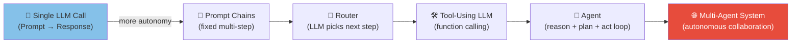

---

## 2. Anatomy of an Agent

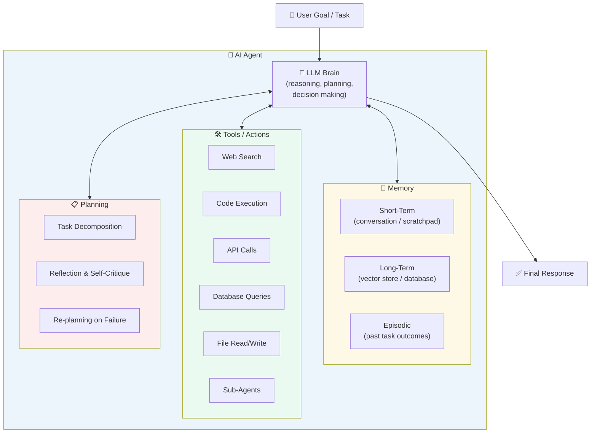

---

## 3. The ReAct Loop

ReAct (**Re**ason + **Act**) is the foundational pattern for most agents.

### ReAct Cycle

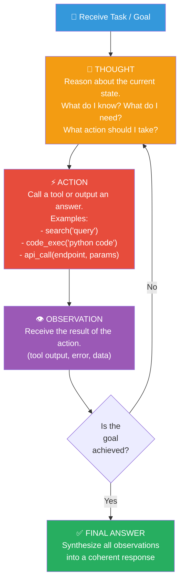

### ReAct Example Trace

```
Task: "What is the current stock price of Apple and how does it compare to last year?"

Thought: I need to get the current stock price of Apple. I'll use the stock_price tool.
Action: stock_price(ticker="AAPL", period="current")
Observation: AAPL current price = $195.40

Thought: Now I need the price from a year ago to compare.
Action: stock_price(ticker="AAPL", period="1y_ago")
Observation: AAPL price 1 year ago = $178.20

Thought: I have both data points. I can now calculate the change and answer.
Final Answer: Apple (AAPL) is currently trading at $195.40, up 9.1% 
             from $178.20 one year ago.
```

---

## 4. Tool Use & Function Calling

### How Function Calling Works

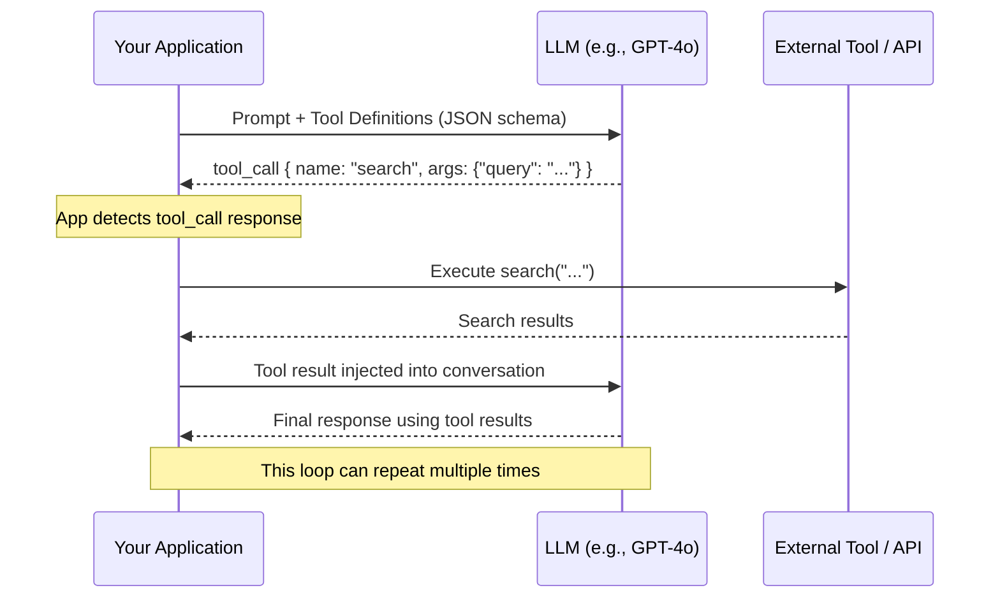

### Tool Definition (OpenAI format)

```json
{
  "type": "function",
  "function": {
    "name": "search_knowledge_base",
    "description": "Search the internal knowledge base for relevant information. Use this when you need to find specific company policies, procedures, or product information.",
    "parameters": {
      "type": "object",
      "properties": {
        "query": {
          "type": "string",
          "description": "The search query to find relevant documents"
        },
        "top_k": {
          "type": "integer",
          "description": "Number of results to return (default: 5)",
          "default": 5
        }
      },
      "required": ["query"]
    }
  }
}
```

### Common Agent Tools

| Tool Category | Examples | Use Case |
|---------------|----------|----------|
| **Search** | Web search, RAG search, SQL query | Grounding answers in real data |
| **Code Execution** | Python sandbox, shell commands | Data analysis, calculations, automation |
| **API Calls** | REST APIs, GraphQL, webhooks | Interact with external systems |
| **File Operations** | Read/write files, parse PDFs | Document processing |
| **Communication** | Send email, Slack, calendar | Action in the real world |
| **Browser** | Playwright, Selenium | Web scraping, UI automation |
| **Sub-Agent** | Delegate to specialised agent | Complex multi-domain tasks |

### Tool Design Best Practices

```
✓ Clear, specific descriptions — the LLM reads these to decide when to call
✓ Well-typed parameters with descriptions
✓ Return structured data (JSON) not free-form text
✓ Include error information in return value
✓ Idempotent tools where possible (safe to retry)
✓ Rate limit and timeout every tool
✓ Log all tool calls for observability and debugging
✗ Do not give agents destructive tools without confirmation (delete, send, publish)
```

---

## 5. Agent Memory

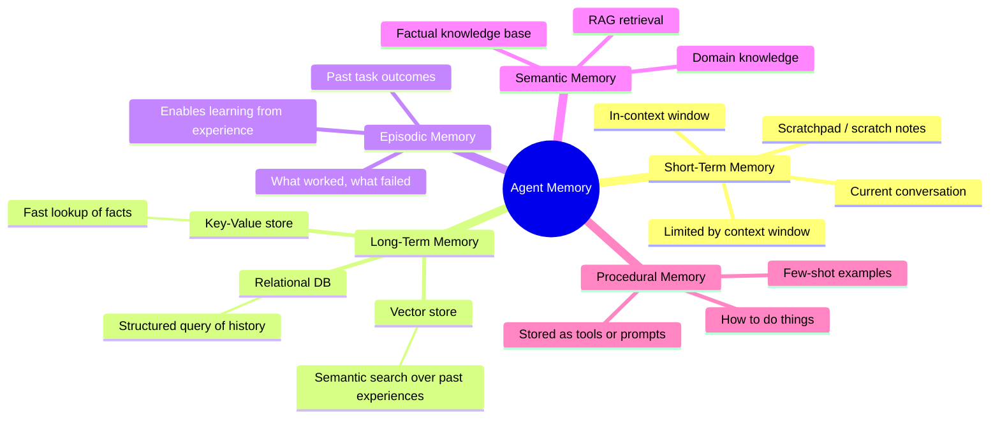

### Memory Management Strategies

```
Problem: context window fills up in long agent runs

Solutions:
  1. Summarisation
     - Periodically summarise old conversation turns
     - Replace old messages with summary
     
  2. Sliding Window
     - Keep only last N messages in context
     - Risk: lose important early context
     
  3. Memory-Augmented RAG
     - Embed and store all messages in vector DB
     - Retrieve relevant past context at each step
     
  4. Structured Memory
     - Extract entities/facts into structured store
     - Query as needed (e.g., "remember user's name is Alice")
```

---

## 6. Planning Strategies

### Plan Types

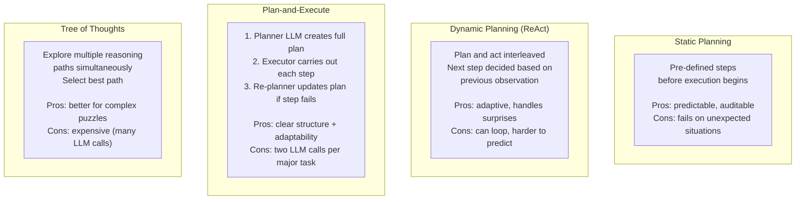

### Plan-and-Execute Pattern

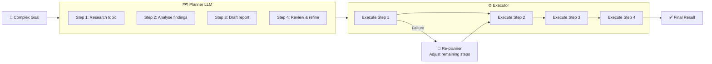

---

## 7. Multi-Agent Patterns

### Why Multiple Agents?

```
Single agent limitations:
  - One context window → limited working memory
  - Single model → limited specialisation
  - Sequential → slow for parallelisable tasks
  - Hard to audit and maintain as tasks grow complex

Multi-agent benefits:
  ✓ Specialisation: each agent optimised for its domain
  ✓ Parallelism: independent sub-tasks run concurrently
  ✓ Scale: complex tasks broken into manageable pieces
  ✓ Quality: agents can review each other's work
```

### Multi-Agent Topologies

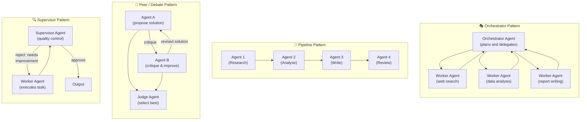

### Orchestrator-Worker Example: Research Assistant

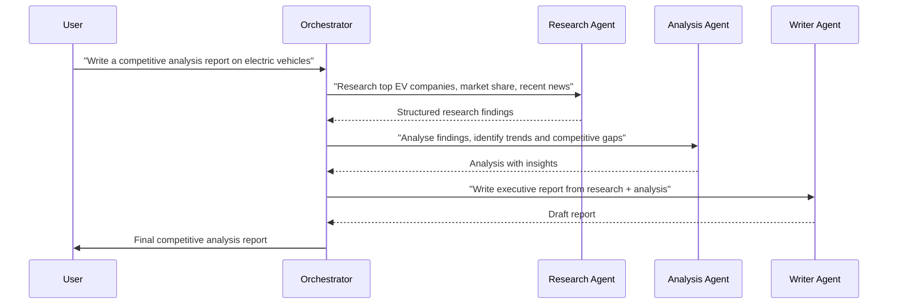

---

## 8. Human-in-the-Loop

### When to Include Humans

```
Include human checkpoint when:
  - Action is irreversible (send email, delete data, make payment)
  - High stakes or compliance-sensitive decisions
  - Agent confidence is low
  - Output will be customer-facing
  - Regulatory requirements mandate human approval

Automate fully when:
  - Action is reversible / low-risk
  - High volume, speed is priority
  - Established accuracy with tested evals
```

### Human-in-the-Loop Patterns

```mermaid
flowchart TD
    subgraph Review["Review Pattern"]
        RV_A["Agent completes task\nfully"] --> RV_H["Human reviews\ncompleted output"]
        RV_H -->|"approve"| RV_OUT["Publish / Act"]
        RV_H -->|"reject"| RV_A
    end

    subgraph Approval["Approval Gate Pattern"]
        AP_A["Agent runs until\nit needs to act\n(irreversible action)"] --> AP_H["Pause ⏸️\nHuman approves\nspecific action"]
        AP_H -->|"approved"| AP_CONT["Agent continues"]
        AP_H -->|"denied"| AP_STOP["Agent takes\nalternative path"]
    end

    subgraph Correction["Correction Pattern"]
        CO_A["Agent produces\nintermediate result"] --> CO_H["Human reviews\nand edits if needed"]
        CO_H --> CO_CONT["Agent continues\nwith corrected input"]
    end

    subgraph Escalation["Escalation Pattern"]
        ES_A["Agent attempts task"] --> ES_CONF{"Confidence\n> threshold?"}
        ES_CONF -->|"Yes"| ES_AUTO["Proceed automatically"]
        ES_CONF -->|"No"| ES_H["Escalate to\nhuman expert"]
    end
```

---

## 9. Agentic Workflow Patterns

### Pattern Catalogue

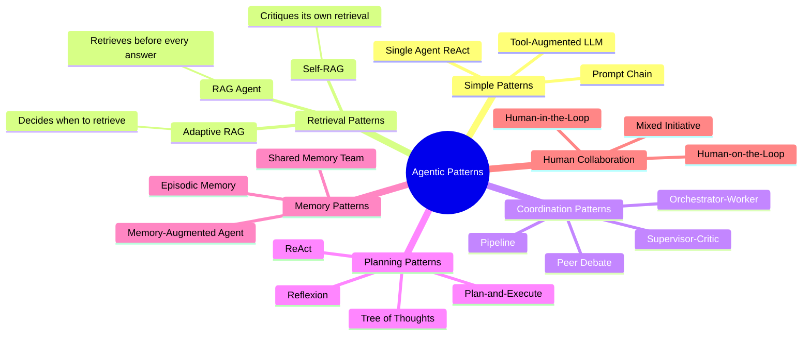

### Reflexion Pattern (Self-Improvement)

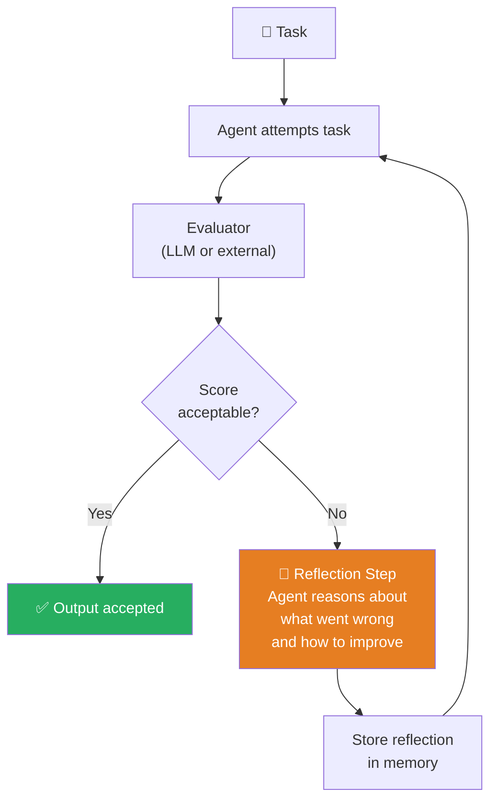

---

## 10. Frameworks & Ecosystem

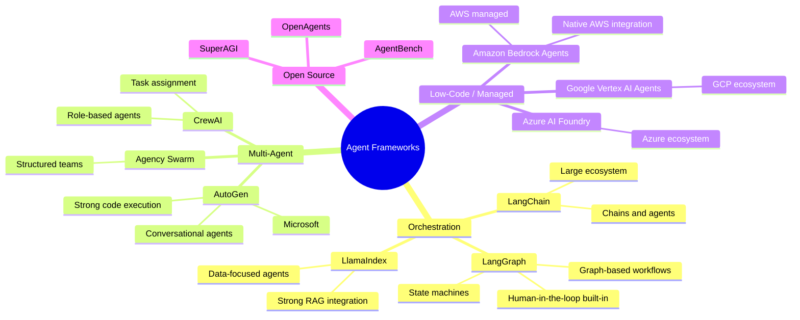

### Framework Selection Guide

| Need | Recommended |
|------|-------------|
| Production workflows with state management | **LangGraph** |
| Quick prototyping with many integrations | **LangChain** |
| RAG-heavy applications | **LlamaIndex** |
| Code-writing / execution agents | **AutoGen** |
| Role-based collaborative agents | **CrewAI** |
| AWS ecosystem | **Amazon Bedrock Agents** |
| Azure ecosystem | **Azure AI Foundry** |
| GCP ecosystem | **Vertex AI Agents** |

---

## 11. When to Use Agents vs. Simpler Patterns

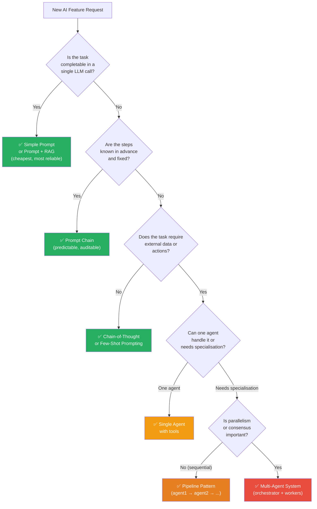

**Rule of thumb:** Start with the simplest solution that works. Move to agents only when simpler patterns are insufficient. Agents add latency, cost, and complexity.

---

## 12. Common Failure Modes & Mitigations

| Failure Mode | Description | Mitigation |
|-------------|-------------|------------|
| **Infinite Loop** | Agent loops without progress | Max iteration limit; break condition check |
| **Tool Hallucination** | Agent calls a tool that doesn't exist | Strict tool definition validation; fallback |
| **Goal Drift** | Agent pursues sub-goals, forgets original | Include original goal in every step's prompt |
| **Context Overflow** | Long runs exhaust context window | Periodic summarisation; external memory |
| **Cascading Errors** | Error in step 2 corrupts all downstream steps | Checkpoint validation; restart capability |
| **Over-calling Tools** | Agent calls expensive tools unnecessarily | Tool use cost budget; caching |
| **Prompt Injection** | Malicious tool output hijacks agent | Sanitise tool returns; sandboxed execution |
| **Non-determinism** | Same input → different plans → different results | Lower temperature; evals; human checkpoints |
| **Deadlock** | Multi-agent system waits on each other | Timeouts; async orchestration |
| **Scope Creep** | Agent takes unintended actions in the world | Principle of least privilege for tools |

---

## 📌 Quick Reference

```
ReAct loop:     Thought → Action → Observation → (repeat) → Final Answer
Agent = LLM + Tools + Memory + Planning loop

Tool call flow:
  1. LLM decides to call tool (returns JSON)
  2. Your app executes the tool
  3. Result injected back into LLM context
  4. LLM continues reasoning

Memory types:
  Short-term: in-context (tokens)
  Long-term:  vector DB, key-value store
  Episodic:   past outcomes stored for reference

Multi-agent patterns:
  Orchestrator-Worker: central agent delegates
  Pipeline:            agent1 → agent2 → agent3
  Supervisor:          critic agent reviews worker
  Peer Debate:         agents argue, judge selects

When NOT to use agents:
  - Task is completable in one LLM call
  - Steps are fixed and predictable (use chains)
  - Latency is critical (agents are slow)
  - Cost is a primary constraint
```
