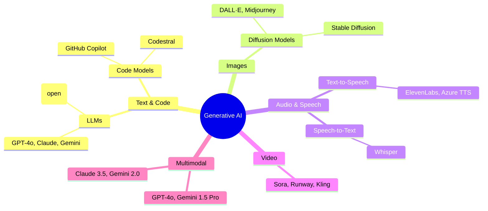
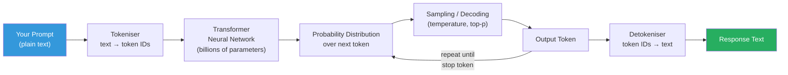
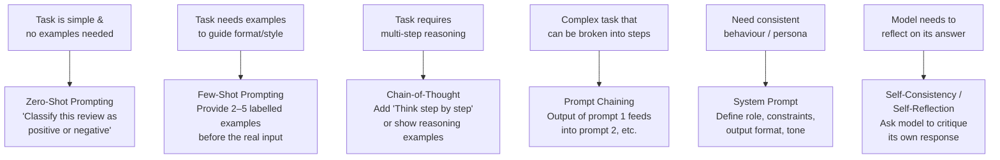
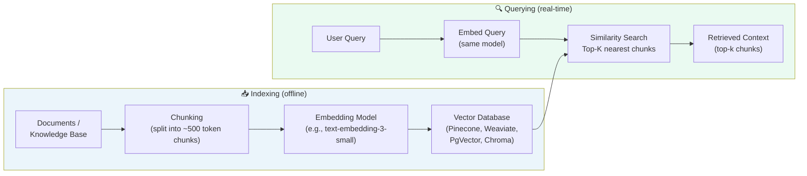
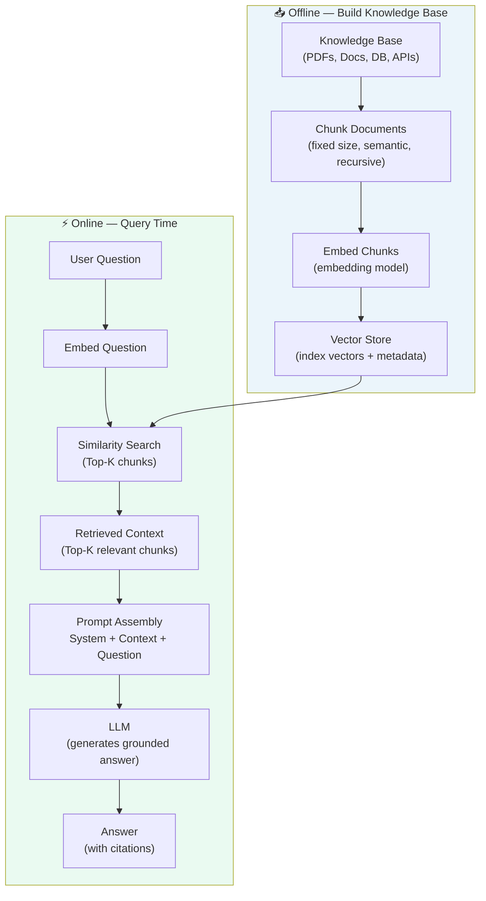
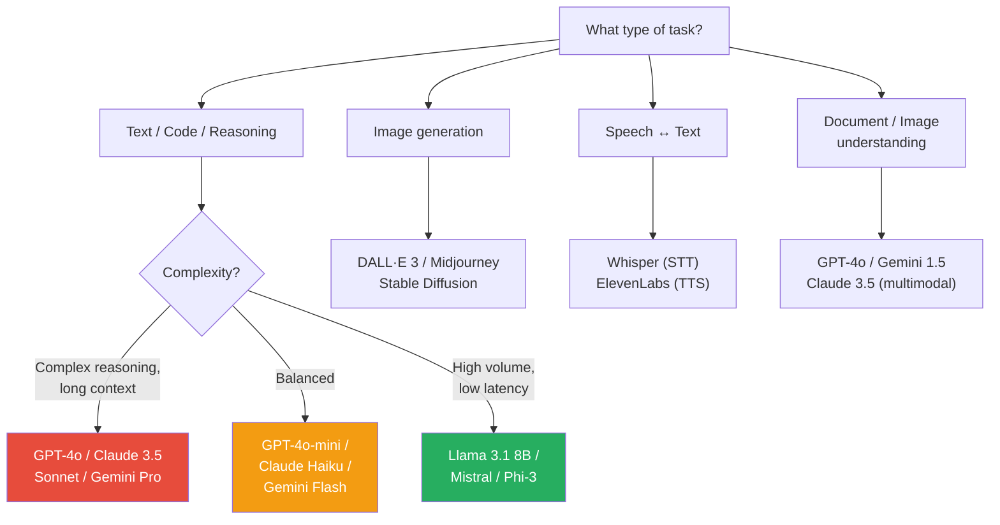

# 🧠 Gen AI Fundamentals — Consumer Reference

> **Goal:** Understand the core concepts of Generative AI and Large Language Models from a *consumer* perspective — enough to design, integrate, and reason about Gen AI powered solutions.

---

## 📋 Table of Contents

| # | Section |
|---|---------|
| 1 | [What is Generative AI?](#1-what-is-generative-ai) |
| 2 | [Foundation Models & LLMs](#2-foundation-models--llms) |
| 3 | [Tokens & Context Windows](#3-tokens--context-windows) |
| 4 | [Inference Parameters](#4-inference-parameters) |
| 5 | [Prompting Techniques](#5-prompting-techniques) |
| 6 | [Embeddings & Semantic Search](#6-embeddings--semantic-search) |
| 7 | [RAG — Retrieval-Augmented Generation](#7-rag--retrieval-augmented-generation) |
| 8 | [Multimodal Models](#8-multimodal-models) |
| 9 | [Model Selection Guide](#9-model-selection-guide) |
| 10 | [Key Limitations & Failure Modes](#10-key-limitations--failure-modes) |

---

## 1. What is Generative AI?

```
Traditional AI:    input → fixed rules / trained classifier → prediction/label
Generative AI:     input (prompt) → generative model → new content (text, image, code, audio)

Key shift: instead of classifying or predicting from a fixed set,
           the model creates novel output token by token.
```

### The Generative AI Family



---

## 2. Foundation Models & LLMs

### What is a Foundation Model?

```
Foundation Model:
  - Large neural network trained on massive datasets (text, code, images, etc.)
  - General purpose: adaptable to many tasks without task-specific training
  - Accessed via API or self-hosted
  - Customised via: prompting → RAG → fine-tuning → pre-training (increasing cost)

LLM (Large Language Model):
  - A foundation model specialised for text and code
  - Trained to predict the next token given a sequence of tokens
  - Emergent capabilities: reasoning, summarisation, translation, code generation
```

### How an LLM Processes Your Request



### Model Tiers (Capability vs. Cost)

| Tier | Examples | Best For |
|------|----------|----------|
| **Flagship** | GPT-4o, Claude 3.5 Sonnet, Gemini 1.5 Pro | Complex reasoning, coding, long context |
| **Mid-tier** | GPT-4o-mini, Claude 3 Haiku, Gemini Flash | Balanced capability and cost |
| **Small / Fast** | Llama 3.1 8B, Mistral 7B, Phi-3 | High-volume, low-latency, edge |
| **Specialised** | Codestral, Whisper, DALL·E | Domain-specific tasks |

---

## 3. Tokens & Context Windows

### What is a Token?

```
Token ≈ 3–4 characters or ¾ of a word (English, roughly)

Examples:
  "Hello"           → 1 token
  "Hello, world!"   → 4 tokens
  "Unbelievable"    → 3 tokens
  1000 tokens       ≈ 750 words ≈ 3 pages of text
  1M tokens         ≈ a full novel

Tokenisation varies by model — always use the model's own tokeniser for estimates.
```

### Context Window

```
┌──────────────────────────────────────────────────────────┐
│                   CONTEXT WINDOW                         │
│                                                          │
│  ┌────────────────┐  ┌──────────────────────────────┐   │
│  │  System Prompt │  │       User Messages           │   │
│  │  Instructions  │  │  + Conversation History       │   │
│  │  Persona       │  │  + Retrieved Documents (RAG)  │   │
│  └────────────────┘  └──────────────────────────────┘   │
│                          ↕                               │
│                    Model Output                          │
│              (consumes output tokens)                    │
└──────────────────────────────────────────────────────────┘
  Input tokens + Output tokens ≤ Context Window Limit
```

### Context Window Sizes (2024–2025)

| Model | Context Window |
|-------|----------------|
| GPT-4o | 128K tokens |
| Claude 3.5 Sonnet | 200K tokens |
| Gemini 1.5 Pro | 1M tokens |
| Gemini 2.0 Flash | 1M tokens |
| Llama 3.1 70B | 128K tokens |

### Why Context Window Matters for Designers

```
Too small context window:
  - Cannot fit large documents → need chunking + RAG
  - Long conversation history gets truncated → need memory management

Large context window:
  + Fit entire codebase or document set
  + Long conversation without truncation
  - Higher cost (cost scales with tokens used)
  - "Lost in the middle" problem: models attend less to middle of very long context
```

---

## 4. Inference Parameters

These knobs control the *style* and *diversity* of model output.

### Temperature

```
Temperature controls randomness of token selection:

  Temperature = 0.0    → Deterministic; always picks highest-probability token
                          Use for: factual Q&A, structured extraction, code
  Temperature = 0.7    → Balanced creativity (common default)
                          Use for: general chat, summarisation
  Temperature = 1.0+   → High creativity / diversity
                          Use for: brainstorming, creative writing

  Low temp ──────────────────────────────── High temp
  Precise, repetitive              Creative, unpredictable
```

### Other Key Parameters

| Parameter | What It Does | When to Tune |
|-----------|-------------|--------------|
| **max_tokens** | Maximum output length | Always set; prevents runaway costs |
| **top_p** | Nucleus sampling: consider tokens making up top p% of probability mass | Alternative to temperature; use one or the other |
| **top_k** | Consider only top k tokens at each step | Common in open-source models |
| **frequency_penalty** | Penalise tokens that appeared frequently | Reduce repetition in long outputs |
| **presence_penalty** | Penalise tokens that appeared at all | Encourage topic diversity |
| **stop sequences** | Halt generation at specific strings | Useful for structured output (e.g., stop at `</answer>`) |
| **seed** | Make output deterministic across calls | Reproducible testing and evals |

---

## 5. Prompting Techniques

### Prompt Anatomy

```
┌─────────────────────────────────────────────────────────────┐
│  SYSTEM PROMPT (optional, but powerful)                     │
│  "You are a helpful assistant specialising in financial     │
│   compliance. Always cite sources. Refuse off-topic         │
│   requests. Output JSON only."                              │
├─────────────────────────────────────────────────────────────┤
│  USER TURN                                                  │
│  Context:   [relevant background / retrieved docs]          │
│  Examples:  [few-shot examples if needed]                   │
│  Task:      "Summarise the following contract clause..."    │
│  Format:    "Respond in this JSON schema: {...}"            │
└─────────────────────────────────────────────────────────────┘
```

### Prompting Techniques — Decision Flow



### Prompting Patterns Cheatsheet

```
Zero-Shot:
  Prompt: "Classify this email as spam or not spam: {email}"

Few-Shot:
  Prompt: "Classify sentiment.
           Email: 'Great product!' → positive
           Email: 'Terrible service' → negative
           Email: '{new_email}' → "

Chain-of-Thought (CoT):
  Prompt: "Solve this step by step: {problem}"
  Or:     Show worked examples with reasoning before the question

System Prompt:
  "You are a JSON-only assistant. Never output plain text.
   Always respond with valid JSON matching this schema: {schema}"

ReAct (for agents):
  "Thought: I need to find X
   Action: search("X")
   Observation: [result]
   Thought: Now I can answer..."

Structured Output:
  "Extract the following fields as JSON:
   - name (string)
   - date (ISO 8601)
   - amount (number)
   Document: {document}"
```

### Prompt Engineering Best Practices

```
DO:
  ✓ Be explicit about output format (JSON schema, XML tags, markdown)
  ✓ Use system prompts to set persona and guardrails
  ✓ Provide examples for novel or complex tasks
  ✓ Specify length constraints ("in 3 bullet points", "max 100 words")
  ✓ Test prompts with edge cases and adversarial inputs
  ✓ Version-control your prompts like code

AVOID:
  ✗ Vague instructions ("make it better")
  ✗ Overloading a single prompt with many unrelated tasks
  ✗ Assuming the model remembers previous conversations (stateless by default)
  ✗ Relying on model knowledge for facts that change frequently (use RAG)
```

---

## 6. Embeddings & Semantic Search

### What are Embeddings?

```
Embedding = a dense vector (list of floating-point numbers) that captures
            the *semantic meaning* of text.

Similar meaning → similar vectors → small distance in vector space

Example:
  "dog"       → [0.21, -0.45, 0.88, ...]   (1536-dim for OpenAI)
  "puppy"     → [0.20, -0.43, 0.90, ...]   ← very close
  "cloud"     → [-0.67, 0.11, -0.32, ...]  ← very far

Distance metrics:
  Cosine Similarity:  measures angle between vectors (most common for text)
  Euclidean Distance: straight-line distance
  Dot Product:        fast; works when vectors are normalised
```

### Embedding Flow



### Vector Databases Comparison

| Database | Type | Best For |
|----------|------|----------|
| **Pinecone** | Managed cloud | Production, zero-ops |
| **Weaviate** | Open source / cloud | Hybrid search (vector + keyword) |
| **pgvector** | PostgreSQL extension | Already use Postgres |
| **Chroma** | Open source, embeddable | Local dev, prototyping |
| **Qdrant** | Open source / cloud | High-performance, filtering |
| **Azure AI Search** | Managed | Azure ecosystem |
| **OpenSearch** | Open source | AWS ecosystem, full-text + vector |

---

## 7. RAG — Retrieval-Augmented Generation

RAG is the **most important pattern** for building production Gen AI applications. It grounds the model's responses in your own data.

### Why RAG?

```
Problem with LLMs out-of-the-box:
  ✗ Knowledge cut-off date (stale facts)
  ✗ No access to your private data
  ✗ Hallucinate when uncertain
  ✗ Context window too small for all your data

RAG Solution:
  ✓ Retrieve relevant documents at query time
  ✓ Inject them into the prompt as context
  ✓ Model answers from retrieved facts → less hallucination
  ✓ You control the knowledge base
  ✓ Citing sources is possible
```

### RAG Architecture



### RAG Pipeline Components

```
1. Document Loading
   - PDFs, Word, HTML, Confluence, SharePoint, databases
   - Loaders: LangChain, LlamaIndex, Unstructured.io

2. Chunking Strategy
   - Fixed-size: simple, predictable (e.g., 512 tokens with 50-token overlap)
   - Recursive character: respects paragraph/sentence boundaries
   - Semantic: split on meaning change (more expensive)
   - Parent-child: index small chunks, retrieve parent for context

3. Embedding
   - OpenAI text-embedding-3-small / large
   - Cohere embed-v3
   - sentence-transformers (open source, local)

4. Vector Store
   - See comparison table above

5. Retrieval
   - Dense retrieval: embedding similarity (semantic)
   - Sparse retrieval: BM25 keyword match
   - Hybrid: combine both (recommended for production)
   - Reranking: cross-encoder to re-score top candidates

6. Generation
   - Inject retrieved chunks into prompt
   - Instruct model to answer ONLY from provided context
   - Ask for citations / source references
```

### RAG Quality Levers

| Problem | Likely Cause | Fix |
|---------|-------------|-----|
| Irrelevant retrieved chunks | Embedding mismatch, bad chunking | Better chunking, hybrid search, reranking |
| Hallucination despite RAG | Model ignores context | Stricter system prompt: "Answer ONLY from context" |
| Missing key information | Chunk too small, relevant info split | Increase chunk size, parent-child chunking |
| Slow retrieval | Large index, no filtering | Add metadata filters, approximate NN index |
| Stale data | Index not refreshed | Incremental indexing pipeline |

---

## 8. Multimodal Models

```
Multimodal models accept and/or produce multiple modalities:

  Input modalities:  text, images, audio, video, documents, code
  Output modalities: text, images, code, audio (model-dependent)

Examples:
  GPT-4o:         text + image → text
  Gemini 1.5 Pro: text + image + video + audio → text
  Claude 3.5:     text + image → text
  DALL·E 3:       text → image
  Whisper:        audio → text (transcription)
  Sora:           text → video

Use cases for solution designers:
  - Document understanding: extract info from scanned PDFs, invoices, forms
  - Image analysis: product inspection, medical imaging analysis
  - Audio transcription + analysis: meeting notes, call centre analytics
  - Chart/graph comprehension: analyse dashboards by screenshot
```

---

## 9. Model Selection Guide



---

## 10. Key Limitations & Failure Modes

```
Hallucination:
  - Model generates plausible but incorrect information confidently
  - Mitigation: RAG, low temperature, ask for citations, verify outputs

Knowledge Cutoff:
  - Model has no knowledge of events after training date
  - Mitigation: RAG with up-to-date knowledge base, web search tools

Context Window Overflow:
  - Too much text for the model to process at once
  - Mitigation: RAG (retrieve only relevant chunks), summarisation chains

Prompt Injection:
  - Malicious input manipulates model to ignore system prompt
  - Mitigation: input validation, output parsing, sandboxed tool use

Inconsistency:
  - Same prompt produces different answers across runs
  - Mitigation: temperature=0, structured output, evals pipeline

Cost Overrun:
  - Unbounded token usage in loops or large context
  - Mitigation: set max_tokens, monitor usage, use smaller models for sub-tasks

Latency:
  - Large models and long contexts are slow
  - Mitigation: streaming (TTFT metric), smaller models, caching

Bias & Toxicity:
  - Model may reflect biases present in training data
  - Mitigation: guardrails, content filtering, human review
```

---

## 📌 Quick Reference Cheatsheet

```
Token estimates:
  1 page ≈ 500 words ≈ 700 tokens
  1 book ≈ 100K words ≈ 130K tokens
  Cost: input tokens cheaper than output tokens

Common model defaults:
  temperature: 0.7 (creative) | 0.0 (deterministic)
  max_tokens: always set explicitly
  top_p: 1.0 (use temperature instead for most cases)

Prompting heuristics:
  Simple task     → zero-shot + clear instructions
  Format needed   → few-shot + output schema
  Reasoning task  → chain-of-thought
  Dynamic data    → RAG
  Complex task    → agent + tools

RAG sweet spots:
  Chunk size:    256–512 tokens with 10–15% overlap
  Top-K:         3–10 chunks (tune by task)
  Hybrid search: BM25 + dense embeddings (better than either alone)
```
