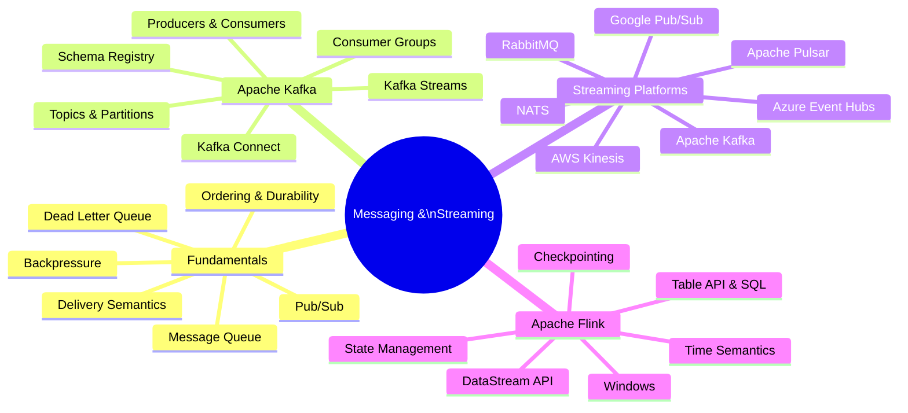

# 📨 Messaging & Streaming

> **Goal:** Understand messaging queue fundamentals, Apache Kafka internals, the landscape of streaming platforms, and Apache Flink stream processing — from first principles to production patterns.

---

## 📋 Table of Contents

| # | File | What You'll Learn |
|---|------|-------------------|
| 1 | [Messaging Fundamentals](./messaging-fundamentals.md) | Queues, pub/sub, delivery semantics, patterns |
| 2 | [Apache Kafka](./kafka.md) | Architecture, topics, partitions, consumer groups, Streams |
| 3 | [Streaming Platforms](./streaming-platforms.md) | Kafka, Pulsar, RabbitMQ, Kinesis, Event Hubs, NATS |
| 4 | [Apache Flink](./flink.md) | DataStream API, windows, state, checkpointing, SQL |

---

## 🗺️ Messaging & Streaming Landscape

---

## 🔗 Related Topics

- [System Design](../system-design/README.md) — Asynchronous patterns, CQRS, Event Sourcing
- [Databases](../databases/) — Persistent storage complementing event streams
- [Cloud](../cloud/aws.md) — Managed streaming services (Kinesis, MSK, EventBridge)
