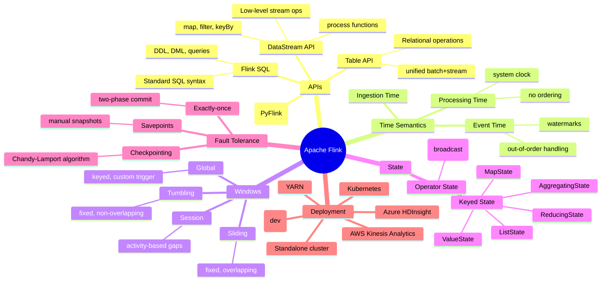
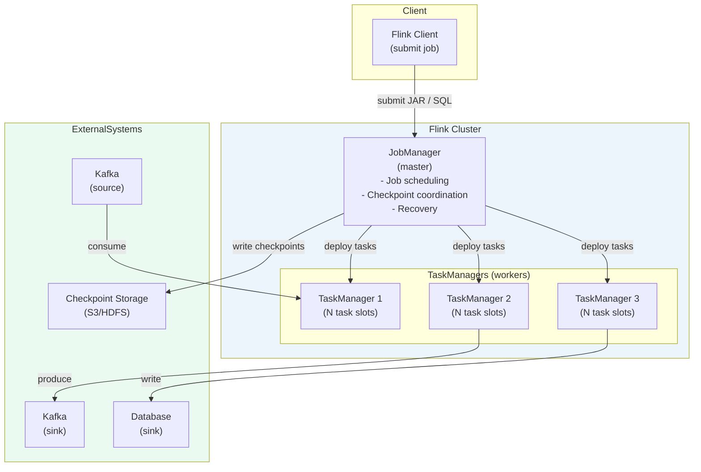
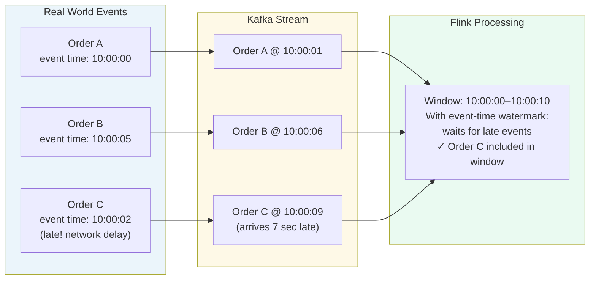
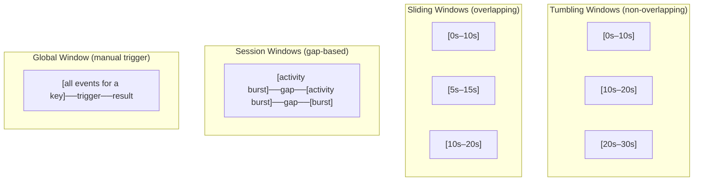
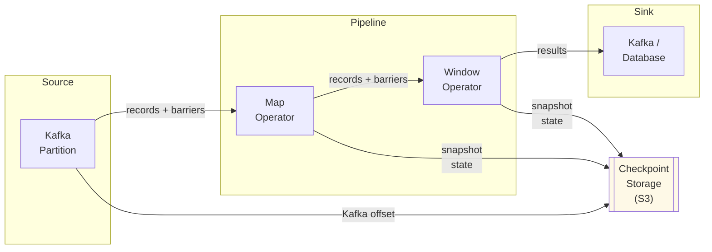
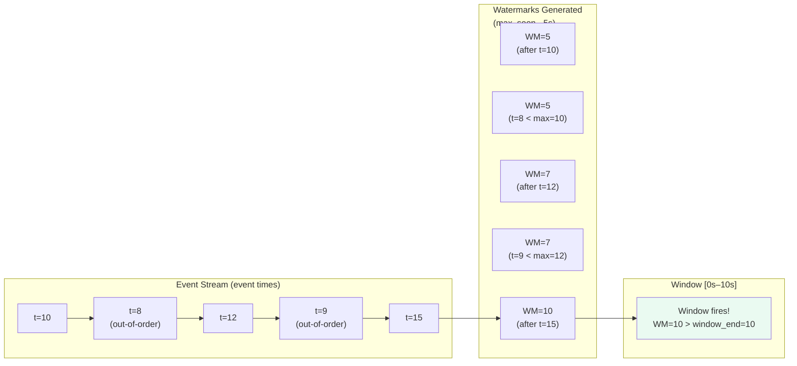

# ⚡ Apache Flink — Stream Processing Fundamentals

> **Audience:** Developers and data engineers building real-time streaming applications
> **Goal:** Understand Apache Flink's core concepts, APIs, time semantics, state management, fault tolerance, and SQL — from fundamentals to production patterns.

---

## 📋 Table of Contents

| # | Section |
|---|---------|
| 1 | [What is Apache Flink?](#1-what-is-apache-flink) |
| 2 | [Flink Architecture](#2-flink-architecture) |
| 3 | [Core APIs](#3-core-apis) |
| 4 | [Time Semantics](#4-time-semantics) |
| 5 | [Windows](#5-windows) |
| 6 | [State Management](#6-state-management) |
| 7 | [Fault Tolerance & Checkpointing](#7-fault-tolerance--checkpointing) |
| 8 | [Watermarks & Late Data](#8-watermarks--late-data) |
| 9 | [Connectors & Sources/Sinks](#9-connectors--sourcessinks) |
| 10 | [Flink SQL & Table API](#10-flink-sql--table-api) |
| 11 | [Flink vs. Kafka Streams vs. Spark Streaming](#11-flink-vs-kafka-streams-vs-spark-streaming) |
| 12 | [Production Best Practices](#12-production-best-practices) |
| 13 | [Quick Reference Cheatsheet](#13-quick-reference-cheatsheet) |

---

## 1. What is Apache Flink?

```
Apache Flink is a stateful, distributed stream processing framework.

Core capabilities:
  - Process unbounded streams (real-time, continuous)
  - Process bounded streams (batch processing)
  - Stateful computation with exactly-once guarantees
  - Event-time processing with watermarks
  - Low latency (milliseconds) and high throughput (millions of events/sec)

Originally developed at TU Berlin (2010), became Apache top-level project in 2014.
Production users: Alibaba (reported 10+ billion events/sec at peak), Netflix, Uber, Lyft, LinkedIn.

Key design philosophy:
  "Stream processing first, batch is a special case of streaming"
  (opposite of Spark which started as batch + added streaming)
```

### The Flink Universe



---

## 2. Flink Architecture

### Cluster Architecture



### Key Components

```
JobManager (master):
  - Receives job (DAG of operators)
  - Schedules tasks to TaskManagers
  - Coordinates distributed checkpoints
  - Handles TaskManager failures and recovery

TaskManager (worker):
  - Executes tasks (subtasks of operators)
  - Each TaskManager has N task slots
  - Task slot = unit of resource (thread + state)
  - Manages local state stores

Task Slot:
  - One slot can run one or more operator subtasks
  - Slot sharing: multiple subtasks of different operators share a slot
  - Number of slots = parallelism of a single operator

JobGraph → ExecutionGraph:
  Application code → JobGraph (DAG of operators) →
  ExecutionGraph (parallelised, physical plan) →
  Deployed as tasks on TaskManagers
```

### Parallelism

```
Each operator can run at N parallel subtasks.
  Parallelism = number of parallel instances of an operator

  source (p=4) ──▶ map (p=4) ──▶ keyBy ──▶ window (p=4) ──▶ sink (p=2)

  Total task slots needed = max parallelism across all operators
  (with slot sharing: same as max operator parallelism)

Set globally:
  env.setParallelism(4);

Set per-operator:
  stream.map(...).setParallelism(8);
```

---

## 3. Core APIs

### DataStream API

```java
StreamExecutionEnvironment env = StreamExecutionEnvironment.getExecutionEnvironment();

// Source: Kafka
KafkaSource<String> source = KafkaSource.<String>builder()
    .setBootstrapServers("broker:9092")
    .setTopics("orders")
    .setGroupId("flink-consumer")
    .setStartingOffsets(OffsetsInitializer.earliest())
    .setValueOnlyDeserializer(new SimpleStringSchema())
    .build();

DataStream<String> rawStream = env.fromSource(
    source, WatermarkStrategy.noWatermarks(), "Kafka Source");

// Parse JSON → POJO
DataStream<Order> orders = rawStream
    .map(json -> MAPPER.readValue(json, Order.class));

// Stateless transformations
DataStream<Order> highValue = orders
    .filter(order -> order.getTotal() > 100.0)          // filter
    .map(order -> enrich(order))                         // transform
    .flatMap((order, out) -> {                           // one-to-many
        out.collect(order);
        if (order.isVip()) out.collect(createVipAlert(order));
    });

// Keyed stream (required for stateful ops and windows)
KeyedStream<Order, String> keyedByCustomer = orders
    .keyBy(order -> order.getCustomerId());

// Sink: Kafka
KafkaSink<String> sink = KafkaSink.<String>builder()
    .setBootstrapServers("broker:9092")
    .setRecordSerializer(KafkaRecordSerializationSchema.builder()
        .setTopic("enriched-orders")
        .setValueSerializationSchema(new SimpleStringSchema())
        .build())
    .build();

highValue
    .map(order -> MAPPER.writeValueAsString(order))
    .sinkTo(sink);

env.execute("Order Processing Job");
```

### Process Functions (Low-Level API)

```java
// ProcessFunction: access to timers, state, side outputs
orders
    .keyBy(order -> order.getCustomerId())
    .process(new KeyedProcessFunction<String, Order, Alert>() {

        // Keyed state: one value per customer
        private ValueState<Long> lastOrderTime;

        @Override
        public void open(Configuration config) {
            lastOrderTime = getRuntimeContext()
                .getState(new ValueStateDescriptor<>("lastOrderTime", Long.class));
        }

        @Override
        public void processElement(Order order,
                                   Context ctx,
                                   Collector<Alert> out) throws Exception {
            Long prev = lastOrderTime.value();
            long now = order.getTimestamp();

            if (prev != null && now - prev < 60_000) {
                // Two orders within 1 minute → suspicious
                out.collect(new Alert(order.getCustomerId(), "rapid_orders"));
            }

            lastOrderTime.update(now);

            // Register timer: fire after 1 hour of inactivity
            ctx.timerService().registerEventTimeTimer(now + 3_600_000);
        }

        @Override
        public void onTimer(long timestamp, OnTimerContext ctx,
                            Collector<Alert> out) throws Exception {
            // Timer fired — no activity for 1 hour
            out.collect(new Alert(ctx.getCurrentKey(), "customer_inactive"));
            lastOrderTime.clear();
        }
    });
```

### Side Outputs (Multiple Output Streams)

```java
OutputTag<LateOrder> lateTag = new OutputTag<LateOrder>("late-orders") {};

SingleOutputStreamOperator<Order> mainStream = orders
    .process(new ProcessFunction<Order, Order>() {
        @Override
        public void processElement(Order order, Context ctx, Collector<Order> out) {
            if (isLate(order)) {
                ctx.output(lateTag, new LateOrder(order));  // side output
            } else {
                out.collect(order);                          // main output
            }
        }
    });

DataStream<LateOrder> lateOrders = mainStream.getSideOutput(lateTag);
```

---

## 4. Time Semantics

```
Flink supports three notions of time:

Event Time:
  - Time embedded in the event itself (e.g., order.created_at)
  - Reflects when the event actually happened in the real world
  - Independent of processing time → correct results even with delays
  - Requires watermarks to handle out-of-order events
  - USE THIS for most production stream processing

Processing Time:
  - System clock of the machine processing the event
  - No ordering guarantees — results vary by network delay, restarts
  - Simplest to implement
  - USE for: approximate results, monitoring, where latency > correctness

Ingestion Time:
  - Time when event enters Flink (assigned at source)
  - Between event time and processing time
  - Rarely used
```



### Setting Time Characteristic

```java
// Event time (recommended)
WatermarkStrategy<Order> watermarkStrategy = WatermarkStrategy
    .<Order>forBoundedOutOfOrderness(Duration.ofSeconds(5))  // max lateness
    .withTimestampAssigner((order, recordTimestamp) -> order.getCreatedAt());

DataStream<Order> timedStream = env
    .fromSource(source, watermarkStrategy, "Kafka Source");
```

---

## 5. Windows

Windows are the primary mechanism for **grouping events in time** for aggregation.

### Window Types



### Window Operations

```java
KeyedStream<Order, String> keyedOrders = orders.keyBy(Order::getCustomerId);

// Tumbling window: 5-minute non-overlapping
DataStream<CustomerTotal> tumblingResult = keyedOrders
    .window(TumblingEventTimeWindows.of(Time.minutes(5)))
    .aggregate(new TotalAggregator());

// Sliding window: 10-min window, slides every 1 min (overlapping)
DataStream<CustomerTotal> slidingResult = keyedOrders
    .window(SlidingEventTimeWindows.of(Time.minutes(10), Time.minutes(1)))
    .aggregate(new TotalAggregator());

// Session window: fire when 30 seconds of inactivity
DataStream<SessionSummary> sessionResult = keyedOrders
    .window(EventTimeSessionWindows.withGap(Time.seconds(30)))
    .process(new SessionWindowProcessFunction());

// Window with allowed lateness (handle late events after window fires)
DataStream<CustomerTotal> withLateness = keyedOrders
    .window(TumblingEventTimeWindows.of(Time.minutes(5)))
    .allowedLateness(Time.minutes(1))              // keep window state 1 min extra
    .sideOutputLateData(lateOutputTag)             // very-late events go to side output
    .aggregate(new TotalAggregator());
```

### Window Functions

| Function | Processes | State | Use Case |
|----------|-----------|-------|----------|
| `ReduceFunction` | Incremental | O(1) | Running aggregate (sum, min, max) |
| `AggregateFunction` | Incremental | O(1) | Custom accumulators |
| `ProcessWindowFunction` | All at once | O(window size) | Need all events, access to window metadata |
| Hybrid: `aggregate(agg, process)` | Incremental + metadata | O(1) | Best of both worlds |

```java
// Efficient: incremental aggregate + window metadata
keyedOrders
    .window(TumblingEventTimeWindows.of(Time.minutes(5)))
    .aggregate(
        new CountAggregator(),         // incremental count
        new WindowMetadataEnricher()   // add window start/end to result
    );
```

---

## 6. State Management

### State Types

```
Keyed State (most common):
  - One state instance per (key, operator) pair
  - Automatically scoped to the current key in KeyedStream
  - Partitioned and distributed across TaskManagers

  ValueState<T>:        single value per key
  ListState<T>:         list of values per key
  MapState<K, V>:       map of (key, value) per key
  ReducingState<T>:     single aggregated value (reduce function)
  AggregatingState<IN, OUT>: single aggregated value (aggregate function)

Operator State (less common):
  - Scoped to the operator instance (not keyed)
  - Used for sources and sinks (e.g., tracking Kafka offsets)
  - ListState<T>: redistributed on rescaling
  - BroadcastState<K, V>: same state on all parallel instances
```

### State Backends

```
State backend = where Flink stores state during execution.

HashMapStateBackend (default):
  - State in JVM heap (Java HashMap)
  - Fast for small state
  - Limited by JVM heap; GC pressure for large state
  - State checkpointed to configured persistent storage

EmbeddedRocksDBStateBackend:
  - State in RocksDB on local disk (off-heap)
  - Handles very large state (terabytes) efficiently
  - Slightly slower reads/writes vs. in-memory
  - Recommended for production with large state

Configuration:
  env.setStateBackend(new EmbeddedRocksDBStateBackend());
  env.getCheckpointConfig().setCheckpointStorage("s3://bucket/checkpoints");
```

### State Example

```java
public class OrderCountFunction
    extends KeyedProcessFunction<String, Order, CustomerStats> {

    // Declare state
    private ValueState<Long> orderCount;
    private ValueState<Double> totalSpend;

    @Override
    public void open(Configuration config) {
        orderCount = getRuntimeContext().getState(
            new ValueStateDescriptor<>("order-count", Long.class));
        totalSpend = getRuntimeContext().getState(
            new ValueStateDescriptor<>("total-spend", Double.class));
    }

    @Override
    public void processElement(Order order, Context ctx,
                               Collector<CustomerStats> out) throws Exception {
        // Read current state
        Long count = orderCount.value();
        Double spend = totalSpend.value();

        // Update state
        count  = (count == null) ? 1L : count + 1;
        spend  = (spend == null) ? order.getTotal() : spend + order.getTotal();

        orderCount.update(count);
        totalSpend.update(spend);

        // Emit result
        out.collect(new CustomerStats(order.getCustomerId(), count, spend));
    }
}
```

---

## 7. Fault Tolerance & Checkpointing

### Checkpointing Mechanism

```
Flink uses the Chandy-Lamport distributed snapshot algorithm.

How it works:
  1. JobManager triggers checkpoint (periodically)
  2. Injects "checkpoint barrier" into source streams
  3. Barriers flow through the dataflow like regular records
  4. When an operator receives barriers on ALL inputs → snapshot its state
  5. State written to checkpoint storage (S3, HDFS, GCS)
  6. JobManager receives ACK from all operators → checkpoint complete

Recovery:
  1. JobManager detects failure
  2. Restarts all TaskManagers from last completed checkpoint
  3. Sources seek back to position recorded in checkpoint (Kafka offsets)
  4. State restored from checkpoint storage
  5. Processing resumes from exactly where it stopped
```



### Checkpoint Configuration

```java
env.enableCheckpointing(60_000);   // checkpoint every 60 seconds

CheckpointConfig config = env.getCheckpointConfig();

// Exactly-once (default) or at-least-once
config.setCheckpointingMode(CheckpointingMode.EXACTLY_ONCE);

// Allow up to 10 seconds for each checkpoint
config.setCheckpointTimeout(10_000);

// Minimum gap between end of checkpoint and start of next
config.setMinPauseBetweenCheckpoints(500);

// Max concurrent checkpoints (usually 1)
config.setMaxConcurrentCheckpoints(1);

// Retain checkpoints when job cancelled (for recovery)
config.setExternalizedCheckpointCleanup(
    CheckpointConfig.ExternalizedCheckpointCleanup.RETAIN_ON_CANCELLATION);

// Checkpoint storage
config.setCheckpointStorage("s3://my-bucket/flink-checkpoints");

// RocksDB state backend for large state
env.setStateBackend(new EmbeddedRocksDBStateBackend(true)); // incremental checkpoints
```

### Savepoints vs. Checkpoints

```
Checkpoint:
  - Automatic, periodic
  - For fault tolerance (operator crash, TaskManager failure)
  - Managed by Flink; cleaned up automatically
  - Lightweight (only changed state with incremental)

Savepoint:
  - Manual, user-triggered
  - For planned operations: upgrades, rescaling, A/B testing, migrations
  - Retained indefinitely until manually deleted
  - Contains full state

# Trigger savepoint (CLI)
flink savepoint <jobId> s3://bucket/savepoints/

# Restore from savepoint
flink run -s s3://bucket/savepoints/savepoint-xxxxx my-job.jar

# Rescale job from savepoint (change parallelism)
flink run -p 8 -s s3://bucket/savepoints/savepoint-xxxxx my-job.jar
```

### Exactly-Once End-to-End

```
For end-to-end exactly-once (source + Flink + sink):

  Source:  Kafka source tracks offsets in checkpoint
           → On recovery, seeks back to last checkpointed offset

  Sink:    Two-phase commit (2PC) sink
           → Flink coordinates with sink (Kafka transactions, JDBC transactions)
           → Records written in transaction, committed only when checkpoint succeeds
           → On failure: transaction aborted, records not visible in sink

  Works with:
    ✓ Kafka source + Kafka sink (KafkaSink with EXACTLY_ONCE)
    ✓ JDBC sink with transaction support
    ✗ HTTP sinks (no 2PC support) → use idempotent writes instead
```

---

## 8. Watermarks & Late Data

```
Problem: events arrive out-of-order due to network delays, retries, etc.
         When can Flink safely "close" a time window?

Watermark: a special marker in the stream saying
           "I have seen all events with timestamp ≤ W"
           → Window fires when watermark > window_end_time

Bounded out-of-orderness watermark:
  If max expected lateness = 5 seconds:
  Watermark = max_seen_event_time - 5_seconds

  Example:
    Events: t=10, t=8, t=12, t=9, t=15, t=11
    After t=15: watermark = 15 - 5 = 10
    → Window [0, 10) can now fire safely (all events with t<10 should have arrived)
```



### Handling Late Events

```java
OutputTag<Order> lateTag = new OutputTag<Order>("late-orders") {};

DataStream<Result> result = keyedOrders
    .window(TumblingEventTimeWindows.of(Time.minutes(5)))
    // Allow events up to 1 minute late to update already-fired windows
    .allowedLateness(Time.minutes(1))
    // Events later than 1 minute after window fires → side output
    .sideOutputLateData(lateTag)
    .aggregate(new TotalAggregator());

// Handle very late events separately
DataStream<Order> veryLateOrders = result.getSideOutput(lateTag);
veryLateOrders.addSink(new LateEventSink());
```

---

## 9. Connectors & Sources/Sinks

### Built-in Connectors

| Connector | Direction | Notes |
|-----------|-----------|-------|
| **Apache Kafka** | Source + Sink | Most common; exactly-once with transactions |
| **Apache Pulsar** | Source + Sink | Flink-Pulsar native connector |
| **Amazon Kinesis** | Source + Sink | KCL-based source |
| **JDBC** | Source + Sink | Any JDBC-compatible database |
| **Elasticsearch** | Sink | Bulk indexing with retry |
| **Apache Cassandra** | Sink | Async writes |
| **Amazon S3 / HDFS** | Source + Sink | File system connector (batch + streaming) |
| **Redis** | Sink | via community connector |
| **Google Pub/Sub** | Source + Sink | |
| **Azure Event Hubs** | Source + Sink | Kafka API |
| **HBase** | Sink | via Table API |
| **Filesystem** | Source + Sink | CSV, JSON, Avro, Parquet, ORC |

### Kafka Source Configuration

```java
KafkaSource<Order> kafkaSource = KafkaSource.<Order>builder()
    .setBootstrapServers("broker:9092")
    .setTopics("orders")
    .setGroupId("flink-order-processor")
    .setStartingOffsets(OffsetsInitializer.committedOffsets(
        OffsetResetStrategy.EARLIEST))   // resume from committed offsets
    .setValueOnlyDeserializer(new OrderDeserializer())
    .build();

// With event-time watermarks from Kafka timestamp
WatermarkStrategy<Order> watermarks = WatermarkStrategy
    .<Order>forBoundedOutOfOrderness(Duration.ofSeconds(5))
    .withTimestampAssigner((order, ts) -> order.getEventTime());

DataStream<Order> orders = env.fromSource(kafkaSource, watermarks, "Orders");
```

### Kafka Sink Configuration

```java
KafkaSink<Result> kafkaSink = KafkaSink.<Result>builder()
    .setBootstrapServers("broker:9092")
    .setRecordSerializer(KafkaRecordSerializationSchema.builder()
        .setTopic("results")
        .setKeySerializationSchema(new ResultKeySerializer())
        .setValueSerializationSchema(new ResultSerializer())
        .build())
    // Exactly-once (requires Kafka transactions)
    .setDeliveryGuarantee(DeliveryGuarantee.EXACTLY_ONCE)
    .setTransactionalIdPrefix("flink-order-job")
    .build();

results.sinkTo(kafkaSink);
```

---

## 10. Flink SQL & Table API

### Flink SQL Overview

```
Flink SQL allows expressing stream and batch processing in standard SQL.
  - Same SQL dialect for streaming and batch (unified runtime)
  - Supports DDL (CREATE TABLE, CREATE VIEW)
  - Supports DML (SELECT, INSERT INTO, JOIN, GROUP BY, WINDOW)
  - Integrates with catalogs (Hive Metastore, AWS Glue, in-memory)
```

### Defining Tables (DDL)

```sql
-- Define Kafka source table
CREATE TABLE orders (
    order_id     STRING,
    customer_id  STRING,
    total        DOUBLE,
    event_time   TIMESTAMP(3),
    -- Declare event-time attribute and watermark strategy
    WATERMARK FOR event_time AS event_time - INTERVAL '5' SECOND
) WITH (
    'connector' = 'kafka',
    'topic' = 'orders',
    'properties.bootstrap.servers' = 'broker:9092',
    'properties.group.id' = 'flink-sql-consumer',
    'scan.startup.mode' = 'earliest-offset',
    'format' = 'json'
);

-- Define Kafka sink table
CREATE TABLE order_summaries (
    customer_id    STRING,
    window_start   TIMESTAMP(3),
    window_end     TIMESTAMP(3),
    order_count    BIGINT,
    total_spend    DOUBLE
) WITH (
    'connector' = 'kafka',
    'topic' = 'order-summaries',
    'properties.bootstrap.servers' = 'broker:9092',
    'format' = 'json'
);
```

### Streaming SQL Queries

```sql
-- Tumbling window aggregation (5-minute windows)
INSERT INTO order_summaries
SELECT
    customer_id,
    TUMBLE_START(event_time, INTERVAL '5' MINUTE) AS window_start,
    TUMBLE_END(event_time, INTERVAL '5' MINUTE)   AS window_end,
    COUNT(*)                                        AS order_count,
    SUM(total)                                      AS total_spend
FROM orders
GROUP BY
    customer_id,
    TUMBLE(event_time, INTERVAL '5' MINUTE);

-- Sliding window (10-min window, 1-min slide)
SELECT
    customer_id,
    HOP_START(event_time, INTERVAL '1' MINUTE, INTERVAL '10' MINUTE),
    HOP_END(event_time, INTERVAL '1' MINUTE, INTERVAL '10' MINUTE),
    COUNT(*) AS cnt
FROM orders
GROUP BY
    customer_id,
    HOP(event_time, INTERVAL '1' MINUTE, INTERVAL '10' MINUTE);

-- Session window (30-second inactivity gap)
SELECT
    customer_id,
    SESSION_START(event_time, INTERVAL '30' SECOND),
    SESSION_END(event_time, INTERVAL '30' SECOND),
    COUNT(*) AS session_orders
FROM orders
GROUP BY
    customer_id,
    SESSION(event_time, INTERVAL '30' SECOND);

-- Stream-stream join (orders joined with payments within 10 minutes)
SELECT
    o.order_id,
    o.customer_id,
    p.payment_method,
    o.total
FROM orders o
JOIN payments p ON o.order_id = p.order_id
WHERE o.event_time BETWEEN p.event_time - INTERVAL '10' MINUTE
                       AND p.event_time + INTERVAL '10' MINUTE;

-- TOP-N: top 3 customers by spend per hour
SELECT *
FROM (
    SELECT
        customer_id,
        total_spend,
        ROW_NUMBER() OVER (
            PARTITION BY window_start
            ORDER BY total_spend DESC
        ) AS rank
    FROM order_summaries
)
WHERE rank <= 3;
```

---

## 11. Flink vs. Kafka Streams vs. Spark Streaming

| Aspect | Apache Flink | Kafka Streams | Spark Structured Streaming |
|--------|-------------|---------------|---------------------------|
| **Type** | Standalone cluster / managed | Library (JVM process) | Spark cluster |
| **Deployment** | Separate cluster (YARN, K8s) | Embedded in app; scales with app instances | Spark cluster (separate) |
| **Latency** | Milliseconds (true streaming) | Milliseconds (true streaming) | Seconds (micro-batch) |
| **Throughput** | Very High | High | Very High |
| **State** | Rich state (RocksDB), keyed + operator | RocksDB (via Kafka) | Limited state |
| **Event time** | ✓ Full support with watermarks | ✓ Full support | ✓ Full support |
| **Exactly-once** | ✓ End-to-end (with Kafka sink) | ✓ End-to-end (Kafka only) | ✓ (with idempotent sinks) |
| **SQL** | ✓ Full Flink SQL (stream + batch) | ✗ (use ksqlDB separately) | ✓ Spark SQL |
| **Batch + Stream** | ✓ Unified API | ✗ Streaming only | ✓ Unified (Spark) |
| **Source/Sink** | Many connectors | Kafka only (natively) | Many connectors |
| **Complexity** | High (cluster management) | Low (library, no extra cluster) | Medium (Spark cluster) |
| **Best for** | Complex stateful streaming, CEP, large-scale | Kafka-to-Kafka transformations | Batch + streaming on Spark |
| **Language** | Java, Scala, Python, SQL | Java, Scala | Java, Scala, Python, R, SQL |

```
Rule of thumb:
  Source and sink are both Kafka →   Kafka Streams (simpler, no separate cluster)
  Complex stateful processing        → Flink (richer state, better windowing)
  Already use Spark                  → Spark Structured Streaming
  Largest scale, lowest latency      → Flink
  SQL-first team                     → Flink SQL or Spark SQL
```

---

## 12. Production Best Practices

```
Checkpointing:
  ✓ Enable checkpoints (at least every 60 seconds)
  ✓ Use RocksDB state backend for large state (>1 GB)
  ✓ Store checkpoints in durable distributed storage (S3, HDFS, GCS)
  ✓ Enable incremental checkpoints (RocksDB) for faster checkpointing
  ✓ Set checkpoint timeout (prevent slow checkpoints from blocking)
  ✓ Take savepoints before planned upgrades or rescaling

State:
  ✓ Set state TTL for unbounded state (clear old keys)
  ✓ Choose appropriate state backend (heap vs. RocksDB)
  ✗ Don't store large objects in ValueState — use MapState or external store
  ✗ Don't forget to clear state when no longer needed (memory leak)

Parallelism:
  ✓ Set parallelism = number of Kafka partitions (for Kafka source)
  ✓ Use slot sharing for efficient resource utilisation
  ✗ Don't set parallelism higher than source partitions (idle consumers)

Watermarks:
  ✓ Set allowedLateness appropriately for your data
  ✓ Always collect late data to side output for inspection
  ✓ Monitor watermark lag in Flink UI
  ✓ Use BoundedOutOfOrdernessWatermarks for most streaming use cases

Monitoring:
  ✓ Monitor: checkpoint duration, checkpoint size, checkpoint failures
  ✓ Monitor: operator backpressure (Flink UI → heatmap)
  ✓ Monitor: records per second, watermark lag, state size
  ✓ Set up alerts on checkpoint failures
  ✓ Enable Flink metrics to Prometheus + Grafana

Kafka + Flink integration:
  ✓ Set Kafka consumer group ID (for offset tracking)
  ✓ Use exactly-once with Kafka transactional sink
  ✓ Kafka parallelism = Flink source parallelism = partition count
  ✓ Enable auto-scaling (reactive mode) to handle varying load
```

---

## 13. Quick Reference Cheatsheet

```
Flink key concepts:
  JobManager    → master: scheduling, checkpoint coordination
  TaskManager   → worker: executes tasks, holds state
  Task Slot     → unit of parallelism (thread + state per operator)
  Operator      → transformation step (map, filter, window, join)
  Parallelism   → number of parallel instances per operator

APIs (highest to lowest level):
  Flink SQL / Table API  → SQL; unified batch + stream
  DataStream API         → Java/Python; fine-grained control
  Process Functions      → access state, timers, side outputs directly

Time semantics:
  Event Time     → USE THIS; based on event payload timestamp
  Processing Time → system clock; approximate results only
  Watermark       → "I've seen all events up to time W"

Window types:
  Tumbling  → fixed, non-overlapping; count per period
  Sliding   → fixed, overlapping; rolling average
  Session   → gap-based; user session analysis
  Global    → all events for key; custom trigger

State:
  ValueState, ListState, MapState → keyed state per entity
  RocksDB backend for large state (>GB)
  Set TTL to prevent unbounded growth

Fault tolerance:
  Checkpoint  → automatic, periodic; for crash recovery
  Savepoint   → manual; for upgrades, rescaling, migrations
  Exactly-once → Kafka source (offsets in checkpoint) + Kafka sink (transactions)

Flink vs Kafka Streams:
  Kafka Streams → Kafka-to-Kafka only; embedded library; simpler
  Flink         → any source/sink; cluster; richer state and windowing

SQL window functions:
  TUMBLE(time_col, INTERVAL 'N' UNIT)       → tumbling
  HOP(time_col, slide_interval, window_size) → sliding
  SESSION(time_col, gap_interval)            → session
```
