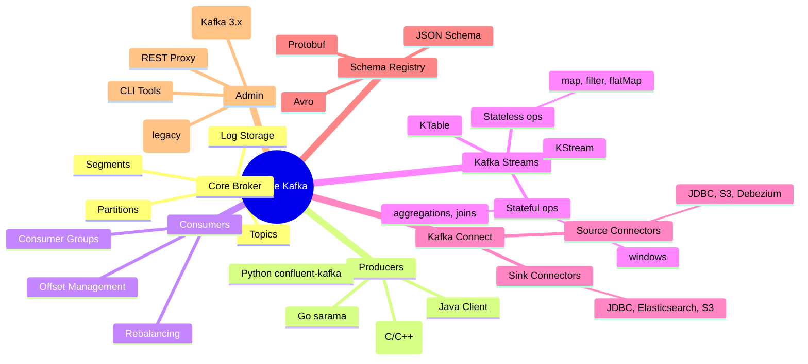
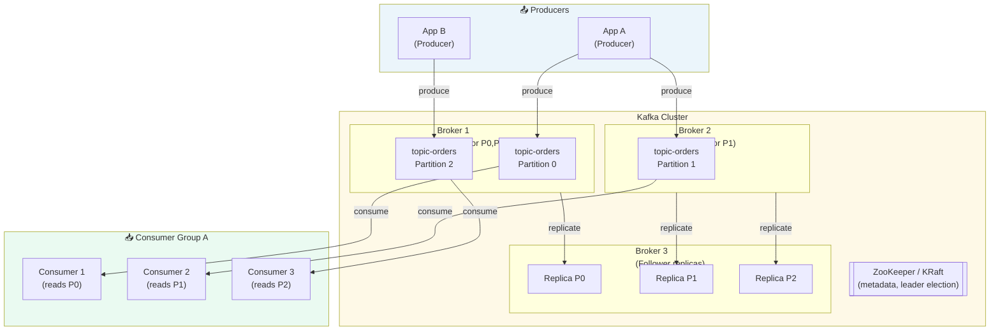
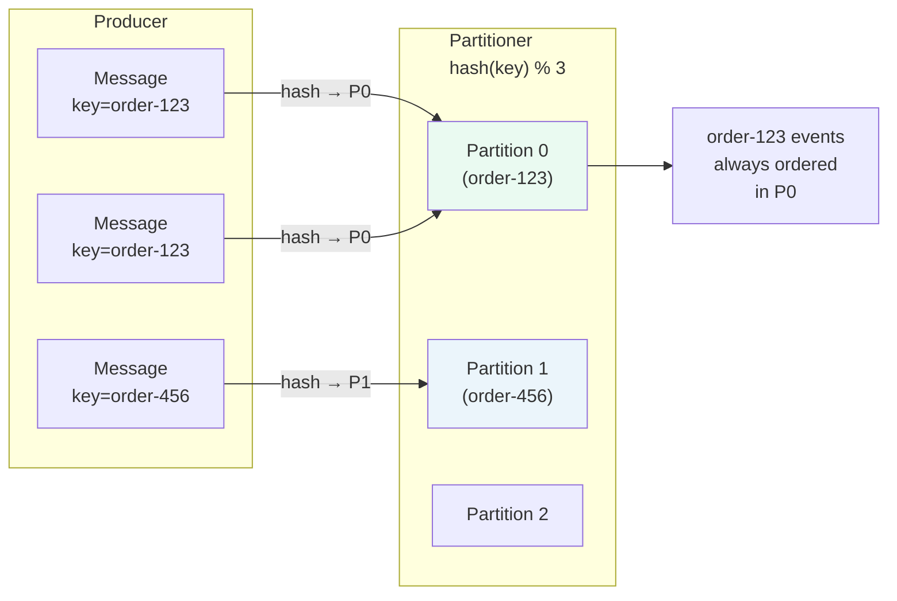
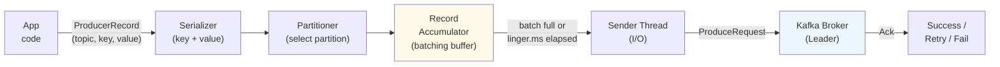
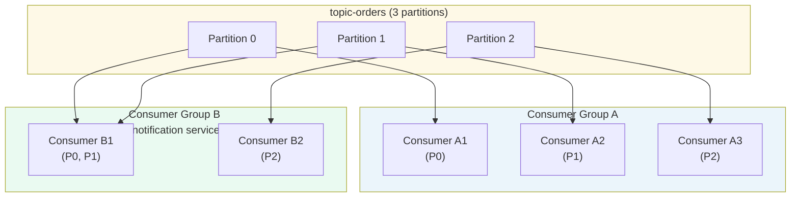
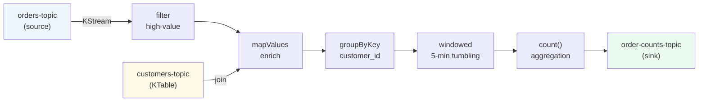
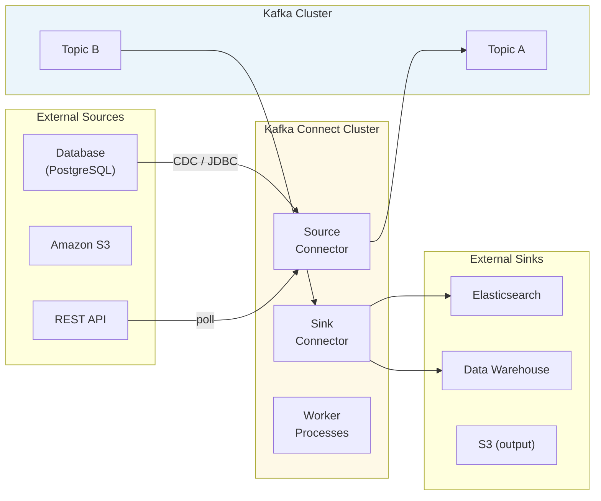

# 🟠 Apache Kafka — Deep Dive

> **Audience:** Developers and architects building event-driven systems
> **Goal:** Understand Kafka's architecture, APIs, configuration, and operational patterns in depth — from producer to consumer to stream processing.

---

## 📋 Table of Contents

| # | Section |
|---|---------|
| 1 | [What is Kafka?](#1-what-is-kafka) |
| 2 | [Core Architecture](#2-core-architecture) |
| 3 | [Topics & Partitions](#3-topics--partitions) |
| 4 | [Producers](#4-producers) |
| 5 | [Consumers & Consumer Groups](#5-consumers--consumer-groups) |
| 6 | [Offsets & Offset Management](#6-offsets--offset-management) |
| 7 | [Replication & Fault Tolerance](#7-replication--fault-tolerance) |
| 8 | [Delivery Semantics in Kafka](#8-delivery-semantics-in-kafka) |
| 9 | [Log Compaction & Retention](#9-log-compaction--retention) |
| 10 | [Kafka Streams](#10-kafka-streams) |
| 11 | [Kafka Connect](#11-kafka-connect) |
| 12 | [Schema Registry](#12-schema-registry) |
| 13 | [Key Configuration Reference](#13-key-configuration-reference) |
| 14 | [Kafka vs. Traditional Queues](#14-kafka-vs-traditional-queues) |
| 15 | [Production Best Practices](#15-production-best-practices) |
| 16 | [Quick Reference Cheatsheet](#16-quick-reference-cheatsheet) |

---

## 1. What is Kafka?

```
Apache Kafka is a distributed, durable, high-throughput event streaming platform.

Core idea: append-only, partitioned, replicated commit log
  - Producers append records to the end of a log
  - Consumers read records at their own pace using offsets
  - Records are retained for a configurable period (not deleted on consumption)
  - Any consumer can replay history from any offset

Originally built at LinkedIn (2011); open-sourced as Apache project.

Key numbers (production systems):
  - Millions of messages per second per cluster
  - Sub-10ms end-to-end latency at p99
  - Petabytes of retained data
  - Thousands of topics per cluster
```

### Kafka Ecosystem Map



---

## 2. Core Architecture



### Key Components

```
Broker:
  - A single Kafka server process
  - Stores partitions on local disk
  - Handles produce and fetch requests
  - A cluster = multiple brokers (typically 3–10)

Controller:
  - One broker elected as controller (KRaft: Raft consensus)
  - Manages partition leader elections
  - Handles broker failures

ZooKeeper / KRaft:
  - ZooKeeper: external coordination service (legacy, deprecated)
  - KRaft: built-in Raft consensus (Kafka 3.3+ default, removes ZooKeeper dependency)

Log:
  - Each partition is a log directory on disk
  - Log is split into segments (e.g., 1 GB each)
  - Old segments deleted or compacted based on retention policy
```

---

## 3. Topics & Partitions

### Topic

```
A topic is a named, ordered, immutable log of records.
  - Records are appended to the end (offset 0, 1, 2, ...)
  - Records are NOT deleted when consumed (unlike queues)
  - Consumers track their own position (offset) independently
  - Multiple consumer groups can read the same topic independently
```

### Partition

```
A topic is split into N partitions for parallelism.

Partition structure:
  topic-orders
  ├── Partition 0:  [msg0] [msg1] [msg2] [msg3] ... (offset 0→N)
  ├── Partition 1:  [msg0] [msg1] [msg2] ...
  └── Partition 2:  [msg0] [msg1] ...

Rules:
  - Messages WITHIN a partition are strictly ordered
  - Messages ACROSS partitions have no ordering guarantee
  - Each partition is handled by exactly one broker (leader)
  - Max parallelism = number of partitions

Partition count trade-offs:
  More partitions:
    + More parallelism → higher throughput
    + More consumer instances can run simultaneously
    - More file handles (OS limit)
    - Longer leader election on failure
    - More replication overhead
```

### Partition Key Selection

```
No key (null):      Round-robin across partitions
                    Max throughput, no ordering

With key:           hash(key) % num_partitions → same partition
                    Ordered per key, key locality
                    Example: order_id → all events for order in same partition

Custom partitioner: user-defined logic (e.g., by region)
```



---

## 4. Producers

### Producer Internals



### Producer Configuration

```
bootstrap.servers=broker1:9092,broker2:9092,broker3:9092
  # Initial brokers to discover the cluster (need not be all)

acks=all           # 0=fire-forget, 1=leader-ack, all=ISR-ack (safest)
retries=2147483647 # Max retries (use with idempotence)
retry.backoff.ms=100

enable.idempotence=true   # Exactly-once delivery per partition (Kafka 0.11+)
max.in.flight.requests.per.connection=5  # Must be ≤5 with idempotence

# Batching (throughput vs. latency)
batch.size=16384           # Max bytes per batch per partition (16 KB)
linger.ms=5                # Wait up to 5ms to fill batch (trade latency for throughput)
buffer.memory=33554432     # Total producer buffer (32 MB)

# Compression (always enable in production)
compression.type=snappy    # none, gzip, snappy, lz4, zstd

# Message size
max.request.size=1048576   # Max single request size (1 MB)

# Timeouts
request.timeout.ms=30000
delivery.timeout.ms=120000
```

### Producer Throughput Optimisation

```
Increase throughput:
  ↑ batch.size       → larger batches
  ↑ linger.ms        → wait longer to fill batch
  ↑ buffer.memory    → more buffering
  compression.type=snappy or lz4  → reduce network I/O

Reduce latency:
  linger.ms=0        → send immediately
  ack=1              → don't wait for ISR
  smaller batch.size → don't wait to fill
```

---

## 5. Consumers & Consumer Groups

### Consumer Group Model

```
Consumer Group:
  - A set of consumers sharing work on a topic
  - Each partition is assigned to EXACTLY ONE consumer in the group
  - Multiple groups can independently read the same topic
  - max parallelism = number of partitions

              topic-orders (3 partitions)
              ┌──────────────────────────────────┐
              │  P0       P1       P2             │
              └──────────────────────────────────┘
                 │         │         │
Group A:      [C1]       [C2]      [C3]      ← 3 consumers, 1 each
Group B:      [C4]       [C4]      [C5]      ← 2 consumers, one gets 2 partitions
Group C:      [C6]                            ← 1 consumer gets all 3 partitions
```



### Consumer Configuration

```
bootstrap.servers=broker1:9092,broker2:9092
group.id=my-consumer-group          # Identifies the consumer group

# Offset reset (what to do when no committed offset exists)
auto.offset.reset=earliest           # earliest | latest | none
  # earliest: read from beginning (useful for new groups)
  # latest:   read only new messages (default for existing groups)

# Committing offsets
enable.auto.commit=false             # Prefer manual commit for reliability
auto.commit.interval.ms=5000         # Interval for auto-commit (if enabled)

# Polling
max.poll.records=500                 # Max records returned per poll()
max.poll.interval.ms=300000          # Max time between polls before rebalance
session.timeout.ms=45000             # Heartbeat timeout before consumer considered dead
heartbeat.interval.ms=3000           # How often to send heartbeats

# Fetch tuning
fetch.min.bytes=1                    # Min bytes broker waits before sending
fetch.max.wait.ms=500               # Max wait if fetch.min.bytes not met
max.partition.fetch.bytes=1048576    # Max bytes fetched per partition per request
```

### Rebalancing

```
Rebalance: reassignment of partitions to consumers in the group.
Triggered by:
  - Consumer joins the group
  - Consumer leaves (or crashes / session timeout)
  - Topic partitions added
  - Consumer calls unsubscribe()

During rebalance:
  - ALL consumers stop consuming (stop-the-world in eager rebalance)
  - Group coordinator assigns partitions

Rebalance strategies:
  RangeAssignor (default): partitions assigned by range per topic
  RoundRobinAssignor:      distributes partitions round-robin
  StickyAssignor:          minimises partition movement on rebalance
  CooperativeStickyAssignor: incremental rebalance — only moved partitions pause (recommended)

Reduce rebalances:
  ↑ session.timeout.ms    → tolerate slow consumers
  ↑ max.poll.interval.ms  → tolerate slow processing
  ↑ heartbeat.interval.ms → faster failure detection
  Use static group membership (group.instance.id) for stable consumers
```

---

## 6. Offsets & Offset Management

```
Offset: integer position of a record within a partition (starts at 0).

Consumer commits offset N → "I have processed all messages up to N"
Next restart → consumer starts at N+1

Committed offsets stored in: __consumer_offsets topic (Kafka internal topic)
```

### Commit Strategies

```java
// Manual synchronous commit (safe, blocks until confirmed)
consumer.poll(Duration.ofMillis(100));
consumer.commitSync();

// Manual async commit (higher throughput, no blocking)
consumer.commitAsync((offsets, exception) -> {
    if (exception != null) log.error("Commit failed", exception);
});

// Commit specific offset (after processing each record)
consumer.commitSync(Collections.singletonMap(
    new TopicPartition(record.topic(), record.partition()),
    new OffsetAndMetadata(record.offset() + 1)
));
```

### At-Least-Once vs. Exactly-Once Consumer Patterns

```
At-Least-Once (default with manual commit):
  1. Poll records
  2. Process records
  3. Commit offset
  → If crash between 2 and 3: records reprocessed on restart
  → Consumer must be idempotent

Exactly-Once (with transactional consumer + producer):
  1. Poll records from input topic
  2. Process and produce to output topic in a transaction
  3. Commit offsets as part of same transaction
  → Kafka Streams handles this transparently
```

---

## 7. Replication & Fault Tolerance

```
Replication factor: how many copies of each partition exist across brokers.
  Minimum recommended: 3 (1 leader + 2 followers)

ISR (In-Sync Replicas):
  - Set of replicas that are fully caught up with the leader
  - Leader tracks ISR membership
  - Only ISR replicas can be elected as new leader
  - acks=all → leader waits for ALL ISR to acknowledge

min.insync.replicas (broker/topic setting):
  - Minimum number of ISR that must acknowledge a write
  - Combined with acks=all for durability
  - Example: replication.factor=3, min.insync.replicas=2
             → at most 1 broker can be down without blocking writes

Leader election:
  - ZooKeeper / KRaft controller detects leader failure
  - New leader elected from ISR
  - Consumers and producers reconnect to new leader
  - Takes ~30 seconds by default (tunable)
```

```
Durability configuration (recommended production):
  replication.factor=3
  min.insync.replicas=2
  acks=all
  enable.idempotence=true (producer)

  This means: a write is acknowledged only when 2 of 3 replicas
              have persisted it. Loss of 1 broker → no data loss,
              no write failure.
```

---

## 8. Delivery Semantics in Kafka

| Semantic | Producer Config | Consumer Pattern | Risk |
|----------|----------------|------------------|------|
| **At-Most-Once** | `acks=0`, no retries | Auto-commit before processing | Message loss |
| **At-Least-Once** | `acks=all`, retries, no idempotence | Manual commit after processing | Duplicates |
| **Exactly-Once** | `enable.idempotence=true` + transactions | Transactional consumer | Complexity |

### Exactly-Once with Kafka Transactions

```java
// Producer — transactional setup
props.put("transactional.id", "my-producer-1");
KafkaProducer<String, String> producer = new KafkaProducer<>(props);
producer.initTransactions();

// Transaction block
producer.beginTransaction();
try {
    producer.send(new ProducerRecord<>("output-topic", key, value));
    producer.sendOffsetsToTransaction(offsets, consumerGroupMetadata);
    producer.commitTransaction();
} catch (Exception e) {
    producer.abortTransaction();
}
```

---

## 9. Log Compaction & Retention

### Time / Size-Based Retention (Default)

```
log.retention.hours=168         # 7 days (default)
log.retention.bytes=-1          # -1 = unlimited by size
log.segment.bytes=1073741824    # 1 GB segments
log.segment.ms=604800000        # Roll segment after 7 days

Behaviour:
  - Entire log segments deleted when oldest message in segment exceeds retention
  - Messages cannot be deleted individually
```

### Log Compaction

```
cleanup.policy=compact           # Keep only the latest value per key

Compaction:
  Before: [key=A:v1] [key=B:v1] [key=A:v2] [key=C:v1] [key=B:v2]
  After:  [key=A:v2]            [key=C:v1]             [key=B:v2]

  - Last value per key is retained; older versions garbage collected
  - Tombstone: produce record with key + null value → key is deleted

Use cases:
  - Changelog topics (database-like semantics)
  - KTable state stores in Kafka Streams
  - User profile events (only latest matters)

Delete vs. Compact:
  cleanup.policy=delete          → time/size-based deletion (streaming)
  cleanup.policy=compact         → keep latest per key (changelog)
  cleanup.policy=compact,delete  → compact AND eventually delete old segments
```

---

## 10. Kafka Streams

Kafka Streams is a **library** (not a separate cluster) for building stream processing applications.

```
Input Kafka Topic ──▶ Kafka Streams App ──▶ Output Kafka Topic
(runs as normal Java app, no separate cluster needed)
```

### Core Abstractions

```
KStream:
  - Unbounded, continuously flowing stream of records
  - Each record is an independent event
  - Like a SQL INSERT stream

KTable:
  - Changelog stream; each key has a current value (latest wins)
  - Like a database table that changes over time
  - Backed by compacted topic

GlobalKTable:
  - KTable replicated to ALL application instances
  - Used for broadcast joins (lookup tables, enrichment)
```

### Stream Processing Operations

```java
StreamsBuilder builder = new StreamsBuilder();

// Source stream
KStream<String, Order> orders = builder.stream("orders-topic");

// Stateless operations
KStream<String, Order> highValue = orders
    .filter((key, order) -> order.getTotal() > 100.0)     // filter
    .mapValues(order -> enrichOrder(order))                // transform
    .selectKey((key, order) -> order.getCustomerId());     // re-key

// Aggregation (stateful — requires windowing or KTable)
KTable<String, Long> orderCountByCustomer = orders
    .groupByKey()
    .count();

// Windowed aggregation
KTable<Windowed<String>, Long> windowedCount = orders
    .groupByKey()
    .windowedBy(TimeWindows.ofSizeWithNoGrace(Duration.ofMinutes(5)))
    .count();

// Stream-Table join (enrich events with current table state)
KTable<String, Customer> customers = builder.table("customers-topic");
KStream<String, EnrichedOrder> enriched = orders.join(
    customers,
    (order, customer) -> new EnrichedOrder(order, customer)
);

// Sink
enriched.to("enriched-orders-topic");
```

### Kafka Streams Topology



### State Stores

```
Local state store:
  - RocksDB on local disk (default for large state)
  - In-memory HashMap (for small state)
  - Backed by changelog Kafka topic (fault tolerant)
  - Restored from changelog on restart or reassignment

Changelog topic:
  - Automatically created by Kafka Streams
  - Replication factor configurable
  - Used to restore state after failure
```

---

## 11. Kafka Connect

Kafka Connect is a **framework** for moving data between Kafka and external systems without writing custom code.



### Popular Connectors

| Connector | Direction | Use Case |
|-----------|-----------|----------|
| **Debezium MySQL/Postgres** | Source | CDC — capture every DB change as Kafka event |
| **JDBC Source/Sink** | Both | Sync relational DB ↔ Kafka |
| **S3 Source/Sink** | Both | Batch import/export to S3 |
| **Elasticsearch Sink** | Sink | Index Kafka events in Elasticsearch |
| **HDFS/Hadoop Sink** | Sink | Stream to data lake |
| **HTTP Source** | Source | Poll REST APIs into Kafka |
| **Snowflake Sink** | Sink | Load events into Snowflake |

### Connect Configuration Example (JDBC Source)

```json
{
  "name": "jdbc-orders-source",
  "config": {
    "connector.class": "io.confluent.connect.jdbc.JdbcSourceConnector",
    "connection.url": "jdbc:postgresql://db:5432/orders",
    "connection.user": "kafka",
    "connection.password": "secret",
    "table.whitelist": "orders,order_items",
    "mode": "timestamp+incrementing",
    "timestamp.column.name": "updated_at",
    "incrementing.column.name": "id",
    "topic.prefix": "db.",
    "poll.interval.ms": "1000"
  }
}
```

---

## 12. Schema Registry

```
Problem: Kafka is schema-agnostic (stores bytes).
         Without governance, producers and consumers break silently.

Schema Registry:
  - Centralised repository for Avro / Protobuf / JSON Schema definitions
  - Schemas versioned; compatibility enforced on registration
  - Producer serialises message, registers schema, sends schema-id + payload
  - Consumer fetches schema by id, deserialises message

Compatibility modes:
  BACKWARD:   new schema can read old data (add optional fields)
  FORWARD:    old schema can read new data (remove optional fields)
  FULL:       both backward and forward compatible
  NONE:       no compatibility check
```

```
Wire format with Schema Registry:
┌─────────┬────────────┬──────────────────────────────┐
│  Magic  │ Schema ID  │          Avro payload          │
│  (0x00) │  (4 bytes) │      (serialised record)       │
└─────────┴────────────┴──────────────────────────────┘
```

---

## 13. Key Configuration Reference

### Broker Configuration

```
# Replication
default.replication.factor=3
min.insync.replicas=2

# Log retention
log.retention.hours=168
log.retention.bytes=-1
log.cleanup.policy=delete

# Performance
num.network.threads=3
num.io.threads=8
socket.send.buffer.bytes=102400
socket.receive.buffer.bytes=102400
socket.request.max.bytes=104857600

# Compression
compression.type=producer          # honour producer compression
```

### Topic Creation CLI

```bash
# Create topic
kafka-topics.sh --bootstrap-server broker:9092 \
  --create --topic orders \
  --partitions 6 \
  --replication-factor 3 \
  --config retention.ms=604800000 \
  --config min.insync.replicas=2

# List topics
kafka-topics.sh --bootstrap-server broker:9092 --list

# Describe topic
kafka-topics.sh --bootstrap-server broker:9092 --describe --topic orders

# Increase partitions (cannot decrease)
kafka-topics.sh --bootstrap-server broker:9092 \
  --alter --topic orders --partitions 12
```

### Consumer Group CLI

```bash
# List consumer groups
kafka-consumer-groups.sh --bootstrap-server broker:9092 --list

# Describe group (shows lag per partition)
kafka-consumer-groups.sh --bootstrap-server broker:9092 \
  --describe --group my-service

# Reset offsets (reprocess from beginning)
kafka-consumer-groups.sh --bootstrap-server broker:9092 \
  --group my-service --topic orders --reset-offsets \
  --to-earliest --execute

# Reset to specific offset
kafka-consumer-groups.sh --bootstrap-server broker:9092 \
  --group my-service --topic orders --reset-offsets \
  --to-offset 1000 --execute
```

### Producer CLI

```bash
# Produce messages
kafka-console-producer.sh --bootstrap-server broker:9092 \
  --topic orders \
  --property "key.separator=:" \
  --property "parse.key=true"

# Produce with key: order-123:{"status":"created"}
```

### Consumer CLI

```bash
# Consume from beginning
kafka-console-consumer.sh --bootstrap-server broker:9092 \
  --topic orders \
  --from-beginning \
  --group debug-group

# Consume with key display
kafka-console-consumer.sh --bootstrap-server broker:9092 \
  --topic orders \
  --property "print.key=true" \
  --property "key.separator=:"
```

---

## 14. Kafka vs. Traditional Queues

| Aspect | Kafka | RabbitMQ | AWS SQS |
|--------|-------|----------|---------|
| **Model** | Distributed log | AMQP broker | Managed queue |
| **Message retention** | Configurable (days/forever) | Until consumed | Up to 14 days |
| **Replay** | ✓ Any consumer can re-read | ✗ Consumed = gone | ✗ Consumed = gone |
| **Ordering** | Per-partition | Per-queue | Best-effort (FIFO queue: per message group) |
| **Throughput** | Millions/sec | 100k/sec | Millions/sec |
| **Consumers** | Pull-based (consumer controls rate) | Push-based | Pull-based |
| **Consumer groups** | Multiple independent groups | Competing consumers only | Single consumer group per queue |
| **Message routing** | Simple: by topic/partition key | Complex: exchanges, bindings, routing keys | Simple: by queue name |
| **Schema enforcement** | Via Schema Registry (optional) | Not built-in | Not built-in |
| **Stream processing** | Kafka Streams (built-in) | No | Lambda, ECS (external) |
| **Best for** | Event streaming, log aggregation, CDC | Complex routing, task queues | AWS-native simple queuing |

---

## 15. Production Best Practices

```
Topic Design:
  ✓ Use partition key for ordering requirements (e.g., entity ID)
  ✓ Size partitions for ~1 GB/s throughput headroom
  ✓ Aim for 6–12 partitions per topic for typical workloads
  ✓ Separate topics for different event types (don't mix schemas)
  ✗ Don't create millions of topics (OS file handle limits)

Producer:
  ✓ Enable idempotence (enable.idempotence=true)
  ✓ Use acks=all + min.insync.replicas=2 for critical data
  ✓ Enable compression (snappy or lz4 for balanced throughput/CPU)
  ✓ Set delivery.timeout.ms appropriately
  ✗ Don't use acks=0 for any business-critical messages

Consumer:
  ✓ Use manual offset commit (enable.auto.commit=false)
  ✓ Commit after successful processing, not before
  ✓ Use CooperativeStickyAssignor to minimise rebalance impact
  ✓ Monitor consumer lag (alert if lag > threshold)
  ✗ Don't process heavy work inside poll loop without committing

Operations:
  ✓ Monitor: consumer lag, under-replicated partitions, broker disk usage
  ✓ Set up alerts on under-replicated partitions > 0
  ✓ Use separate JVM heap for Kafka Streams state stores vs. broker
  ✓ Plan capacity: #partitions × replication.factor × retention = disk needed
  ✓ Test failure scenarios (broker kill, consumer crash, network partition)

Schema:
  ✓ Use Avro or Protobuf with Schema Registry
  ✓ Set compatibility to BACKWARD or FULL
  ✓ Version schemas; never change field types or remove required fields
```

---

## 16. Quick Reference Cheatsheet

```
Kafka key concepts:
  Topic         → named log of records
  Partition     → ordered sub-unit of a topic; unit of parallelism
  Offset        → position in partition (0, 1, 2, ...)
  Consumer Group→ set of consumers sharing partitions
  ISR           → In-Sync Replicas; candidates for leader election

Partition selection:
  No key → round-robin (max throughput, no ordering)
  Key    → hash(key) % partitions (ordering per key)

Delivery semantics:
  acks=0  + no retry         → at-most-once
  acks=all + retry           → at-least-once (commit after processing)
  idempotence + transactions → exactly-once

Retention:
  cleanup.policy=delete  → time/size-based (streaming log)
  cleanup.policy=compact → keep latest per key (changelog/KTable)

Kafka Streams core:
  KStream → event stream (each record = independent event)
  KTable  → latest state per key (changelog)
  GlobalKTable → broadcast table replicated to all instances

Monitor:
  kafka.server:type=BrokerTopicMetrics → MessagesInPerSec
  kafka.server:type=ReplicaManager     → UnderReplicatedPartitions
  Consumer group lag via kafka-consumer-groups.sh --describe
```
