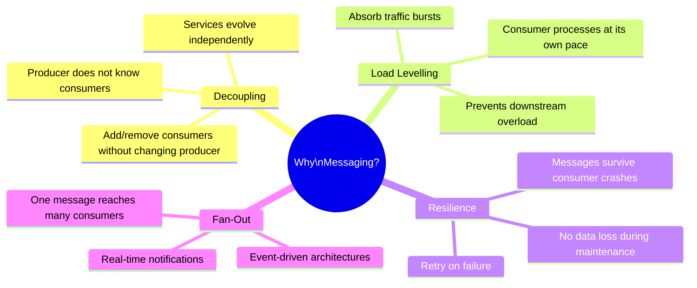
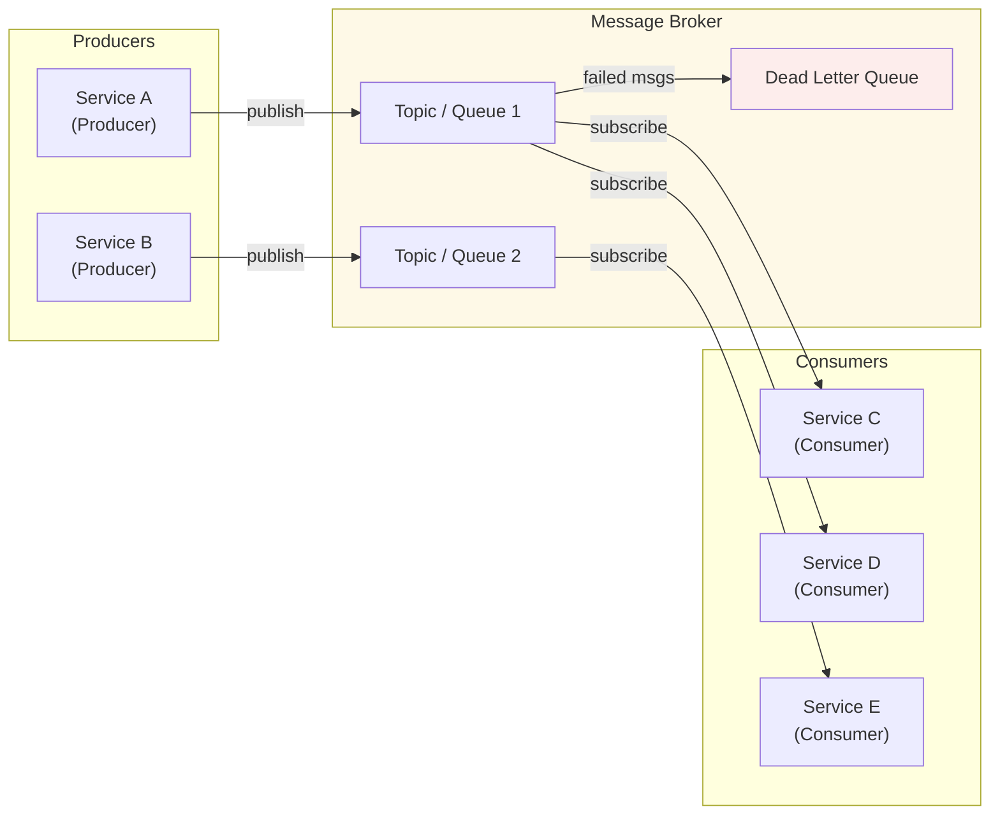
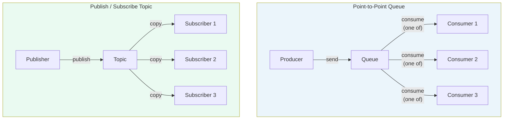
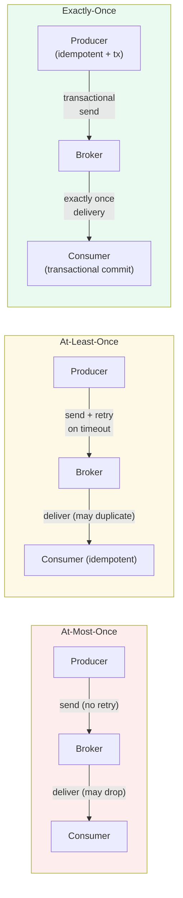
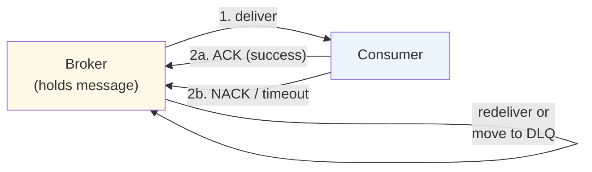
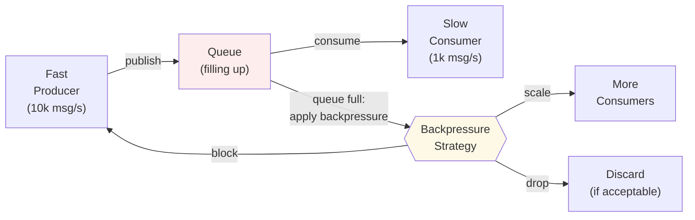
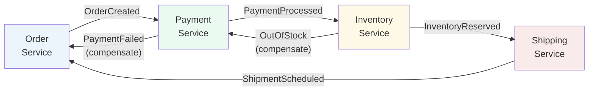
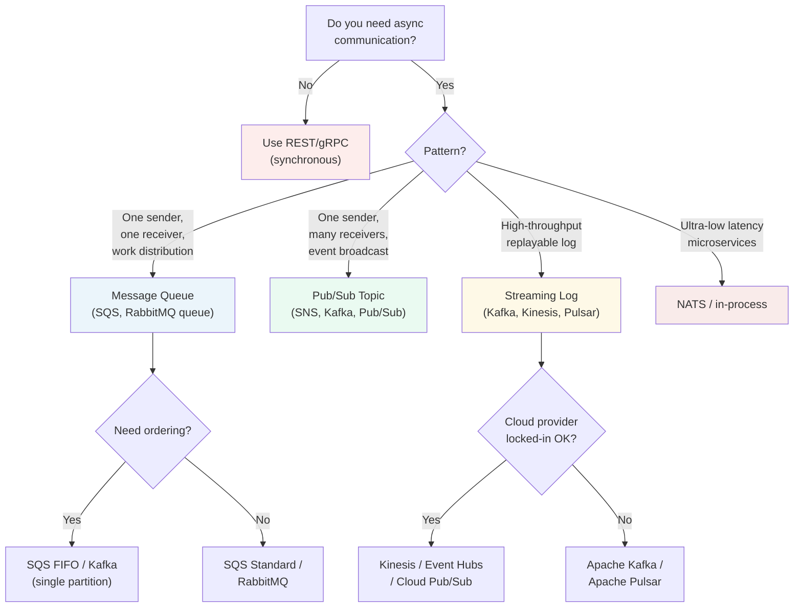

# 📬 Messaging Queue Fundamentals

> **Audience:** Developers and architects building distributed systems
> **Goal:** Understand the foundational concepts of message-based communication — queues, topics, delivery guarantees, ordering, and common patterns — before picking a specific technology.

---

## 📋 Table of Contents

| # | Section |
|---|---------|
| 1 | [Why Messaging?](#1-why-messaging) |
| 2 | [Core Concepts](#2-core-concepts) |
| 3 | [Queue vs. Pub/Sub](#3-queue-vs-pubsub) |
| 4 | [Delivery Semantics](#4-delivery-semantics) |
| 5 | [Message Ordering](#5-message-ordering) |
| 6 | [Durability & Persistence](#6-durability--persistence) |
| 7 | [Acknowledgment & Dead Letter Queues](#7-acknowledgment--dead-letter-queues) |
| 8 | [Backpressure](#8-backpressure) |
| 9 | [Messaging Patterns](#9-messaging-patterns) |
| 10 | [Messaging Systems Comparison](#10-messaging-systems-comparison) |
| 11 | [When to Use Messaging](#11-when-to-use-messaging) |
| 12 | [Quick Reference Cheatsheet](#12-quick-reference-cheatsheet) |

---

## 1. Why Messaging?

```
Synchronous (direct) call:
  Service A ──HTTP──▶ Service B
  + Simple, immediate response
  - A is blocked until B responds
  - A fails if B is down
  - Tight coupling

Asynchronous (message-based):
  Service A ──▶ [Queue/Topic] ──▶ Service B
  + A continues immediately after publishing
  + B can be down temporarily; message is retained
  + Rate mismatch handled by queue buffering
  + Multiple consumers can process independently
  - Eventual consistency
  - Harder to debug end-to-end
```

### The Four Key Benefits



---

## 2. Core Concepts

```
Producer  — the application that creates and sends messages
Message   — the unit of data (payload + metadata/headers)
Broker    — the server that stores and routes messages
Queue     — ordered buffer holding messages for one consumer group
Topic     — named channel; multiple consumers can subscribe
Partition — subdivision of a topic for parallelism (Kafka)
Offset    — position of a message within a partition (Kafka)
Consumer  — application that reads and processes messages
Consumer Group — set of consumers sharing work on a topic
Exchange  — AMQP routing component (RabbitMQ) that decides which queue
Binding   — rule connecting an exchange to a queue (RabbitMQ)
```

### Anatomy of a Message

```
┌───────────────────────────────────────────────────────────┐
│                        MESSAGE                            │
├─────────────────┬─────────────────────────────────────────┤
│    HEADERS      │               PAYLOAD                   │
│                 │                                         │
│  message-id     │   {"order_id": "ORD-123",              │
│  timestamp      │    "customer_id": "CUST-456",          │
│  correlation-id │    "items": [...],                     │
│  content-type   │    "total": 49.99}                     │
│  reply-to       │                                         │
│  ttl            │   (binary blob, JSON, Avro, Protobuf)  │
└─────────────────┴─────────────────────────────────────────┘
```

### Message Broker Architecture



---

## 3. Queue vs. Pub/Sub

```
Point-to-Point Queue (P2P):
  - One producer, one consumer (or competing consumers)
  - Each message processed ONCE by exactly one consumer
  - Message deleted after consumption
  - Use for: task distribution, work queues, RPC

Publish-Subscribe (Pub/Sub):
  - One producer, MANY consumers (subscribers)
  - Each subscriber gets its own copy of the message
  - Subscribers are independent
  - Use for: event notification, fan-out, audit logging
```



| Aspect | Queue (P2P) | Pub/Sub Topic |
|--------|-------------|---------------|
| **Consumers** | One consumer processes each message | All subscribers get each message |
| **Scalability** | Add consumers to increase throughput | Add subscribers for new use cases |
| **Message retention** | Deleted after consumption | Retained until all subscribers ack (or TTL) |
| **Use case** | Work distribution, task queues | Event broadcast, fan-out |
| **Examples** | AWS SQS, RabbitMQ queue | AWS SNS, Kafka topic, Google Pub/Sub |

---

## 4. Delivery Semantics

The three guarantees a messaging system can offer:

```
At-Most-Once:
  - Message delivered 0 or 1 times; may be lost
  - Producer fires and forgets; no retries
  - Consumer processes before acknowledging
  - Use when: data loss is acceptable (metrics, telemetry)
  + Lowest latency, no duplicate handling needed
  - Data loss possible

At-Least-Once:
  - Message delivered 1 or more times; may be duplicated
  - Producer retries on failure
  - Consumer acknowledges only after successful processing
  - Use when: duplicates are tolerable or idempotency is implemented
  + No data loss
  - Consumer must handle duplicates (idempotent operations)

Exactly-Once:
  - Message delivered exactly once, no duplicates, no loss
  - Requires distributed coordination (2PC or idempotent writes + transactions)
  - Most expensive guarantee
  - Use when: financial transactions, inventory, billing
  + Strongest guarantee
  - Higher latency, more complex implementation
```



### Idempotency — The Key to At-Least-Once Safety

```
Idempotent operation: applying it multiple times has the same effect as once.

Examples:
  ✓ Upsert by primary key: INSERT ... ON CONFLICT DO UPDATE
  ✓ Set a value:  SET account_balance = 100  (vs. ADD 50)
  ✓ Deduplication by message-id: skip if already processed
  ✗ Append log line: results in duplicates
  ✗ Increment counter: results in over-counting
```

---

## 5. Message Ordering

```
Global ordering:
  - All messages across the system arrive in send order
  - Requires single partition / single queue
  - Bottleneck at high throughput
  - Kafka: single partition guarantees order within that partition

Partition-level ordering (Kafka):
  - Messages with the same partition key always go to the same partition
  - Ordered within partition, not across partitions
  - Scale by increasing partitions without sacrificing per-key order
  - Example: order_id as key → all events for one order are ordered

No ordering guarantee:
  - Consumers process messages independently
  - Best throughput
  - Use when order does not matter (independent tasks)
```

### Ordering Trade-off

```
Parallelism ◄─────────────────────────────────────► Ordering
    High                                              Strong
  (many partitions / consumers,                  (single partition,
   no order guarantee)                           sequential processing)
```

---

## 6. Durability & Persistence

```
In-memory (non-durable):
  - Messages stored only in RAM
  - Lost if broker restarts
  - Highest throughput
  - Use for: ephemeral data, real-time metrics where loss is acceptable

Persistent (durable):
  - Messages written to disk before acknowledgment
  - Survives broker restarts
  - Slightly higher latency (disk write)
  - Use for: financial events, orders, audit trails

Replication:
  - Messages copied to multiple broker nodes
  - Survives single broker failure
  - Kafka: replication factor (e.g., 3 replicas)
  - RabbitMQ: quorum queues (Raft consensus)

Retention:
  - How long messages are kept after consumption
  - Kafka: time-based (7 days default) or size-based
  - Allows consumers to replay history or recover from failure
```

| Durability Level | Storage | Replication | Survives Broker Restart | Use Case |
|-----------------|---------|-------------|------------------------|----------|
| **None** | Memory only | No | ✗ | Ephemeral, high-speed |
| **Disk** | Disk | No | ✓ | Single-node reliability |
| **Replicated** | Disk | Yes (multi-node) | ✓ | Production, HA |
| **Geo-replicated** | Disk | Cross-region | ✓ | Disaster recovery |

---

## 7. Acknowledgment & Dead Letter Queues

### Acknowledgment Flow



```
ACK  (acknowledge):   consumer successfully processed message → broker deletes it
NACK (negative ack):  consumer failed to process → broker requeues or sends to DLQ
Visibility timeout:   message hidden from other consumers while being processed
                      (SQS pattern); if not ACKed within timeout, redelivered
```

### Dead Letter Queue (DLQ)

```
Dead Letter Queue — a holding area for messages that cannot be processed.

A message is sent to the DLQ when:
  - Consumer NACKs and max retries exceeded
  - Message TTL (time-to-live) expires
  - Message size exceeds limit
  - Consumer queue is full (overflow)

DLQ workflow:
  1. Message fails processing
  2. Broker retries N times (configurable)
  3. After N failures → moved to DLQ
  4. Operations team inspects and resolves root cause
  5. Message replayed after fix

Best practices:
  ✓ Always configure a DLQ in production
  ✓ Alert on DLQ depth > 0
  ✓ Include original message + error context in DLQ message
  ✓ Build tooling to replay DLQ messages after fixes
```

```
Normal flow:    Producer → Queue ──▶ Consumer (success) → ACK
Retry flow:     Producer → Queue ──▶ Consumer (fail)   → NACK → redeliver (max 3x)
DLQ flow:       Producer → Queue ──▶ Consumer (fail x3) → DLQ → Manual review
```

---

## 8. Backpressure

```
Problem:
  Producer publishes 10,000 msg/s
  Consumer processes   1,000 msg/s
  Queue fills up → memory/disk exhausted → broker crash or message loss

Backpressure strategies:
  1. Block producer:   slow down publisher when queue is full
                       Simple but can cascade failures upstream

  2. Drop messages:    discard new messages when queue full
                       Acceptable for non-critical, idempotent data

  3. Scale consumers:  add more consumer instances (horizontal scaling)
                       Best long-term solution

  4. Rate limiting:    limit producer throughput at source
                       Prevents queue saturation from the start

  5. Consumer pull:    consumer requests messages when ready (Kafka model)
                       Natural backpressure; consumer controls its own rate
```



---

## 9. Messaging Patterns

### Request-Reply

```
Synchronous-style RPC over async messaging:
  Requester                    Responder
      │── request ──▶ Queue A ──▶│
      │                          │ (processes)
      │◀─ reply ── Queue B ◀────│
      │  (reply-to: Queue B,     │
      │   correlation-id: xyz)   │

Use for: orchestration, async RPC where result is needed
```

### Fan-Out / Broadcast

```
One publisher → many independent subscribers:
  Publisher ──▶ Topic ──┬──▶ Subscriber 1 (email notification)
                        ├──▶ Subscriber 2 (analytics)
                        ├──▶ Subscriber 3 (audit log)
                        └──▶ Subscriber 4 (cache invalidation)

Use for: event-driven architectures, audit, notifications
```

### Event Sourcing

```
All changes stored as immutable events in a log:
  Command ──▶ Service ──▶ Event Log (topic)
                              │
               ┌──────────────┼──────────────┐
               ▼              ▼              ▼
          Read Model 1   Read Model 2   Read Model 3
           (current       (analytics)    (search)
            state)

Use for: audit trail, time-travel queries, CQRS
```

### Competing Consumers (Work Queue)

```
Scale processing by having multiple consumers share a queue:
  Queue ──▶ Consumer 1 (processing task A)
        ──▶ Consumer 2 (processing task B)
        ──▶ Consumer 3 (processing task C)

Each task processed by exactly one consumer.
Use for: job queues, batch processing, email sending
```

### Saga Pattern (Distributed Transactions)



---

## 10. Messaging Systems Comparison

| System | Model | Protocol | Ordering | Throughput | Retention | Best For |
|--------|-------|----------|----------|------------|-----------|----------|
| **Apache Kafka** | Pub/Sub + Log | Custom (TCP) | Per-partition | Very High (millions/s) | Configurable (days–forever) | Event streaming, log aggregation |
| **Apache Pulsar** | Pub/Sub + Queue | Custom (TCP) | Per-partition | Very High | Tiered storage | Multi-tenant, geo-replication |
| **RabbitMQ** | Queue + Pub/Sub | AMQP / MQTT | Per-queue | High (100k/s) | Until consumed | Task queues, complex routing |
| **AWS SQS** | Queue | HTTP | Best-effort (FIFO optional) | High | 14 days | Serverless, AWS-native |
| **AWS SNS** | Pub/Sub (fan-out) | HTTP | None | Very High | No retention | Fan-out to SQS/Lambda/HTTP |
| **AWS Kinesis** | Streaming log | HTTP | Per-shard | High | 7–365 days | Real-time analytics, AWS ecosystem |
| **Azure Event Hubs** | Streaming log | AMQP / HTTP | Per-partition | Very High | 1–90 days | Azure ecosystem, Kafka-compatible |
| **Google Pub/Sub** | Pub/Sub | HTTP/gRPC | Best-effort | Very High | 7 days | GCP ecosystem, serverless |
| **NATS** | Pub/Sub + Queue | Custom (TCP) | Per-subject | Extremely High | JetStream optional | Low-latency microservices |
| **ActiveMQ** | Queue + Topic | AMQP / STOMP | Per-queue | Medium | Configurable | Legacy enterprise, JMS |

---

## 11. When to Use Messaging



---

## 12. Quick Reference Cheatsheet

```
Delivery semantics:
  At-most-once  → fire-and-forget; lowest latency; risk of loss
  At-least-once → retry on failure; consumer must be idempotent
  Exactly-once  → transactional; highest cost; for financial/billing

Queue vs. Pub/Sub:
  Queue  → work distribution; one consumer per message
  Topic  → fan-out; all subscribers get each message

Ordering:
  Global order    → single partition/queue; bottleneck
  Partition order → messages with same key → same partition (Kafka)
  Unordered       → maximum throughput

Dead Letter Queue:
  Always configure; alert on DLQ depth; replay after fix

Backpressure:
  Consumer pull model (Kafka) = natural backpressure
  Otherwise: scale consumers or rate-limit producer

Key patterns:
  Work Queue      → competing consumers, task distribution
  Fan-Out         → pub/sub, event broadcast
  Request-Reply   → async RPC with correlation-id
  Event Sourcing  → immutable log, replay history
  Saga            → distributed transactions via compensating events
```
