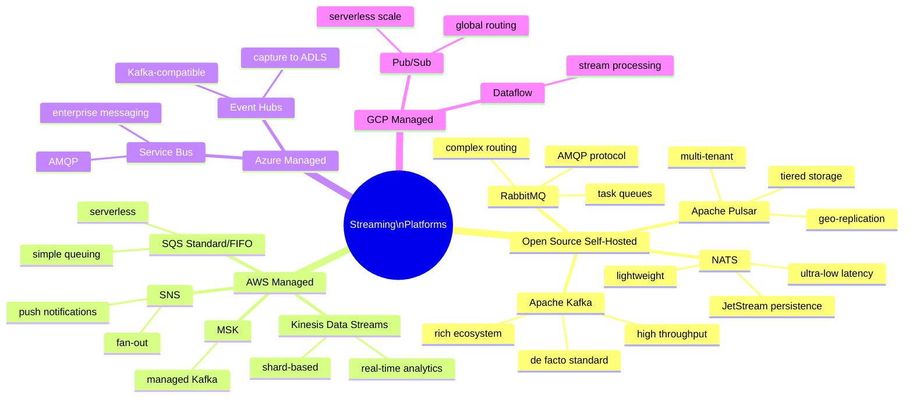
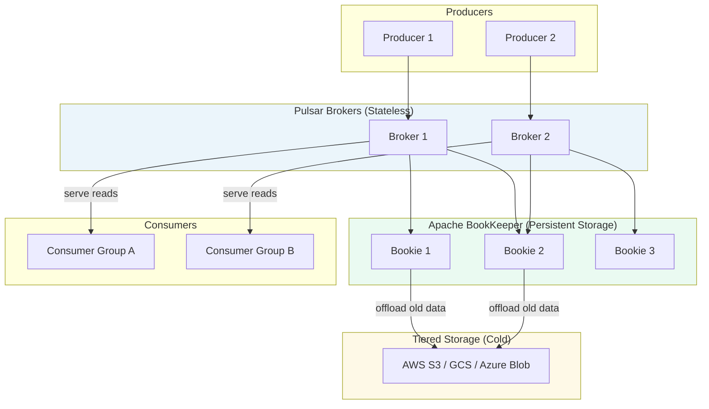
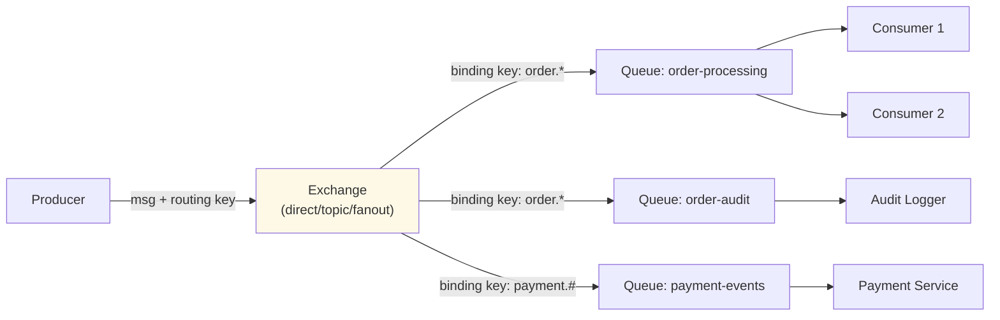
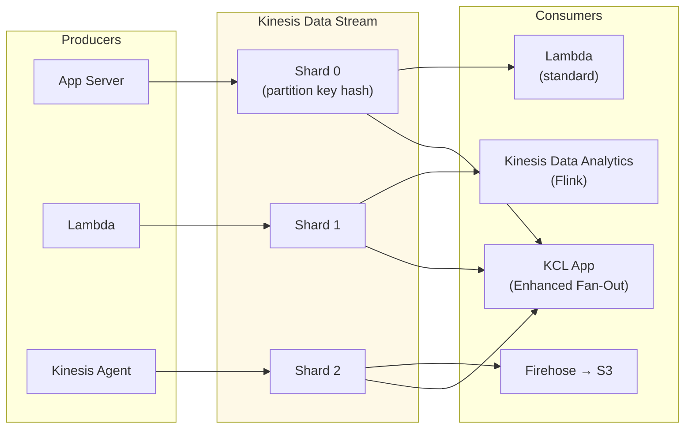
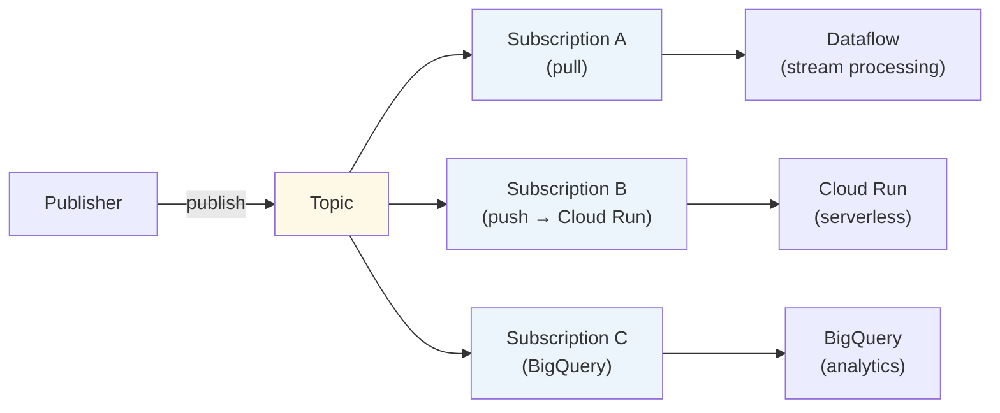
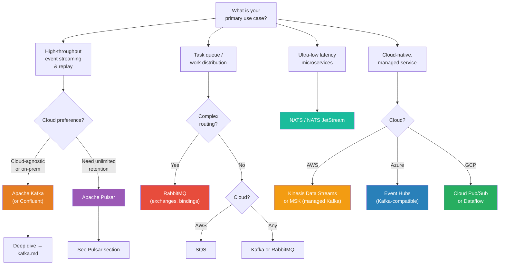

# 🌊 Streaming Platforms — Landscape & Comparison

> **Audience:** Architects and engineers evaluating streaming and messaging platforms
> **Goal:** Understand the major streaming platforms, their architectures, trade-offs, and when to use each one.

---

## 📋 Table of Contents

| # | Section |
|---|---------|
| 1 | [Streaming Platform Landscape](#1-streaming-platform-landscape) |
| 2 | [Apache Kafka](#2-apache-kafka) |
| 3 | [Apache Pulsar](#3-apache-pulsar) |
| 4 | [RabbitMQ](#4-rabbitmq) |
| 5 | [AWS Kinesis](#5-aws-kinesis) |
| 6 | [Azure Event Hubs](#6-azure-event-hubs) |
| 7 | [Google Cloud Pub/Sub](#7-google-cloud-pubsub) |
| 8 | [NATS / NATS JetStream](#8-nats--nats-jetstream) |
| 9 | [AWS SQS + SNS](#9-aws-sqs--sns) |
| 10 | [Full Comparison Matrix](#10-full-comparison-matrix) |
| 11 | [Decision Guide](#11-decision-guide) |
| 12 | [Quick Reference Cheatsheet](#12-quick-reference-cheatsheet) |

---

## 1. Streaming Platform Landscape



---

## 2. Apache Kafka

### Architecture Overview

```
Kafka is a distributed, replicated commit log.
  - Immutable, append-only log per partition
  - Consumers control their own read position (offset)
  - Messages retained regardless of consumption (configurable TTL)
  - Horizontal scale by adding partitions and brokers

Components:
  Broker    → server storing partitions
  ZooKeeper → metadata and leader election (deprecated in KRaft mode)
  KRaft     → built-in Raft consensus (Kafka 3.3+, removes ZooKeeper)
  Producer  → writes records to topics
  Consumer  → reads records using consumer groups
```

### Kafka Strengths & Weaknesses

```
Strengths:
  ✓ Highest throughput (millions of events/sec per cluster)
  ✓ Durable, replayable log — consumers can re-read history
  ✓ Multiple independent consumer groups on same topic
  ✓ Rich ecosystem: Kafka Streams, Connect, Schema Registry, KSQL
  ✓ De facto standard — wide tool and cloud support (MSK, Confluent, Aiven)
  ✓ Exactly-once semantics (with transactions)
  ✓ Log compaction for changelog/CDC use cases

Weaknesses:
  ✗ Operational complexity (partitions, replication, ZooKeeper/KRaft)
  ✗ No native support for complex message routing (use separate bus)
  ✗ Partition count fixed at creation (can increase, not decrease)
  ✗ High latency for very small messages at low throughput
  ✗ Not ideal for RPC-style request-reply patterns
  ✗ Requires careful capacity planning (disk, partition count)
```

### When to Choose Kafka

```
Use Kafka when:
  ✓ High-throughput event streaming (>100k messages/sec)
  ✓ Multiple independent consumers reading same stream
  ✓ Need to replay historical data
  ✓ Building CDC (change data capture) pipelines
  ✓ Stream processing with Kafka Streams or Flink
  ✓ You want a unified log for all services (event backbone)
  ✓ Exactly-once processing guarantees required
  ✓ Long retention (days to forever) needed
```

---

## 3. Apache Pulsar

### Architecture Overview



### Key Differentiators vs. Kafka

```
Kafka:                          Pulsar:
  Broker is stateful              Broker is STATELESS
  (stores data locally)           (data stored in BookKeeper)

  Partition rebalance             Broker scale is independent of
  moves data → slow               storage scale → fast

  Single-layer storage            Tiered storage: hot in BookKeeper,
                                  cold automatically offloaded to S3/GCS

  Consumer groups                 Multiple subscription types:
  (shared, one assignment)          Exclusive (1 consumer)
                                    Failover (active-standby)
                                    Shared (competing consumers)
                                    Key_Shared (key-based routing)

  Single namespace                Multi-tenant namespaces
                                  (tenants/namespaces/topics)
```

### Pulsar Strengths & Weaknesses

```
Strengths:
  ✓ Native multi-tenancy with resource isolation
  ✓ Tiered storage — virtually unlimited retention at S3 cost
  ✓ Stateless brokers — scale compute and storage independently
  ✓ Built-in geo-replication across datacentres
  ✓ Flexible subscription models (exclusive, shared, key-shared, failover)
  ✓ Native Functions (lightweight stream processing without external framework)
  ✓ Built-in schema registry

Weaknesses:
  ✗ More complex operational model (Broker + BookKeeper + ZooKeeper)
  ✗ Smaller ecosystem than Kafka
  ✗ Fewer production deployments / less community knowledge
  ✗ Higher infrastructure cost (more components)
  ✗ Kafka Streams equivalent (Pulsar Functions) less mature

When to choose Pulsar over Kafka:
  ✓ Multi-tenant SaaS platform needing resource isolation per tenant
  ✓ Unlimited retention needed (tiered storage to object store)
  ✓ Multi-datacenter geo-replication required natively
  ✓ Mixed queue + stream workloads on a single platform
```

---

## 4. RabbitMQ

### Architecture Overview

```
RabbitMQ is a traditional AMQP message broker.

Producer → Exchange → Binding → Queue → Consumer

Exchange types:
  direct:  route by exact routing key match
  fanout:  route to all bound queues (broadcast)
  topic:   route by routing key pattern (* = one word, # = multiple)
  headers: route by message header attributes

Queue types (RabbitMQ 3.8+):
  Classic:  original, single-node storage
  Quorum:   Raft-based replication (recommended for durability)
  Stream:   append-only log with replay (like Kafka topic)
```



### RabbitMQ Strengths & Weaknesses

```
Strengths:
  ✓ Flexible message routing (exchanges, bindings, routing keys)
  ✓ Multiple protocols: AMQP 0-9-1, AMQP 1.0, MQTT, STOMP
  ✓ Mature, battle-tested (>15 years in production)
  ✓ Good support for complex routing topologies
  ✓ Quorum queues for high availability
  ✓ Management UI out of the box
  ✓ Priority queues, TTL, dead-letter, delayed messages built-in
  ✓ Lower operational complexity than Kafka for simple use cases

Weaknesses:
  ✗ Lower throughput than Kafka for streaming workloads
  ✗ No native log replay (consumed = gone, unless using Stream queues)
  ✗ Memory-intensive; requires careful memory alarm tuning
  ✗ Not designed for very high partition counts
  ✗ Weaker stream processing story
  ✗ No native tiered storage

When to choose RabbitMQ:
  ✓ Task queues (email, image processing, background jobs)
  ✓ Complex routing requirements (topic/header-based)
  ✓ Multiple protocols needed (AMQP + MQTT for IoT)
  ✓ Low-to-medium throughput (<100k msg/sec)
  ✓ Priority queue or delayed message requirements
  ✓ Teams familiar with AMQP
```

---

## 5. AWS Kinesis

### Architecture Overview

```
Kinesis Data Streams = AWS-managed distributed streaming log.

Concepts:
  Stream     → named collection of shards
  Shard      → unit of capacity (1 MB/s in, 2 MB/s out, 1000 records/s)
  Record     → data blob (up to 1 MB) + partition key + sequence number
  Partition Key → determines which shard (like Kafka partition key)

Capacity:
  Scale by splitting/merging shards
  1 shard → 1 MB/s ingest, 2 MB/s read (per consumer)
  On-demand mode → auto-scales shards

Enhanced Fan-Out (EFO):
  Dedicated 2 MB/s throughput per consumer per shard
  Push-based delivery via HTTP/2 (vs. polling in standard mode)
```



### Kinesis Strengths & Weaknesses

```
Strengths:
  ✓ Fully managed — no cluster to operate
  ✓ Native AWS integrations (Lambda, Firehose, Analytics, DynamoDB)
  ✓ Enhanced Fan-Out: dedicated throughput per consumer
  ✓ Serverless-friendly
  ✓ Pay per shard-hour (predictable pricing)
  ✓ Retention: 24h default, up to 365 days (extended retention)

Weaknesses:
  ✗ AWS lock-in
  ✗ Shard-based capacity: must manually split/merge (or use on-demand)
  ✗ Record size limit: 1 MB
  ✗ No Kafka-compatible API (cannot use Kafka clients directly)
  ✗ More expensive than self-hosted Kafka at scale
  ✗ Limited ecosystem (no Streams equivalent, no Connect)

When to choose Kinesis:
  ✓ All-in on AWS and want zero operational overhead
  ✓ Serverless architecture (Lambda consumers)
  ✓ Moderate throughput (can scale shards as needed)
  ✓ AWS-native analytics pipeline (Kinesis → Firehose → S3 → Athena)
  ✓ Don't need Kafka-specific features
```

---

## 6. Azure Event Hubs

### Architecture Overview

```
Event Hubs = Azure-managed Kafka-compatible streaming service.

Key facts:
  - Kafka-compatible API (Kafka clients work against Event Hubs)
  - Partitions: 1–32 per Event Hub (Standard), up to 2000 (Premium)
  - Retention: 1–90 days
  - Capture: automatically archive events to Azure Data Lake Storage / Blob
  - Premium/Dedicated tiers for isolation and higher throughput

Namespaces:
  Namespace → Event Hub 1 (topic)
            → Event Hub 2 (topic)
            → Event Hub N (topic)

Tiers:
  Basic:     1 consumer group, 1 day retention
  Standard:  20 consumer groups, 7 days retention, 10 MB/s
  Premium:   dedicated resources, 10–100 partitions
  Dedicated: dedicated cluster, custom capacity
```

### Event Hubs Strengths & Weaknesses

```
Strengths:
  ✓ Kafka-compatible API — migrate Kafka apps with minimal changes
  ✓ Fully managed (Azure SLA)
  ✓ Native Azure integrations (Stream Analytics, Functions, Logic Apps)
  ✓ Capture to ADLS Gen2 or Blob Storage automatically
  ✓ Geo-disaster recovery (metadata replication)
  ✓ Schema Registry built-in (Standard tier+)

Weaknesses:
  ✗ Azure lock-in (despite Kafka API compatibility)
  ✗ Partition count limit (32 per hub in Standard)
  ✗ Kafka API compatibility is not 100% (some Kafka features unsupported)
  ✗ Cannot use Kafka Streams or Kafka Connect fully
  ✗ Pricing adds up at high throughput

When to choose Event Hubs:
  ✓ Azure-native architecture
  ✓ Existing Kafka workloads migrating to Azure
  ✓ Need managed service with auto-capture to data lake
  ✓ Azure Stream Analytics or Databricks as consumers
```

---

## 7. Google Cloud Pub/Sub

### Architecture Overview

```
Google Pub/Sub = fully managed, global pub/sub messaging.

Concepts:
  Topic        → named resource to which producers publish
  Subscription → named resource representing interest in a topic
                 (each subscription receives all messages independently)
  Subscriber   → pull or push consumer of a subscription

Delivery:
  Pull:  subscriber polls for messages (at-least-once, manual ack)
  Push:  Pub/Sub pushes to a HTTPS endpoint (serverless-friendly)
  BigQuery subscription: stream directly to BigQuery table
  Cloud Storage subscription: write to GCS
```



### Pub/Sub Strengths & Weaknesses

```
Strengths:
  ✓ Serverless — no capacity planning, auto-scales globally
  ✓ Global routing — messages routed to nearest region
  ✓ Native GCP integrations (Dataflow, BigQuery, Cloud Run, GKE)
  ✓ Push delivery — ideal for serverless/event-driven architectures
  ✓ Exactly-once delivery (Pub/Sub Lite)
  ✓ Dead-letter topics built-in
  ✓ Ordering keys for per-key ordering

Weaknesses:
  ✗ GCP lock-in
  ✗ No replay by time (only by subscription backlog)
  ✗ 7-day retention only
  ✗ Not Kafka-compatible
  ✗ Limited ecosystem compared to Kafka
  ✗ Ordering requires ordering key (not default)

When to choose Pub/Sub:
  ✓ GCP-native architecture
  ✓ Serverless event-driven pipeline (Cloud Run + Pub/Sub)
  ✓ Dataflow streaming jobs
  ✓ Real-time analytics into BigQuery
```

---

## 8. NATS / NATS JetStream

### Architecture Overview

```
NATS: ultra-lightweight, high-performance messaging system.
  - Core NATS: at-most-once, no persistence
  - JetStream: persistence layer on top of NATS (at-least-once / exactly-once)

Subjects (topics):
  - Hierarchical: "orders.created", "orders.updated"
  - Wildcards: "orders.*" (single token), "orders.>" (multi-token)

NATS models:
  Publish-Subscribe:  1 publisher → all subscribers
  Queue Groups:       competing consumers (like Kafka consumer groups)
  Request-Reply:      built-in RPC pattern
  JetStream:          persistent streams with configurable retention
```

### NATS Strengths & Weaknesses

```
Strengths:
  ✓ Extremely low latency (<1ms end-to-end in same DC)
  ✓ Very lightweight (single binary, <10 MB)
  ✓ Simple operation (no ZooKeeper, no BookKeeper)
  ✓ Native request-reply pattern (built-in correlation-id)
  ✓ Multi-protocol: NATS, WebSockets, MQTT (via NATS)
  ✓ JetStream provides durability when needed
  ✓ Edge-friendly (runs on IoT devices, edge nodes)

Weaknesses:
  ✗ Smaller ecosystem than Kafka
  ✗ JetStream is less mature than Kafka for high-volume streaming
  ✗ No Kafka-compatible API
  ✗ Less tooling (no Kafka Streams equivalent)
  ✗ Core NATS: at-most-once (no persistence)

When to choose NATS:
  ✓ Ultra-low latency microservice communication
  ✓ IoT / edge computing
  ✓ Request-reply RPC over messaging
  ✓ Lightweight service mesh alternative
  ✓ Multi-protocol (MQTT + NATS + WebSocket) needed
```

---

## 9. AWS SQS + SNS

### SQS — Simple Queue Service

```
SQS is a fully managed message queue (point-to-point).

Queue types:
  Standard:  at-least-once, best-effort ordering, unlimited throughput
  FIFO:      exactly-once, strict ordering within message group, 3000 msg/s

Key features:
  Visibility timeout:  message hidden from other consumers while processed
  Dead Letter Queue:   configurable; moves unprocessed messages after N retries
  Long polling:        reduces empty receives (up to 20s wait)
  Delay queue:         delay message delivery 0–900 seconds
  Message size:        up to 256 KB (use S3 for larger payloads)
  Retention:           1 minute to 14 days (default 4 days)
```

### SNS — Simple Notification Service

```
SNS is a fully managed pub/sub service (fan-out).

Fan-out:
  SNS Topic → SQS Queue (durable, buffered)
            → Lambda function (serverless)
            → HTTP/HTTPS endpoint
            → Email / SMS
            → Kinesis Data Firehose

Common pattern (SNS + SQS fan-out):
  Producer → SNS Topic → SQS Queue A → Consumer Service A
                       → SQS Queue B → Consumer Service B
                       → SQS Queue C → Consumer Service C

This gives each consumer its own durable queue while using SNS for fan-out.
```

### SQS+SNS Strengths & Weaknesses

```
Strengths:
  ✓ Fully managed, serverless
  ✓ Native Lambda integration
  ✓ SQS FIFO for exactly-once + ordering
  ✓ SNS fan-out to multiple SQS queues
  ✓ Very cost-effective for low-to-medium throughput
  ✓ Simple to operate — no cluster management

Weaknesses:
  ✗ AWS lock-in
  ✗ No replay of consumed messages (unlike Kafka)
  ✗ SQS FIFO limited to 3000 msg/s (300 batches/s × 10 msg/batch with high throughput mode)
  ✗ No stream processing built-in
  ✗ SNS: no message persistence (if subscriber unavailable, message lost unless buffered by SQS)

When to choose SQS+SNS:
  ✓ AWS-native serverless architecture
  ✓ Lambda consumers
  ✓ Simple task queuing without operational overhead
  ✓ Fan-out with each consumer getting durable delivery (SNS → SQS)
  ✓ Low-to-medium throughput, cost-sensitive
```

---

## 10. Full Comparison Matrix

| Feature | Kafka | Pulsar | RabbitMQ | Kinesis | Event Hubs | Pub/Sub | NATS JetStream | SQS/SNS |
|---------|-------|--------|----------|---------|------------|---------|----------------|---------|
| **Model** | Log | Log + Queue | AMQP Queue | Log | Log | Pub/Sub | Log + Queue | Queue + Fan-out |
| **Throughput** | ★★★★★ | ★★★★★ | ★★★★ | ★★★★ | ★★★★ | ★★★★★ | ★★★★★ | ★★★★ |
| **Latency** | Low | Low | Low | Low | Low | Low | Ultra-low | Low |
| **Replayability** | ✓ (full) | ✓ (full) | ✗ | ✓ (7–365d) | ✓ (1–90d) | Partial | ✓ | ✗ |
| **Retention** | Configurable | Unlimited (tiered) | Until consumed | 7–365 days | 1–90 days | 7 days | Configurable | 14 days |
| **Ordering** | Per-partition | Per-partition | Per-queue | Per-shard | Per-partition | Per-key | Per-subject | FIFO queue |
| **Multi-consumer** | ✓ Groups | ✓ Subscriptions | ✓ Queues | ✓ KCL apps | ✓ Groups | ✓ Subscriptions | Partial | SNS fan-out |
| **Exactly-once** | ✓ | ✓ | Partial | Partial | Partial | ✓ (Lite) | ✓ | ✓ (FIFO) |
| **Stream processing** | Kafka Streams | Pulsar Functions | No | Kinesis Analytics | Stream Analytics | Dataflow | No | Lambda |
| **Multi-tenant** | No | ✓ Native | Vhosts | No | Namespaces | Projects | Accounts | Accounts |
| **Geo-replication** | MirrorMaker 2 | ✓ Native | Federation | Cross-region | Paired namespace | ✓ Global | ✓ | Cross-region |
| **Kafka-compatible API** | ✓ (is Kafka) | Partial | ✗ | ✗ | ✓ | ✗ | ✗ | ✗ |
| **Managed cloud** | MSK, Confluent | StreamNative | CloudAMQP | Native AWS | Native Azure | Native GCP | Synadia Cloud | Native AWS |
| **Operational complexity** | High | Very High | Medium | Low (managed) | Low (managed) | Low (managed) | Low | Very Low |
| **Best for** | Event backbone | Multi-tenant SaaS | Task queues | AWS real-time | Azure ecosystem | GCP ecosystem | Edge/IoT/RPC | AWS serverless |

---

## 11. Decision Guide



### Quick Decision Rules

```
Choose Kafka when:
  ✓ Need replay / multiple independent consumers reading same stream
  ✓ High throughput (>100k msg/sec) with low latency
  ✓ Stream processing with Kafka Streams or Flink as consumer
  ✓ CDC (Debezium → Kafka) pipelines
  ✓ Event sourcing backbone
  ✓ Want largest ecosystem and most tooling

Choose Pulsar when:
  ✓ Multi-tenant platform needing namespace isolation per tenant
  ✓ Unlimited retention (tiered storage to object store)
  ✓ Native geo-replication across multiple DCs
  ✓ Mixed queue + stream semantics on one platform

Choose RabbitMQ when:
  ✓ Complex routing (topic/fanout/header exchanges)
  ✓ Priority queues, delayed messages, TTL per message
  ✓ MQTT protocol needed (IoT)
  ✓ Traditional task queue pattern

Choose Kinesis when:
  ✓ Already deeply in AWS
  ✓ Serverless consumers (Lambda)
  ✓ Kinesis Firehose pipeline to S3/Redshift
  ✓ Want zero operational overhead in AWS

Choose Event Hubs when:
  ✓ Azure ecosystem
  ✓ Migrating existing Kafka workloads to Azure
  ✓ Capture to ADLS for data lake pipeline

Choose Pub/Sub when:
  ✓ GCP ecosystem
  ✓ Serverless consumers (Cloud Run, Cloud Functions)
  ✓ Global distribution needed automatically
  ✓ Dataflow streaming jobs

Choose NATS when:
  ✓ Sub-millisecond latency required
  ✓ IoT / edge deployments
  ✓ Request-reply RPC over messaging
  ✓ Lightweight footprint required

Choose SQS+SNS when:
  ✓ AWS-native simple queuing
  ✓ Lambda consumers, serverless
  ✓ Fan-out (SNS) with individual per-consumer queues (SQS)
  ✓ FIFO ordering required at low volume
```

---

## 12. Quick Reference Cheatsheet

```
Throughput leaders:
  Kafka ≈ Pulsar > NATS > Event Hubs ≈ Kinesis > Pub/Sub > RabbitMQ > SQS

Replay / event log:
  Full replay:    Kafka, Pulsar, Kinesis (up to 365d), Event Hubs (up to 90d)
  No replay:      RabbitMQ (standard queues), SQS, Core NATS

Managed cloud options:
  AWS:   MSK (Kafka), Kinesis, SQS, SNS
  Azure: Event Hubs (Kafka API), Service Bus
  GCP:   Cloud Pub/Sub
  Multi: Confluent Cloud, Aiven, StreamNative (Pulsar)

Kafka-compatible APIs:
  Azure Event Hubs → yes (Kafka wire protocol)
  Apache Pulsar    → partial (Kafka protocol proxy)
  All others       → no

Multi-tenant out-of-the-box:
  Apache Pulsar: yes (namespaces, tenants)
  All others:    no (use separate clusters or topics per tenant)

Ordering guarantees:
  Global:          Single partition/shard/queue (bottleneck)
  Per-key:         Kafka (partition key), SQS FIFO (message group)
  Best-effort:     SQS Standard, Google Pub/Sub (without ordering key)

Protocol support:
  AMQP:    RabbitMQ, Azure Service Bus, ActiveMQ
  MQTT:    RabbitMQ, NATS, EMQ X
  Kafka:   Kafka, MSK, Event Hubs, Confluent
  HTTP:    SQS, SNS, Pub/Sub, Kinesis (all REST)
  WebSocket: NATS, Pub/Sub

Kafka ecosystem tools:
  Kafka Streams    → stream processing library (JVM)
  Kafka Connect    → data integration framework
  KSQL/ksqlDB      → SQL over Kafka streams
  Schema Registry  → schema governance
  Kafka MirrorMaker 2 → cross-cluster replication
```
