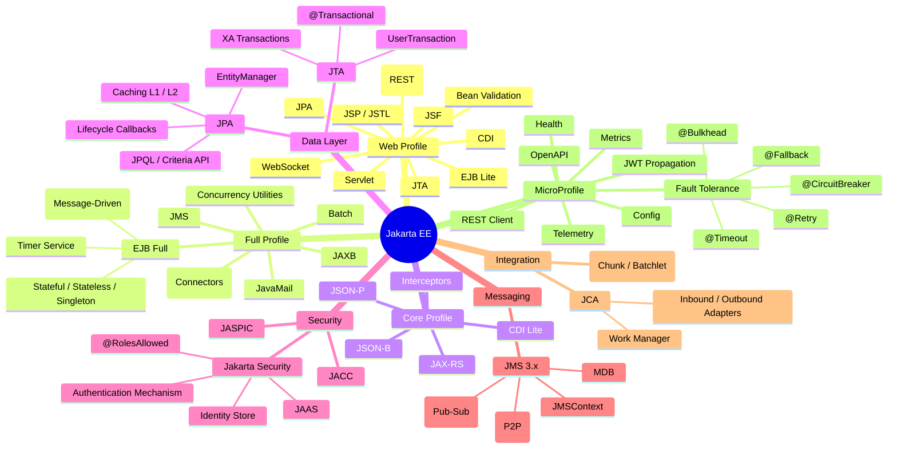

# ☕ Advanced Java EE / Jakarta EE — Principal Engineer Reference

> **Audience:** Principal engineers and senior architects working with Java EE / Jakarta EE
> **Goal:** Comprehensive coverage of enterprise Java specifications, patterns, and internals — all foundational concepts a principal engineer must know for architecture decisions, code reviews, and mentoring.

---

## 📋 Table of Contents

| # | Section |
|---|---------|
| 1 | [Jakarta EE Overview](#1-jakarta-ee-overview) |
| 2 | [CDI — Contexts & Dependency Injection](#2-cdi--contexts--dependency-injection) |
| 3 | [EJB — Enterprise JavaBeans](#3-ejb--enterprise-javabeans) |
| 4 | [JPA — Java Persistence API](#4-jpa--java-persistence-api) |
| 5 | [Jakarta REST (JAX-RS)](#5-jakarta-rest-jax-rs) |
| 6 | [Jakarta Messaging (JMS)](#6-jakarta-messaging-jms) |
| 7 | [Jakarta Servlet & Filters](#7-jakarta-servlet--filters) |
| 8 | [Jakarta Security](#8-jakarta-security) |
| 9 | [Bean Validation](#9-bean-validation) |
| 10 | [Jakarta Concurrency & Async](#10-jakarta-concurrency--async) |
| 11 | [Jakarta Transactions (JTA)](#11-jakarta-transactions-jta) |
| 12 | [JNDI & Resource Injection](#12-jndi--resource-injection) |
| 13 | [WebSocket & Server-Sent Events](#13-websocket--server-sent-events) |
| 14 | [MicroProfile](#14-microprofile) |
| 15 | [Architecture Patterns & Best Practices](#15-architecture-patterns--best-practices) |
| 16 | [Quick Reference Cheatsheet](#16-quick-reference-cheatsheet) |

---

## 1. Jakarta EE Overview

```
Java EE → Jakarta EE transition:
  Java EE 8 (2017, Oracle) → Jakarta EE 8 (2019, Eclipse Foundation)
  Jakarta EE 9 (2020) — javax.* renamed to jakarta.*
  Jakarta EE 10 (2022) — CDI 4, Core Profile for microservices
  Jakarta EE 11 (2024) — Java 21 baseline, virtual threads, structured concurrency
```

### Jakarta EE Specification Map



### Version Compatibility Matrix

| Jakarta EE | Java SE | Key new features |
|-----------|---------|-----------------|
| EE 8 | 8+ | Stable CDI 2, JAX-RS 2.1, JSON-B 1.0 |
| EE 9.1 | 11+ | javax → jakarta namespace migration |
| EE 10 | 11+ (17 recommended) | CDI Lite, Core Profile, UUID as PK |
| EE 11 | 21+ | Virtual Threads, Structured Concurrency |

---

## 2. CDI — Contexts & Dependency Injection

### CDI vs Spring IoC

```
CDI (Jakarta standard)            Spring IoC (proprietary)
  Spec-defined, portable             Spring-specific, opinionated
  SPI-driven (Extension API)         Spring @Configuration, @Bean
  @Dependent, @ApplicationScoped     @Prototype, @Singleton
  Portable extensions                BeanFactoryPostProcessor
  Interceptors via @AroundInvoke     AOP Aspects
  Decorators pattern built-in        No direct equivalent
  Events via Event<T>                ApplicationEventPublisher
  Producers via @Produces            @Bean factory methods
```

### CDI Scopes

| Scope | Annotation | Lifecycle |
|-------|-----------|-----------|
| Dependent (pseudo) | `@Dependent` | Bound to owner bean — destroyed with owner |
| Request | `@RequestScoped` | One per HTTP request |
| Session | `@SessionScoped` | One per HTTP session |
| Application | `@ApplicationScoped` | One per application (singleton) |
| Conversation | `@ConversationScoped` | Explicitly started/ended (JSF) |
| Transaction | `@TransactionScoped` | One per active JTA transaction |

```java
@ApplicationScoped
public class ConfigService {

    @Inject
    private ConfigurationRepository configRepo;

    @PostConstruct
    void init() { loadConfigurations(); }

    public String get(String key) { ... }
}

@RequestScoped
public class RequestContext {
    private String correlationId;
    // fresh instance per HTTP request
}
```

### CDI Injection Points

```java
// Constructor injection (preferred)
@ApplicationScoped
public class OrderProcessor {

    private final PaymentGateway gateway;
    private final InventoryService inventory;

    @Inject
    public OrderProcessor(PaymentGateway gateway, InventoryService inventory) {
        this.gateway   = gateway;
        this.inventory = inventory;
    }
}

// Field injection
@RequestScoped
public class OrderResource {

    @Inject
    private OrderService orderService;

    @Inject
    @Named("auditLogger")              // qualifier by name
    private Logger auditLogger;
}

// Programmatic lookup (Instance<T>)
@ApplicationScoped
public class PaymentRouter {

    @Inject
    @Any
    private Instance<PaymentProcessor> processors;

    public PaymentProcessor getProcessor(String type) {
        return processors.select(new PaymentTypeLiteral(type)).get();
    }
}
```

### CDI Qualifiers

```java
// Define qualifier
@Qualifier
@Retention(RetentionPolicy.RUNTIME)
@Target({ElementType.FIELD, ElementType.PARAMETER, ElementType.METHOD, ElementType.TYPE})
public @interface Premium {}

// Implementations
@Premium
@ApplicationScoped
public class PremiumPaymentGateway implements PaymentGateway { ... }

@ApplicationScoped                    // default
public class StandardPaymentGateway implements PaymentGateway { ... }

// Injection
@Inject @Premium
private PaymentGateway gateway;       // gets PremiumPaymentGateway
```

### CDI Producers

```java
@ApplicationScoped
public class ResourceProducers {

    @Produces
    @ApplicationScoped
    public DataSource dataSource() {
        // create and configure DataSource
        return dataSource;
    }

    @Produces
    @RequestScoped
    public EntityManager entityManager(EntityManagerFactory emf) {
        return emf.createEntityManager();
    }

    void closeEntityManager(@Disposes EntityManager em) {
        if (em.isOpen()) em.close();
    }

    @Produces
    @Named("appVersion")
    public String appVersion() {
        return System.getProperty("app.version", "1.0.0");
    }
}
```

### CDI Events

```java
// Fire events
@RequestScoped
public class AuthenticationService {

    @Inject
    private Event<UserLoggedInEvent> loginEvent;

    @Inject
    @LoggedOut
    private Event<UserLoggedInEvent> logoutEvent;

    public void login(String username) {
        // ...
        loginEvent.fire(new UserLoggedInEvent(username));
        // or async:
        loginEvent.fireAsync(new UserLoggedInEvent(username));
    }
}

// Observe events
@ApplicationScoped
public class AuditService {

    public void onLogin(@Observes UserLoggedInEvent event) {
        auditRepo.record("LOGIN", event.getUsername());
    }

    // After transaction commits (most common for DB events)
    public void onOrderCreated(
            @Observes(during = TransactionPhase.AFTER_SUCCESS)
            OrderCreatedEvent event) {
        notificationService.sendConfirmation(event.getOrderId());
    }

    // Async observer
    public CompletionStage<Void> onLoginAsync(
            @ObservesAsync UserLoggedInEvent event) {
        return analyticsService.trackAsync(event.getUsername());
    }
}
```

### CDI Interceptors

```java
// 1. Define binding annotation
@InterceptorBinding
@Retention(RetentionPolicy.RUNTIME)
@Target({ElementType.TYPE, ElementType.METHOD})
public @interface Audited {}

// 2. Implement interceptor
@Audited
@Interceptor
@Priority(Interceptor.Priority.APPLICATION + 10)
public class AuditInterceptor {

    @Inject
    private AuditService auditService;

    @AroundInvoke
    public Object audit(InvocationContext ctx) throws Exception {
        String method = ctx.getMethod().getName();
        String user   = SecurityContext.getCurrentUser();
        try {
            Object result = ctx.proceed();
            auditService.logSuccess(user, method);
            return result;
        } catch (Exception e) {
            auditService.logFailure(user, method, e);
            throw e;
        }
    }
}

// 3. Apply to bean or method
@Audited
@ApplicationScoped
public class AccountService {
    public void transferFunds(...) { ... }  // intercepted
}
```

### CDI Decorators

```java
// Different from Interceptors: Decorators know the business interface
@Decorator
@Priority(Interceptor.Priority.APPLICATION)
public class CachingOrderDecorator implements OrderRepository {

    @Inject @Delegate @Any
    private OrderRepository delegate;   // wrapped bean

    @Inject
    private Cache cache;

    @Override
    public Optional<Order> findById(Long id) {
        return cache.computeIfAbsent("order:" + id,
            () -> delegate.findById(id));
    }
}
```

### Portable Extensions (SPI)

```java
// CDI Extension — observe container lifecycle events
public class MetricsExtension implements Extension {

    private final List<AnnotatedType<?>> metricsTypes = new ArrayList<>();

    <T> void processAnnotatedType(
            @Observes ProcessAnnotatedType<T> pat) {
        if (pat.getAnnotatedType().isAnnotationPresent(Metered.class)) {
            metricsTypes.add(pat.getAnnotatedType());
        }
    }

    void afterBeanDiscovery(
            @Observes AfterBeanDiscovery abd, BeanManager bm) {
        metricsTypes.forEach(type ->
            abd.addBean(new MetricsBean<>(type, bm)));
    }
}
// Register in META-INF/services/jakarta.enterprise.inject.spi.Extension
```

---

## 3. EJB — Enterprise JavaBeans

### EJB Types

```
EJB Types:

Stateless Session Bean (SLSB)
  - No conversational state between client calls
  - Pooled — container manages pool of instances
  - Best for: services, orchestration logic
  - @Stateless

Stateful Session Bean (SFSB)
  - Maintains conversational state per client
  - Passivated/activated (serialized to disk when idle)
  - Best for: shopping cart, multi-step wizards
  - @Stateful + @Remove

Singleton Session Bean
  - One instance per JVM/application
  - Concurrent access controlled with @Lock
  - Best for: caches, startup tasks
  - @Singleton + @Startup

Message-Driven Bean (MDB)
  - Asynchronous JMS consumer
  - No client interface — activated by JMS messages
  - Best for: async processing, integration
  - @MessageDriven
```

### Stateless & Stateful EJBs

```java
// Stateless EJB
@Stateless
@TransactionAttribute(TransactionAttributeType.REQUIRED)
public class OrderService {

    @PersistenceContext
    private EntityManager em;

    @EJB
    private PaymentService paymentService;

    public Order createOrder(OrderRequest req) {
        Order order = new Order(req);
        em.persist(order);
        paymentService.charge(order);
        return order;
    }
}

// Stateful EJB (shopping cart pattern)
@Stateful
@StatefulTimeout(value = 30, unit = TimeUnit.MINUTES)
public class ShoppingCartBean implements ShoppingCart {

    private final List<CartItem> items = new ArrayList<>();

    @Override
    public void addItem(Product product, int qty) {
        items.add(new CartItem(product, qty));
    }

    @Override
    public BigDecimal getTotal() {
        return items.stream()
            .map(i -> i.getProduct().getPrice()
                       .multiply(BigDecimal.valueOf(i.getQty())))
            .reduce(BigDecimal.ZERO, BigDecimal::add);
    }

    @Remove                        // removes bean after call
    @Override
    public Order checkout() {
        return orderService.createFromCart(items);
    }
}

// Singleton EJB
@Singleton
@Startup
@ConcurrencyManagement(ConcurrencyManagementType.CONTAINER)
public class ApplicationBootstrap {

    @Lock(LockType.WRITE)
    @PostConstruct
    public void init() {
        // runs at startup, write-locked
        loadMasterData();
    }

    @Lock(LockType.READ)            // concurrent reads allowed
    public MasterData getMasterData() { return masterData; }

    @Lock(LockType.WRITE)           // exclusive write
    public void refreshMasterData() { loadMasterData(); }
}
```

### Message-Driven Beans

```java
@MessageDriven(
    activationConfig = {
        @ActivationConfigProperty(
            propertyName  = "destinationType",
            propertyValue = "jakarta.jms.Queue"),
        @ActivationConfigProperty(
            propertyName  = "destination",
            propertyValue = "java:/jms/queue/orders"),
        @ActivationConfigProperty(
            propertyName  = "acknowledgeMode",
            propertyValue = "Auto-acknowledge")
    }
)
public class OrderProcessorMDB implements MessageListener {

    @EJB
    private OrderService orderService;

    @Override
    public void onMessage(Message message) {
        try {
            TextMessage textMsg = (TextMessage) message;
            OrderEvent event = deserialize(textMsg.getText());
            orderService.process(event);
        } catch (JMSException e) {
            throw new EJBException("Failed to process message", e);
        }
    }
}
```

### EJB Timer Service

```java
@Stateless
public class ReportScheduler {

    @Resource
    private TimerService timerService;

    // Programmatic timer
    public void scheduleReport(Date when) {
        timerService.createSingleActionTimer(when,
            new TimerConfig("reportJob", true));  // persistent=true
    }

    // Automatic timer (annotation-based)
    @Schedule(dayOfWeek  = "Mon-Fri",
              hour       = "8",
              minute     = "0",
              second     = "0",
              persistent = true)
    public void generateDailyReport(Timer timer) {
        reportService.generate();
    }

    @Timeout
    public void handleTimeout(Timer timer) {
        String jobName = (String) timer.getInfo();
        // handle programmatic timers
    }
}
```

### EJB vs CDI Beans — When to Use

| Aspect | EJB | CDI Bean |
|--------|-----|---------|
| Transaction management | Built-in CMT | @Transactional (CDI 2+) |
| Thread safety | Container-managed pool | Manual / scope-based |
| Remoting | Remote/local interfaces | No remoting |
| Timer service | Built-in | Quartz / @Scheduled |
| Async | @Asynchronous | @Asynchronous |
| Pooling | Automatic | No pooling |
| JMS consumer | MDB | No equivalent |
| Passivation (SFSB) | Yes | No |
| Interceptors | Yes | Yes |
| Message listener | MDB | No |
| Lightweight | No (heavier) | Yes |

---

## 4. JPA — Java Persistence API

### EntityManager Operations

```java
@Stateless
public class OrderRepository {

    @PersistenceContext(unitName = "OrderPU")
    private EntityManager em;

    // Persist (INSERT)
    public Order save(Order order) {
        em.persist(order);
        return order;
    }

    // Find (SELECT by PK — uses L1 cache)
    public Order findById(Long id) {
        return em.find(Order.class, id);
    }

    // Merge (UPDATE for detached entities)
    public Order update(Order order) {
        return em.merge(order);
    }

    // Remove (DELETE)
    public void delete(Long id) {
        Order order = em.getReference(Order.class, id); // proxy, no SQL
        em.remove(order);
    }

    // Refresh from DB (overwrite L1 cache)
    public void refresh(Order order) {
        em.refresh(order);
    }

    // Detach from persistence context
    public void detach(Order order) {
        em.detach(order);
    }

    // Check managed state
    public boolean isManaged(Order order) {
        return em.contains(order);
    }
}
```

### Entity States

```
  NEW (Transient)
    │
    │  em.persist()
    ▼
  MANAGED (Persistent)  ◄──── em.merge()  ◄──── DETACHED
    │    │
    │    │  em.detach() / context closes / serialization
    │    └──────────────────────────────────────────────► DETACHED
    │
    │  em.remove()
    ▼
  REMOVED
    │
    │  transaction commit
    ▼
  [DB DELETE executed]
```

### Advanced Entity Mapping

```java
@Entity
@Table(name = "products")
@Inheritance(strategy = InheritanceType.JOINED)   // SINGLE_TABLE / TABLE_PER_CLASS
@DiscriminatorColumn(name = "product_type")
public abstract class Product {

    @Id
    @GeneratedValue(strategy = GenerationType.UUID)  // Jakarta EE 10+
    private UUID id;

    @Column(nullable = false, length = 200)
    private String name;

    @Column(precision = 10, scale = 2)
    private BigDecimal price;

    @ElementCollection
    @CollectionTable(name = "product_tags",
                     joinColumns = @JoinColumn(name = "product_id"))
    @Column(name = "tag")
    private Set<String> tags = new HashSet<>();

    @Lob
    @Basic(fetch = FetchType.LAZY)                   // lazy LOB
    private byte[] image;
}

@Entity
@DiscriminatorValue("PHYSICAL")
public class PhysicalProduct extends Product {
    private double weight;

    @Embedded
    private Dimensions dimensions;
}

@Embeddable
public class Dimensions {
    private double length;
    private double width;
    private double height;
}

// Entity listeners
@EntityListeners(AuditListener.class)
@Entity
public class Order { ... }

public class AuditListener {
    @PrePersist  void prePersist(Object entity) { ... }
    @PostPersist void postPersist(Object entity) { ... }
    @PreUpdate   void preUpdate(Object entity) { ... }
    @PostUpdate  void postUpdate(Object entity) { ... }
    @PreRemove   void preRemove(Object entity) { ... }
    @PostRemove  void postRemove(Object entity) { ... }
    @PostLoad    void postLoad(Object entity) { ... }
}
```

### JPQL & Criteria API

```java
// JPQL
public List<Order> findByCustomer(String customerId) {
    return em.createQuery(
        "SELECT o FROM Order o JOIN FETCH o.items " +
        "WHERE o.customer.id = :customerId " +
        "AND o.status <> :cancelled " +
        "ORDER BY o.createdAt DESC",
        Order.class)
        .setParameter("customerId", customerId)
        .setParameter("cancelled", OrderStatus.CANCELLED)
        .setMaxResults(100)
        .setHint(QueryHints.HINT_CACHEABLE, true)
        .getResultList();
}

// Criteria API (type-safe)
public List<Order> findOrdersCriteria(OrderFilter filter) {
    CriteriaBuilder cb = em.getCriteriaBuilder();
    CriteriaQuery<Order> cq = cb.createQuery(Order.class);
    Root<Order> root = cq.from(Order.class);
    root.fetch("items", JoinType.LEFT);   // JOIN FETCH

    List<Predicate> predicates = new ArrayList<>();

    if (filter.getCustomerId() != null) {
        predicates.add(cb.equal(
            root.get("customer").get("id"), filter.getCustomerId()));
    }
    if (filter.getStatus() != null) {
        predicates.add(cb.equal(root.get("status"), filter.getStatus()));
    }
    if (filter.getFromDate() != null) {
        predicates.add(cb.greaterThanOrEqualTo(
            root.get("createdAt"), filter.getFromDate()));
    }

    cq.where(predicates.toArray(new Predicate[0]))
      .orderBy(cb.desc(root.get("createdAt")));

    return em.createQuery(cq)
        .setMaxResults(filter.getLimit())
        .getResultList();
}
```

### JPA Caching

```
L1 Cache (Persistence Context):
  - Per EntityManager instance
  - Automatically used for em.find()
  - Cleared on em.clear() / em.detach()
  - Extended PC = SFSB spans multiple transactions

L2 Cache (Shared Cache):
  - Per EntityManagerFactory (shared across all EMs)
  - Provider-specific (EHCache, Infinispan, Hazelcast)
  - Configured with @Cacheable on entity
  - Works for: entities, collections, queries
  - NOT safe with direct DB updates (bypass JPA)
```

```java
// Enable L2 caching
@Entity
@Cacheable                           // enable L2 cache for this entity
@Cache(usage = CacheConcurrencyStrategy.READ_WRITE)   // Hibernate annotation
public class Product { ... }

// persistence.xml
<persistence-unit name="OrderPU">
  <properties>
    <property name="jakarta.persistence.sharedCache.mode" value="ENABLE_SELECTIVE"/>
    <!-- Hibernate -->
    <property name="hibernate.cache.use_second_level_cache" value="true"/>
    <property name="hibernate.cache.region.factory_class"
              value="org.hibernate.cache.jcache.JCacheRegionFactory"/>
  </properties>
</persistence-unit>
```

### JPA Performance Anti-Patterns

```
1. N+1 queries
   Problem: Accessing lazy collection on each entity in a list
   Fix: JOIN FETCH, @EntityGraph, or batch fetching

2. SELECT * when projection needed
   Problem: Loading all columns including LOBs
   Fix: Use DTO projections:
   SELECT new com.example.dto.OrderSummary(o.id, o.status, o.total)
   FROM Order o

3. EAGER by default on @OneToMany
   Problem: Always loading collections
   Fix: Always use LAZY on collections (default for @OneToMany is LAZY — don't change it)

4. Open Session in View (OSIV)
   Problem: Lazy loading during view rendering — hides performance issues
   Fix: Disable in REST APIs, load what you need in service layer

5. Identity / SEQUENCE generation mismatch
   Problem: Using IDENTITY (per-insert) with batch inserts
   Fix: Use SEQUENCE with allocationSize matching batch size

6. Large transactions
   Problem: Long-running transactions holding DB locks
   Fix: Short transactions, pagination, read-only @TransactionAttribute
```

---

## 5. Jakarta REST (JAX-RS)

### Resource Class Structure

```java
@Path("/api/v1/orders")
@Produces(MediaType.APPLICATION_JSON)
@Consumes(MediaType.APPLICATION_JSON)
@RequestScoped
public class OrderResource {

    @Inject
    private OrderService orderService;

    @Context
    private UriInfo uriInfo;

    @Context
    private SecurityContext securityContext;

    @GET
    @Path("/{id}")
    public Response getOrder(@PathParam("id") Long id) {
        return orderService.findById(id)
            .map(order -> Response.ok(order).build())
            .orElse(Response.status(Status.NOT_FOUND).build());
    }

    @GET
    public Response listOrders(
            @QueryParam("page")   @DefaultValue("0") int page,
            @QueryParam("size")   @DefaultValue("20") int size,
            @QueryParam("status") String status) {
        List<OrderDto> orders = orderService.findAll(page, size, status);
        return Response.ok(orders)
            .header("X-Total-Count", orderService.count(status))
            .build();
    }

    @POST
    public Response createOrder(@Valid @NotNull CreateOrderRequest req) {
        OrderDto created = orderService.create(req);
        URI location = uriInfo.getAbsolutePathBuilder()
            .path(created.id().toString())
            .build();
        return Response.created(location).entity(created).build();
    }

    @PUT
    @Path("/{id}")
    public Response updateOrder(@PathParam("id") Long id,
                                @Valid UpdateOrderRequest req) {
        OrderDto updated = orderService.update(id, req);
        return Response.ok(updated).build();
    }

    @DELETE
    @Path("/{id}")
    public Response deleteOrder(@PathParam("id") Long id) {
        orderService.delete(id);
        return Response.noContent().build();
    }

    // Sub-resource locator
    @Path("/{id}/items")
    public OrderItemResource getItemResource(@PathParam("id") Long orderId) {
        return CDI.current().select(OrderItemResource.class).get();
    }
}
```

### JAX-RS Filters & Interceptors

```java
// Request filter (e.g., authentication)
@Provider
@Priority(Priorities.AUTHENTICATION)
public class JwtAuthFilter implements ContainerRequestFilter {

    @Inject
    private JwtService jwtService;

    @Override
    public void filter(ContainerRequestContext ctx) {
        String header = ctx.getHeaderString(HttpHeaders.AUTHORIZATION);
        if (header == null || !header.startsWith("Bearer ")) {
            ctx.abortWith(Response.status(Status.UNAUTHORIZED).build());
            return;
        }
        try {
            Claims claims = jwtService.validate(header.substring(7));
            ctx.setSecurityContext(new JwtSecurityContext(claims));
        } catch (InvalidJwtException e) {
            ctx.abortWith(Response.status(Status.UNAUTHORIZED).build());
        }
    }
}

// Response filter (e.g., CORS)
@Provider
public class CorsFilter implements ContainerResponseFilter {

    @Override
    public void filter(ContainerRequestContext req,
                       ContainerResponseContext resp) {
        resp.getHeaders().add("Access-Control-Allow-Origin", "*");
        resp.getHeaders().add("Access-Control-Allow-Methods",
            "GET, POST, PUT, DELETE, OPTIONS");
        resp.getHeaders().add("Access-Control-Allow-Headers",
            "Content-Type, Authorization");
    }
}

// Entity interceptor (e.g., compression)
@Provider
@Compress                              // name binding annotation
public class GzipInterceptor implements WriterInterceptor {

    @Override
    public void aroundWriteTo(WriterInterceptorContext ctx)
            throws IOException, WebApplicationException {
        OutputStream out = ctx.getOutputStream();
        ctx.getHeaders().putSingle(HttpHeaders.CONTENT_ENCODING, "gzip");
        ctx.setOutputStream(new GZIPOutputStream(out));
        ctx.proceed();
    }
}
```

### Exception Mapping

```java
@Provider
public class GlobalExceptionMapper implements ExceptionMapper<Exception> {

    @Override
    public Response toResponse(Exception ex) {
        if (ex instanceof NotFoundException) {
            return Response.status(Status.NOT_FOUND)
                .entity(new ErrorDto("NOT_FOUND", ex.getMessage()))
                .build();
        }
        if (ex instanceof ValidationException) {
            return Response.status(Status.BAD_REQUEST)
                .entity(new ErrorDto("VALIDATION_ERROR", ex.getMessage()))
                .build();
        }
        log.error("Unhandled exception", ex);
        return Response.status(Status.INTERNAL_SERVER_ERROR)
            .entity(new ErrorDto("INTERNAL_ERROR", "Contact support"))
            .build();
    }
}
```

### Async JAX-RS

```java
// Asynchronous resource method (Servlet async)
@GET
@Path("/reports/{id}")
public void getReport(@PathParam("id") Long id,
                      @Suspended AsyncResponse asyncResponse) {
    asyncResponse.setTimeout(10, TimeUnit.SECONDS);
    asyncResponse.setTimeoutHandler(ar ->
        ar.resume(Response.status(Status.SERVICE_UNAVAILABLE).build()));

    executor.submit(() -> {
        try {
            ReportDto report = reportService.generate(id);
            asyncResponse.resume(report);
        } catch (Exception e) {
            asyncResponse.resume(e);
        }
    });
}

// Reactive (CompletionStage)
@GET
@Path("/{id}/price")
public CompletionStage<Response> getPrice(@PathParam("id") Long id) {
    return pricingService.getPrice(id)
        .thenApply(price -> Response.ok(price).build())
        .exceptionally(ex -> Response.serverError().build());
}
```

---

## 6. Jakarta Messaging (JMS)

### JMS Architecture

```
P2P (Queue):
  Producer ──► Queue ──► One Consumer
              (messages held until consumed)

Pub/Sub (Topic):
  Publisher ──► Topic ──► Subscriber 1
                     └──► Subscriber 2
                     └──► Subscriber N
  (durable subscribers survive downtime)
```

### JMS API (JMS 2.0 Simplified)

```java
@Stateless
public class NotificationService {

    @Inject
    private JMSContext context;                   // container-managed, auto-closed

    @Resource(lookup = "java:/jms/queue/notifications")
    private Queue notificationQueue;

    @Resource(lookup = "java:/jms/topic/events")
    private Topic eventTopic;

    // Send text message
    public void sendNotification(String message) {
        context.createProducer()
            .setDeliveryMode(DeliveryMode.PERSISTENT)
            .setPriority(Message.DEFAULT_PRIORITY)
            .setTimeToLive(3600_000)              // 1 hour
            .send(notificationQueue, message);
    }

    // Send object message (must be Serializable)
    public void publishEvent(OrderEvent event) {
        context.createProducer()
            .setProperty("eventType", event.getType())
            .send(eventTopic, event);
    }

    // Request-reply pattern
    public String requestReply(String request) throws JMSException {
        TemporaryQueue replyQueue = context.createTemporaryQueue();
        context.createProducer()
            .setJMSReplyTo(replyQueue)
            .setJMSCorrelationID(UUID.randomUUID().toString())
            .send(notificationQueue, request);

        try (JMSConsumer consumer = context.createConsumer(replyQueue)) {
            return consumer.receiveBody(String.class, 5000); // 5s timeout
        }
    }
}
```

### Message Selectors & Durable Subscribers

```java
// Message selector (SQL-92 subset on properties)
JMSConsumer consumer = context.createConsumer(
    topic, "region = 'US' AND priority > 5");

// Durable subscriber (survives connection downtime)
JMSConsumer durableSub = context.createDurableConsumer(
    topic, "mySubscriptionName");

// Shared durable (JMS 2.0 — load-balanced across consumers)
JMSConsumer sharedDurable = context.createSharedDurableConsumer(
    topic, "sharedSub");

// Unsubscribe
context.unsubscribe("mySubscriptionName");
```

---

## 7. Jakarta Servlet & Filters

### Servlet Lifecycle

```
  container loads class
        │
        ▼
  Servlet.init(ServletConfig)        ← one time
        │
        ▼
  [Handle Requests]:
  Servlet.service(req, resp)         ← per request
    ├── doGet()
    ├── doPost()
    ├── doPut()
    ├── doDelete()
    └── doHead()
        │
        ▼
  Servlet.destroy()                  ← one time, on undeploy
```

```java
@WebServlet(
    name       = "ApiServlet",
    urlPatterns = {"/api/*"},
    asyncSupported = true,
    initParams = {
        @WebInitParam(name = "maxConnections", value = "100")
    }
)
public class ApiServlet extends HttpServlet {

    @Override
    protected void doGet(HttpServletRequest req,
                         HttpServletResponse resp)
            throws ServletException, IOException {
        String id = req.getPathInfo().substring(1);
        resp.setContentType("application/json");
        resp.setCharacterEncoding("UTF-8");
        try (PrintWriter out = resp.getWriter()) {
            out.write(fetchJson(id));
        }
    }

    // Async processing
    @Override
    protected void doPost(HttpServletRequest req,
                          HttpServletResponse resp)
            throws ServletException, IOException {
        AsyncContext asyncCtx = req.startAsync();
        asyncCtx.setTimeout(30000);
        executor.submit(() -> {
            try {
                processRequest(asyncCtx.getRequest(), asyncCtx.getResponse());
            } finally {
                asyncCtx.complete();
            }
        });
    }
}
```

### Filter Chain

```java
@WebFilter(
    filterName   = "AuthFilter",
    urlPatterns  = {"/api/*"},
    dispatcherTypes = {DispatcherType.REQUEST, DispatcherType.ASYNC}
)
@Priority(100)
public class AuthenticationFilter implements Filter {

    @Override
    public void doFilter(ServletRequest req, ServletResponse resp,
                         FilterChain chain)
            throws IOException, ServletException {
        HttpServletRequest  httpReq  = (HttpServletRequest) req;
        HttpServletResponse httpResp = (HttpServletResponse) resp;

        String token = httpReq.getHeader("Authorization");
        if (!isValid(token)) {
            httpResp.sendError(HttpServletResponse.SC_UNAUTHORIZED);
            return;
        }
        chain.doFilter(req, resp);  // pass to next filter / servlet
    }
}
```

### Session Management

```java
// Get or create session
HttpSession session = request.getSession(true);
session.setAttribute("user", currentUser);
session.setMaxInactiveInterval(30 * 60);  // 30 minutes

// Invalidate on logout
session.invalidate();

// Session tracking modes
@WebServlet("/session-demo")
public class SessionDemoServlet extends HttpServlet {
    // Session tracking: URL rewriting, cookie (JSESSIONID), SSL
    // Configure in web.xml:
    // <tracking-mode>COOKIE</tracking-mode>
}

// Session listener
@WebListener
public class SessionTracker implements HttpSessionListener {

    private static final AtomicInteger activeSessions = new AtomicInteger(0);

    @Override
    public void sessionCreated(HttpSessionEvent se) {
        activeSessions.incrementAndGet();
    }

    @Override
    public void sessionDestroyed(HttpSessionEvent se) {
        activeSessions.decrementAndGet();
    }
}
```

---

## 8. Jakarta Security

### Security Model Overview

```
Jakarta Security 3.0 (EE 10) modernizes the API:

Authentication Mechanisms:
  - @BasicAuthenticationMechanismDefinition
  - @FormAuthenticationMechanismDefinition
  - @CustomFormAuthenticationMechanismDefinition
  - @OpenIdConnectAuthenticationMechanismDefinition (EE 10)

Identity Stores:
  - @LdapIdentityStoreDefinition
  - @DatabaseIdentityStoreDefinition
  - Custom IdentityStore implementation

Security Context API:
  - SecurityContext.getCallerPrincipal()
  - SecurityContext.isCallerInRole("ADMIN")
  - SecurityContext.hasAccessToWebResource()
  - SecurityContext.authenticate()
```

```java
// Database identity store
@DatabaseIdentityStoreDefinition(
    dataSourceLookup = "java:comp/env/jdbc/UserDS",
    callerQuery      = "SELECT password FROM users WHERE username = ?",
    groupsQuery      = "SELECT role FROM user_roles WHERE username = ?",
    hashAlgorithm    = Pbkdf2PasswordHash.class
)
@ApplicationScoped
public class ApplicationConfig {}

// Custom identity store
@ApplicationScoped
public class CustomIdentityStore implements IdentityStore {

    @Inject
    private UserRepository userRepo;

    @Override
    public CredentialValidationResult validate(Credential credential) {
        if (!(credential instanceof UsernamePasswordCredential)) {
            return NOT_VALIDATED_RESULT;
        }
        UsernamePasswordCredential upc = (UsernamePasswordCredential) credential;
        return userRepo.findByUsername(upc.getCaller())
            .filter(u -> passwordHash.verify(upc.getPasswordAsString(), u.getHash()))
            .map(u -> new CredentialValidationResult(
                u.getUsername(), new HashSet<>(u.getRoles())))
            .orElse(INVALID_RESULT);
    }
}

// Securing resources
@Path("/admin")
@RolesAllowed("ADMIN")
public class AdminResource {

    @Inject
    private SecurityContext securityContext;

    @GET
    @Path("/users")
    public Response listUsers() {
        Principal caller = securityContext.getCallerPrincipal();
        log.info("Accessed by: {}", caller.getName());
        return Response.ok(userService.findAll()).build();
    }
}
```

---

## 9. Bean Validation

### Constraint Annotations

| Annotation | Validates |
|-----------|----------|
| `@NotNull` | Not null |
| `@NotEmpty` | Not null, not empty (String, Collection, Map, Array) |
| `@NotBlank` | Not null, not empty, not whitespace-only |
| `@Size(min, max)` | Size / length range |
| `@Min(value)` / `@Max(value)` | Numeric minimum/maximum |
| `@DecimalMin` / `@DecimalMax` | BigDecimal min/max |
| `@Positive` / `@PositiveOrZero` | Positive number |
| `@Negative` / `@NegativeOrZero` | Negative number |
| `@Email` | Valid email format |
| `@Pattern(regexp)` | Regex pattern |
| `@Past` / `@PastOrPresent` | Date in past |
| `@Future` / `@FutureOrPresent` | Date in future |
| `@Digits(integer, fraction)` | Numeric digits constraint |
| `@AssertTrue` / `@AssertFalse` | Boolean value |
| `@Valid` | Cascade validation to nested object |

```java
// Custom constraint
@Constraint(validatedBy = IbanValidator.class)
@Target({ElementType.FIELD, ElementType.PARAMETER})
@Retention(RetentionPolicy.RUNTIME)
@Documented
public @interface ValidIban {
    String message() default "Invalid IBAN";
    Class<?>[] groups() default {};
    Class<? extends Payload>[] payload() default {};
}

public class IbanValidator implements ConstraintValidator<ValidIban, String> {

    @Override
    public boolean isValid(String value, ConstraintValidatorContext ctx) {
        if (value == null) return true; // @NotNull handles null
        return IbanUtil.isValid(value);
    }
}

// Cross-field constraint
@Constraint(validatedBy = DateRangeValidator.class)
@Target(ElementType.TYPE)
@Retention(RetentionPolicy.RUNTIME)
public @interface ValidDateRange {
    String message() default "End date must be after start date";
    Class<?>[] groups() default {};
    Class<? extends Payload>[] payload() default {};
}

// Validation groups (ordered validation)
public interface BasicValidation {}
public interface AdvancedValidation extends BasicValidation {}

public class OrderRequest {
    @NotBlank(groups = BasicValidation.class)
    private String customerId;

    @CreditCard(groups = AdvancedValidation.class)  // only if basic passes
    private String creditCardNumber;
}
```

---

## 10. Jakarta Concurrency & Async

### ManagedExecutorService

```java
@Stateless
public class ReportService {

    @Resource
    private ManagedExecutorService executor;

    @Resource
    private ManagedScheduledExecutorService scheduler;

    // Submit task to container-managed thread
    public Future<Report> generateAsync(ReportRequest req) {
        return executor.submit(() -> {
            // thread has proper Java EE context (security, JNDI, tx)
            return generateReport(req);
        });
    }

    // Schedule recurring task
    public ScheduledFuture<?> scheduleReport() {
        return scheduler.scheduleAtFixedRate(
            () -> reportRepository.generateSummary(),
            0, 1, TimeUnit.HOURS);
    }

    // CompletableFuture with managed executor (Jakarta EE 10)
    public CompletableFuture<Report> generateCompletable(ReportRequest req) {
        return ManagedExecutors.managedCompletableFuture(executor,
            () -> generateReport(req));
    }
}
```

### @Asynchronous on EJBs

```java
@Stateless
public class EmailService {

    // Fire-and-forget
    @Asynchronous
    public void sendWelcomeEmail(User user) {
        // runs in a new thread managed by container
        mailer.send(user.getEmail(), "Welcome!", buildBody(user));
    }

    // Async with return value
    @Asynchronous
    public Future<Boolean> sendEmailWithResult(String to, String body) {
        boolean sent = mailer.send(to, body);
        return new AsyncResult<>(sent);
    }
}

@Stateless
public class NotificationOrchestrator {

    @EJB
    private EmailService emailService;

    public void notifyAll(List<User> users) {
        List<Future<Boolean>> futures = users.stream()
            .map(u -> emailService.sendEmailWithResult(u.getEmail(), "Hello!"))
            .toList();

        futures.forEach(f -> {
            try {
                f.get(10, TimeUnit.SECONDS);
            } catch (Exception e) {
                log.warn("Email send failed", e);
            }
        });
    }
}
```

### Virtual Threads (Jakarta EE 11 / Java 21)

```java
// Jakarta EE 11 with virtual threads
@Resource(name = "java:comp/DefaultVirtualThreadExecutorService")
private ExecutorService virtualExecutor;

// Virtual thread-per-request model
// Each HTTP request can run on a virtual thread — massive concurrency
// without reactive programming complexity

// Thread pool config (server-specific, e.g., WildFly)
// <subsystem xmlns="urn:jboss:domain:ee:6.0">
//   <virtual-threads enabled="true"/>
// </subsystem>
```

---

## 11. Jakarta Transactions (JTA)

### Transaction Demarcation

```
CMT (Container-Managed Transactions) — EJBs:
  - Container starts/commits/rolls back
  - Controlled via @TransactionAttribute
  - Default: REQUIRED

BMT (Bean-Managed Transactions) — @Stateful or Servlets:
  - Developer manages UserTransaction explicitly
  - More control, more responsibility

CDI @Transactional (Jakarta EE 7+):
  - Works on CDI beans (not just EJBs)
  - Same propagation behaviors as CMT
```

```java
// CMT (EJB)
@Stateless
@TransactionAttribute(TransactionAttributeType.REQUIRED)
public class TransferService {

    @TransactionAttribute(TransactionAttributeType.REQUIRES_NEW)
    public void auditTransfer(Transfer t) {
        // always runs in NEW transaction — committed even if outer fails
        auditRepo.save(t);
    }

    @TransactionAttribute(TransactionAttributeType.MANDATORY)
    public void validateBalance(Account account) {
        // must be called within an active transaction
    }
}

// BMT (explicit UserTransaction)
@Stateful
@TransactionManagement(TransactionManagementType.BEAN)
public class BulkImportBean {

    @Resource
    private UserTransaction utx;

    public void importBatch(List<Record> records) throws Exception {
        utx.begin();
        try {
            for (int i = 0; i < records.size(); i++) {
                importRecord(records.get(i));
                if (i % 100 == 0) {
                    utx.commit();    // commit every 100 records
                    utx.begin();     // start new transaction
                }
            }
            utx.commit();
        } catch (Exception e) {
            utx.rollback();
            throw e;
        }
    }
}
```

### XA Transactions (Distributed Transactions)

```
XA (2-Phase Commit):
  Phase 1 — Prepare:
    TM asks all RMs: "Can you commit?"
    Each RM: "Yes" or "No"
  Phase 2 — Commit / Rollback:
    If all "Yes" → TM sends Commit to all
    If any  "No"  → TM sends Rollback to all

Participants: DB (JDBC XA), JMS broker, CICS, etc.

Trade-offs:
  - Atomic across resources (ACID guaranteed)
  - Slow (2 round-trips), blocking protocol
  - Heuristic failures possible (network partition)
  - Best effort: SAGA pattern is preferred in microservices
```

---

## 12. JNDI & Resource Injection

### JNDI Naming Namespaces

```
java:comp/          — Component scope  (per servlet/EJB)
java:module/        — Module scope     (per WAR/EJB-JAR)
java:app/           — Application scope (per EAR)
java:global/        — Global scope     (entire server)

Examples:
  java:comp/env/jdbc/MyDS        — DataSource
  java:comp/env/jms/MyQueue      — JMS Queue
  java:comp/DefaultManagedExecutorService
  java:comp/UserTransaction
  java:global/MyApp/OrderEJB     — Remote EJB
```

### Resource Annotations

```java
@Stateless
public class OrderService {

    // DataSource
    @Resource(lookup = "java:jboss/datasources/OrderDS")
    private DataSource dataSource;

    // JMS resources
    @Resource(lookup = "java:/ConnectionFactory")
    private ConnectionFactory connectionFactory;

    @Resource(lookup = "java:/jms/queue/orders")
    private Queue ordersQueue;

    // Managed executor
    @Resource
    private ManagedExecutorService executor;

    // UserTransaction (BMT only)
    @Resource
    private UserTransaction userTransaction;

    // Environment entries (from web.xml or ejb-jar.xml)
    @Resource(name = "maxOrderSize")
    private int maxOrderSize;

    // EJB injection
    @EJB
    private PaymentService paymentService;

    @EJB(lookup = "java:global/OrderApp/PaymentService")
    private PaymentService remotePaymentService;
}
```

---

## 13. WebSocket & Server-Sent Events

### Jakarta WebSocket

```java
@ServerEndpoint(
    value          = "/ws/orders/{userId}",
    encoders       = {OrderEncoder.class},
    decoders       = {OrderMessageDecoder.class},
    configurator   = WebSocketConfig.class
)
public class OrderWebSocketEndpoint {

    private static final Map<String, Session> sessions = new ConcurrentHashMap<>();

    @OnOpen
    public void onOpen(Session session, @PathParam("userId") String userId) {
        sessions.put(userId, session);
        session.setMaxIdleTimeout(300_000);
        session.getAsyncRemote().sendText("Connected: " + userId);
    }

    @OnMessage
    public void onMessage(OrderMessage msg, Session session,
                          @PathParam("userId") String userId) {
        // handle incoming message
        orderService.processWebSocketOrder(msg, userId);
    }

    @OnClose
    public void onClose(Session session, CloseReason reason,
                        @PathParam("userId") String userId) {
        sessions.remove(userId);
    }

    @OnError
    public void onError(Session session, Throwable error) {
        log.error("WebSocket error", error);
    }

    // Broadcast to all connected users
    public static void broadcast(String message) {
        sessions.values().forEach(s -> {
            if (s.isOpen()) {
                s.getAsyncRemote().sendText(message);
            }
        });
    }
}
```

### Server-Sent Events (JAX-RS SSE)

```java
@Path("/sse/orders")
@RequestScoped
public class OrderSseResource {

    @Inject
    private SseEventSink eventSink;

    @Inject
    private Sse sse;

    @GET
    @Produces(MediaType.SERVER_SENT_EVENTS)
    public void streamOrders(@QueryParam("userId") String userId,
                             @Context SseEventSink sink,
                             @Context Sse sse) {
        executor.submit(() -> {
            try (SseEventSink s = sink) {
                orderStream.filter(o -> o.getUserId().equals(userId))
                    .forEach(order -> s.send(
                        sse.newEventBuilder()
                           .name("order-update")
                           .id(String.valueOf(order.getId()))
                           .data(Order.class, order)
                           .reconnectDelay(3000)
                           .build()));
            }
        });
    }
}
```

---

## 14. MicroProfile

### MicroProfile Fault Tolerance

```java
@ApplicationScoped
public class ProductClient {

    @Inject
    @RestClient
    private ExternalProductApi api;

    @CircuitBreaker(
        requestVolumeThreshold = 20,
        failureRatio           = 0.5,
        delay                  = 5000,           // ms open state
        successThreshold       = 2
    )
    @Retry(
        maxRetries   = 3,
        delay        = 200,
        jitter       = 50,
        retryOn      = {IOException.class, TimeoutException.class},
        abortOn      = {UnauthorizedException.class}
    )
    @Fallback(fallbackMethod = "getProductFallback")
    @Timeout(value = 2, unit = ChronoUnit.SECONDS)
    @Bulkhead(
        value              = 10,        // concurrent calls
        waitingTaskQueue   = 50
    )
    public Product getProduct(Long id) {
        return api.findById(id);
    }

    public Product getProductFallback(Long id) {
        return new Product(id, "Unknown Product", BigDecimal.ZERO);
    }
}
```

### MicroProfile Config

```java
@ApplicationScoped
public class PaymentService {

    @Inject
    @ConfigProperty(name = "payment.gateway.url")
    private String gatewayUrl;

    @Inject
    @ConfigProperty(name = "payment.timeout", defaultValue = "5000")
    private int timeoutMs;

    @Inject
    @ConfigProperty(name = "payment.retry.enabled", defaultValue = "true")
    private boolean retryEnabled;

    // Programmatic access
    Config config = ConfigProvider.getConfig();
    String url = config.getValue("payment.gateway.url", String.class);
    Optional<String> opt = config.getOptionalValue("feature.flag", String.class);
}
```

### MicroProfile REST Client

```java
@RegisterRestClient(baseUri = "https://api.payments.com")
@RegisterProvider(AuthHeaderFactory.class)
public interface PaymentApi {

    @POST
    @Path("/charge")
    @Consumes(MediaType.APPLICATION_JSON)
    @Produces(MediaType.APPLICATION_JSON)
    CompletionStage<PaymentResponse> charge(ChargeRequest request);

    @GET
    @Path("/transactions/{id}")
    PaymentTransaction getTransaction(@PathParam("id") String id);
}

// Usage
@Inject
@RestClient
private PaymentApi paymentApi;
```

### MicroProfile Health

```java
@ApplicationScoped
@Liveness
public class DatabaseHealthCheck implements HealthCheck {

    @Inject
    private DataSource ds;

    @Override
    public HealthCheckResponse call() {
        try (Connection c = ds.getConnection()) {
            c.isValid(1);
            return HealthCheckResponse.up("database");
        } catch (Exception e) {
            return HealthCheckResponse.down("database");
        }
    }
}

@ApplicationScoped
@Readiness
public class DependencyReadinessCheck implements HealthCheck {

    @Override
    public HealthCheckResponse call() {
        return HealthCheckResponse.named("dependencies")
            .status(externalService.isAvailable())
            .withData("version", "1.2.3")
            .build();
    }
}
```

---

## 15. Architecture Patterns & Best Practices

### Layered Architecture for Jakarta EE

```
┌─────────────────────────────────────────────────┐
│              Presentation Layer                  │
│  JAX-RS Resources / Servlets / JSF Beans         │
│  DTOs, Input Validation, HTTP status codes       │
└─────────────────────────────────────────────────┘
                        │
                        ▼ (DTOs only, no entities)
┌─────────────────────────────────────────────────┐
│              Application Layer                   │
│  @Stateless / CDI @ApplicationScoped Services    │
│  Use case orchestration, transaction boundaries  │
│  Domain events, command/query separation          │
└─────────────────────────────────────────────────┘
                        │
                        ▼
┌─────────────────────────────────────────────────┐
│              Domain Layer                        │
│  JPA Entities, Value Objects, Domain Logic       │
│  Domain Services, Aggregate Roots                │
└─────────────────────────────────────────────────┘
                        │
                        ▼
┌─────────────────────────────────────────────────┐
│           Infrastructure Layer                   │
│  Repository implementations, JPA, JDBC           │
│  JMS Producers/Consumers, External APIs          │
│  @DataSource, @ConnectionFactory                 │
└─────────────────────────────────────────────────┘
```

### SAGA Pattern (Microservices + JTA alternative)

```
Choreography-based SAGA:
  OrderService  ──publishes──► OrderPlacedEvent
  PaymentService ◄─subscribes─ OrderPlacedEvent
                ──publishes──► PaymentCompletedEvent
  ShippingService ◄─subscribes─ PaymentCompletedEvent
                ──publishes──► OrderShippedEvent

  On failure: compensating events published
  PaymentFailedEvent → OrderService cancels order

Orchestration-based SAGA:
  OrderSaga (orchestrator) calls:
    1. paymentService.charge()      → success
    2. inventoryService.reserve()   → FAILURE
       → compensate: paymentService.refund()
       → publish OrderFailedEvent
```

### Outbox Pattern (Reliable Event Publishing)

```
Problem: Cannot atomically write to DB AND publish to JMS/Kafka.

Solution: Write events to same DB in same transaction:

1. Service writes Order + OrderEvent to DB (same TX)
2. Outbox poller reads unpublished events
3. Publishes to JMS/Kafka
4. Marks events as published

@Stateless
public class OrderService {
    @TransactionAttribute(REQUIRED)
    public Order createOrder(OrderRequest req) {
        Order order = orderRepo.save(new Order(req));
        outboxRepo.save(new OutboxEvent("ORDER_CREATED", order.getId(), serialize(order)));
        return order;
    }
}

@Singleton
@Startup
public class OutboxPoller {
    @Schedule(second = "*/5", minute = "*", hour = "*")
    public void pollAndPublish() {
        List<OutboxEvent> events = outboxRepo.findUnpublished();
        events.forEach(e -> {
            messagingService.publish(e);
            outboxRepo.markPublished(e.getId());
        });
    }
}
```

### Performance Tuning Checklist

```
Database:
  ☐ Use connection pooling (HikariCP, Agroal)
  ☐ Set connection pool size = (core count * 2) + effective spindle count
  ☐ Enable L2 cache for read-mostly entities
  ☐ Use read-only transactions for queries (no dirty checking)
  ☐ Use bulk operations for large datasets (@Modifying queries)
  ☐ Avoid N+1 with JOIN FETCH or @EntityGraph
  ☐ Index foreign keys and frequent filter columns
  ☐ Use pagination for large result sets

EJBs:
  ☐ Tune Stateless bean pool size per expected concurrency
  ☐ Use @Asynchronous for non-critical paths
  ☐ @Stateful bean passivation — ensure Serializable or @Exclude

JMS:
  ☐ Use persistent messages for critical messages
  ☐ Set appropriate TTL to prevent queue buildup
  ☐ MDB pool size should match consumer parallelism
  ☐ Use message selectors sparingly (full topic scan)

General:
  ☐ Profile with JFR / async-profiler before optimizing
  ☐ Use @RequestScoped beans — not @ApplicationScoped for mutable state
  ☐ Avoid synchronized in container-managed beans (use concurrent collections)
  ☐ Enable HTTP/2, response compression at server level
  ☐ Use CDI @Produces for expensive resource creation + @Disposes for cleanup
```

---

## 16. Quick Reference Cheatsheet

### Annotation Quick Reference

| Category | Annotation | Spec | Purpose |
|----------|-----------|------|---------|
| **CDI Scopes** | `@ApplicationScoped` | CDI | Singleton per app |
| | `@RequestScoped` | CDI | Per HTTP request |
| | `@SessionScoped` | CDI | Per HTTP session |
| | `@Dependent` | CDI | Lifecycle tied to owner |
| | `@TransactionScoped` | CDI | Per JTA transaction |
| **CDI DI** | `@Inject` | CDI | Injection point |
| | `@Qualifier` | CDI | Disambiguation annotation |
| | `@Produces` | CDI | Producer method/field |
| | `@Disposes` | CDI | Cleanup for producer |
| | `@Named` | CDI | String-based naming |
| | `@Any` | CDI | Match any qualifier |
| **CDI Events** | `@Observes` | CDI | Sync event observer |
| | `@ObservesAsync` | CDI | Async event observer |
| **CDI Interceptors** | `@Interceptor` | CDI/Interceptors | Mark as interceptor |
| | `@InterceptorBinding` | CDI | Define binding |
| | `@AroundInvoke` | Interceptors | Around method call |
| | `@AroundConstruct` | Interceptors | Around constructor |
| | `@Priority` | Common | Ordering |
| **EJB** | `@Stateless` | EJB | Stateless session bean |
| | `@Stateful` | EJB | Stateful session bean |
| | `@Singleton` | EJB | Singleton session bean |
| | `@MessageDriven` | EJB | JMS consumer bean |
| | `@Startup` | EJB | Eager initialization |
| | `@Remove` | EJB | Remove SFSB after call |
| | `@Asynchronous` | EJB | Fire-and-forget method |
| | `@Schedule` | EJB | Timer schedule |
| | `@Lock` | EJB | Singleton concurrency |
| | `@TransactionAttribute` | EJB | CMT propagation |
| | `@TransactionManagement` | EJB | CMT vs BMT |
| **JPA** | `@Entity` | JPA | Persistent entity |
| | `@Table` | JPA | Table mapping |
| | `@Id` | JPA | Primary key |
| | `@GeneratedValue` | JPA | PK generation |
| | `@Column` | JPA | Column mapping |
| | `@OneToMany` | JPA | 1:N relationship |
| | `@ManyToOne` | JPA | N:1 relationship |
| | `@ManyToMany` | JPA | N:N relationship |
| | `@Embedded` | JPA | Embed value object |
| | `@Cacheable` | JPA | L2 cache |
| | `@NamedQuery` | JPA | Static JPQL |
| | `@EntityListeners` | JPA | Lifecycle callbacks |
| | `@Version` | JPA | Optimistic locking |
| **JAX-RS** | `@Path` | JAX-RS | URL path |
| | `@GET` / `@POST` etc | JAX-RS | HTTP method |
| | `@Produces` / `@Consumes` | JAX-RS | Media type |
| | `@PathParam` | JAX-RS | Path variable |
| | `@QueryParam` | JAX-RS | Query parameter |
| | `@HeaderParam` | JAX-RS | Header value |
| | `@Context` | JAX-RS | Inject JAX-RS context |
| | `@Provider` | JAX-RS | Register provider |
| | `@Suspended` | JAX-RS | Async response |
| **JMS** | `@JMSConnectionFactory` | JMS | Inject connection factory |
| | `@JMSDestination` | JMS | Queue/Topic lookup |
| **Resources** | `@Resource` | Common | JNDI resource injection |
| | `@PersistenceContext` | JPA | EntityManager injection |
| | `@PersistenceUnit` | JPA | EMF injection |
| | `@EJB` | EJB | EJB injection |
| **Servlet** | `@WebServlet` | Servlet | Register servlet |
| | `@WebFilter` | Servlet | Register filter |
| | `@WebListener` | Servlet | Register listener |
| | `@MultipartConfig` | Servlet | File upload |
| **Security** | `@RolesAllowed` | Security | Method-level role check |
| | `@DenyAll` | Security | Deny all access |
| | `@PermitAll` | Security | Allow all access |
| **Validation** | `@NotNull` / `@NotBlank` | BV | Null checks |
| | `@Size` / `@Min` / `@Max` | BV | Range constraints |
| | `@Valid` | BV | Cascade validation |
| | `@Constraint` | BV | Custom constraint |
| **Lifecycle** | `@PostConstruct` | Common | After DI complete |
| | `@PreDestroy` | Common | Before destruction |

### Transaction Attribute Summary

| Attribute | Client has TX | Client has NO TX |
|-----------|--------------|-----------------|
| `REQUIRED` | Join existing | Create new |
| `REQUIRES_NEW` | Suspend, create new | Create new |
| `SUPPORTS` | Join existing | Run without TX |
| `NOT_SUPPORTED` | Suspend | Run without TX |
| `MANDATORY` | Join existing | **Throw exception** |
| `NEVER` | **Throw exception** | Run without TX |
| `NESTED` | Nested (savepoint) | Create new |

### Jakarta EE Servers

| Server | License | Profile | Notes |
|--------|---------|---------|-------|
| WildFly / JBoss EAP | OSS / Commercial | Full | Red Hat, most popular |
| GlassFish | OSS | Full | Eclipse reference impl |
| Payara | OSS / Commercial | Full | GlassFish fork |
| OpenLiberty | OSS | Full / MicroProfile | IBM |
| TomEE | OSS | Full | Apache Tomcat + EE |
| Quarkus | OSS | MicroProfile / EE | Fast startup, native |
| Helidon | OSS | MicroProfile / EE | Oracle, SE/MP editions |
| Thorntail (dead) | — | — | Replaced by Quarkus |
