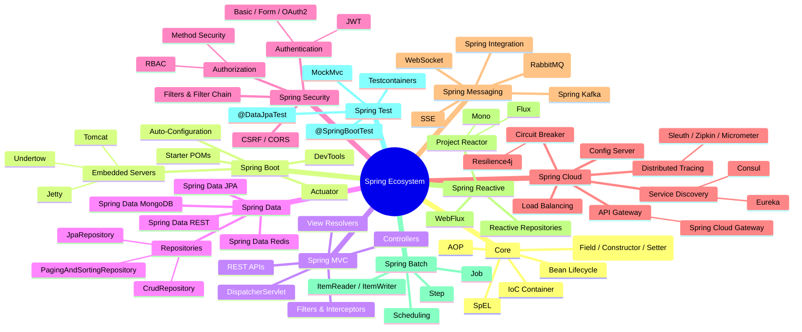
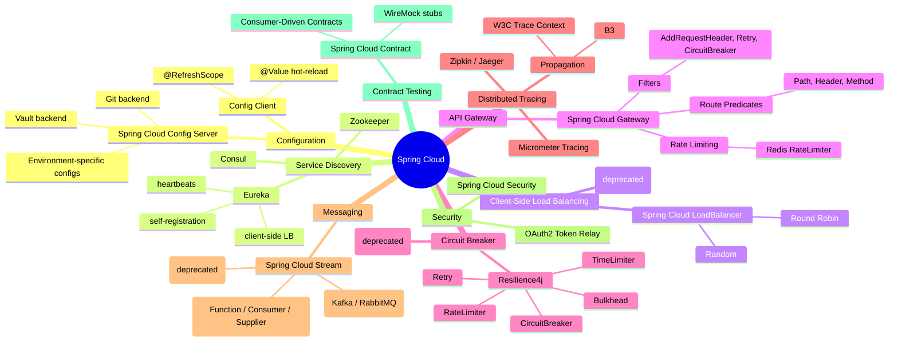

# 🍃 Spring Framework — Comprehensive Reference

> **Audience:** Java developers and architects using the Spring ecosystem
> **Goal:** Foundational to advanced Spring concepts as a quick refresher — IoC, AOP, Spring Boot, Spring MVC, Spring Data, Spring Security, Spring Cloud, and more.

---

## 📋 Table of Contents

| # | Section |
|---|---------|
| 1 | [Spring Ecosystem Overview](#1-spring-ecosystem-overview) |
| 2 | [Core Container — IoC & DI](#2-core-container--ioc--di) |
| 3 | [Bean Lifecycle & Scopes](#3-bean-lifecycle--scopes) |
| 4 | [Aspect-Oriented Programming (AOP)](#4-aspect-oriented-programming-aop) |
| 5 | [Spring Boot](#5-spring-boot) |
| 6 | [Spring MVC & REST](#6-spring-mvc--rest) |
| 7 | [Spring Data](#7-spring-data) |
| 8 | [Spring Security](#8-spring-security) |
| 9 | [Spring Transactions](#9-spring-transactions) |
| 10 | [Spring Cloud](#10-spring-cloud) |
| 11 | [Spring Messaging & Events](#11-spring-messaging--events) |
| 12 | [Testing in Spring](#12-testing-in-spring) |
| 13 | [Spring Reactive (WebFlux)](#13-spring-reactive-webflux) |
| 14 | [Configuration & Profiles](#14-configuration--profiles) |
| 15 | [Quick Reference Cheatsheet](#15-quick-reference-cheatsheet) |

---

## 1. Spring Ecosystem Overview

```
Spring is a comprehensive, modular framework for building enterprise Java applications.

Design philosophy:
  - Inversion of Control (IoC) — framework manages object lifecycles
  - POJO-based — no mandatory inheritance; plain Java classes
  - Non-invasive — minimal coupling to Spring APIs
  - Convention over configuration (especially Spring Boot)
  - Testability — DI makes unit testing natural
```

### Spring Ecosystem Mindmap



### Module Dependency Map

```
spring-context  ──► spring-core
                ──► spring-beans
                ──► spring-expression (SpEL)
                ──► spring-aop
spring-webmvc   ──► spring-context
                ──► spring-web
spring-data-jpa ──► spring-data-commons
                ──► hibernate-core
spring-security ──► spring-context
                ──► spring-web (for web security)
spring-boot     ──► spring-context
                ──► spring-boot-autoconfigure
                ──► spring-boot-actuator
```

---

## 2. Core Container — IoC & DI

### Inversion of Control

```
Traditional code:           IoC (Spring):
  MyService s = new         ApplicationContext:
    MyService(new Repo());    - creates MyService
                              - injects Repo
                              - manages lifecycle
```

### Dependency Injection Styles

```java
// 1. Constructor Injection (RECOMMENDED — immutable, testable)
@Service
public class OrderService {
    private final OrderRepository repo;
    private final EmailService email;

    // @Autowired optional when single constructor (Spring 4.3+)
    public OrderService(OrderRepository repo, EmailService email) {
        this.repo  = repo;
        this.email = email;
    }
}

// 2. Setter Injection (optional dependencies)
@Service
public class ReportService {
    private NotificationService notifier;

    @Autowired
    public void setNotifier(NotificationService notifier) {
        this.notifier = notifier;
    }
}

// 3. Field Injection (convenient but NOT recommended for prod code)
@Service
public class UserService {
    @Autowired
    private UserRepository repo;   // hard to unit-test without Spring
}
```

### ApplicationContext Hierarchy

```
BeanFactory  (basic DI, lazy)
  └── ApplicationContext  (eager, events, i18n, AOP)
        ├── ClassPathXmlApplicationContext   (XML config)
        ├── AnnotationConfigApplicationContext (Java config)
        └── WebApplicationContext
              └── DispatcherServlet context
                    └── parent: Root WebApplicationContext
```

### Bean Registration Methods

```java
// 1. @Component stereotype family
@Component       // generic
@Service         // service layer
@Repository      // data layer (adds exception translation)
@Controller      // web layer
@RestController  // @Controller + @ResponseBody

// 2. Java @Configuration class
@Configuration
public class AppConfig {

    @Bean
    public DataSource dataSource() {
        HikariDataSource ds = new HikariDataSource();
        ds.setJdbcUrl("jdbc:postgresql://localhost/mydb");
        return ds;
    }

    @Bean
    @DependsOn("dataSource")
    public JdbcTemplate jdbcTemplate(DataSource ds) {
        return new JdbcTemplate(ds);
    }
}

// 3. Conditional beans
@Bean
@ConditionalOnMissingBean(DataSource.class)
public DataSource embeddedDataSource() { ... }

@Bean
@ConditionalOnProperty(name = "feature.enabled", havingValue = "true")
public FeatureService featureService() { ... }
```

### Bean Qualifiers & Primary

```java
// Multiple implementations of same interface
@Component("postgresRepo")
public class PostgresUserRepo implements UserRepository { ... }

@Component("mongoRepo")
public class MongoUserRepo implements UserRepository { ... }

// Injection by qualifier
@Autowired
@Qualifier("postgresRepo")
private UserRepository repo;

// @Primary — default when no qualifier
@Primary
@Component
public class DefaultPaymentService implements PaymentService { ... }
```

### Spring Expression Language (SpEL)

```java
@Value("${app.maxRetries:3}")          // property placeholder with default
int maxRetries;

@Value("#{systemProperties['user.home']}")  // SpEL — system property
String homeDir;

@Value("#{T(java.lang.Math).PI}")       // SpEL — static field
double pi;

@Value("#{otherBean.price * 1.1}")      // SpEL — reference another bean
double markupPrice;
```

---

## 3. Bean Lifecycle & Scopes

### Bean Lifecycle Sequence

```
Instantiation
    │
    ▼
Populate Properties (DI)
    │
    ▼
BeanNameAware.setBeanName()
    │
    ▼
BeanFactoryAware.setBeanFactory()
    │
    ▼
ApplicationContextAware.setApplicationContext()
    │
    ▼
BeanPostProcessor.postProcessBeforeInitialization()
    │
    ▼
@PostConstruct / InitializingBean.afterPropertiesSet() / init-method
    │
    ▼
BeanPostProcessor.postProcessAfterInitialization()
    │
    ▼
[Bean Ready for Use]
    │
    ▼
@PreDestroy / DisposableBean.destroy() / destroy-method
```

```java
@Component
public class CacheManager {

    @PostConstruct
    public void init() {
        // called after DI is complete
        loadCacheFromDB();
    }

    @PreDestroy
    public void cleanup() {
        // called before context closes
        flushCache();
    }
}
```

### Bean Scopes

| Scope | Description | Typical Use |
|-------|-------------|-------------|
| `singleton` | One instance per IoC container (default) | Services, DAOs |
| `prototype` | New instance per injection/getBean() | Stateful helpers |
| `request` | One per HTTP request (web) | Request-scoped data |
| `session` | One per HTTP session (web) | Shopping cart, user prefs |
| `application` | One per ServletContext | App-wide shared state |
| `websocket` | One per WebSocket session | Real-time handlers |

```java
@Bean
@Scope("prototype")
public ReportGenerator reportGenerator() { return new ReportGenerator(); }

// Inject prototype into singleton — use Provider or ObjectFactory
@Service
public class BatchProcessor {
    private final ObjectProvider<ReportGenerator> generatorProvider;

    public BatchProcessor(ObjectProvider<ReportGenerator> p) {
        this.generatorProvider = p;
    }

    public void run() {
        ReportGenerator gen = generatorProvider.getObject(); // new each call
    }
}
```

---

## 4. Aspect-Oriented Programming (AOP)

### Core AOP Concepts

```
Concern         : Cross-cutting functionality (logging, security, transactions)
Aspect          : Module encapsulating the concern
Join Point      : Point in program execution (method call, exception thrown)
Pointcut        : Expression selecting join points
Advice          : Action taken at a join point
Weaving         : Linking aspects with application code
  - Compile-time (AspectJ)
  - Load-time    (AspectJ LTW)
  - Runtime      (Spring AOP — proxy-based)
```

### AOP Advice Types

| Advice | Annotation | When |
|--------|-----------|------|
| Before | `@Before` | Before method execution |
| After Returning | `@AfterReturning` | After normal return |
| After Throwing | `@AfterThrowing` | After exception thrown |
| After (Finally) | `@After` | After method (any outcome) |
| Around | `@Around` | Wraps method — most powerful |

```java
@Aspect
@Component
public class LoggingAspect {

    // Pointcut expression: all methods in service package
    @Pointcut("execution(* com.example.service.*.*(..))")
    public void serviceLayer() {}

    @Before("serviceLayer()")
    public void logBefore(JoinPoint jp) {
        log.info("Calling: {}", jp.getSignature().getName());
    }

    @AfterReturning(pointcut = "serviceLayer()", returning = "result")
    public void logAfterReturning(JoinPoint jp, Object result) {
        log.info("Returned: {}", result);
    }

    @AfterThrowing(pointcut = "serviceLayer()", throwing = "ex")
    public void logException(JoinPoint jp, Throwable ex) {
        log.error("Exception in {}: {}", jp.getSignature(), ex.getMessage());
    }

    @Around("serviceLayer()")
    public Object measureTime(ProceedingJoinPoint pjp) throws Throwable {
        long start = System.currentTimeMillis();
        try {
            return pjp.proceed();
        } finally {
            log.info("{} took {}ms",
                pjp.getSignature().getName(),
                System.currentTimeMillis() - start);
        }
    }
}
```

### Pointcut Expressions

```
execution(* com.example.service.*.*(..))
  │         │ └── any method, any args, in any class under service
  │         └── any return type
  └── method execution join point

within(com.example.service.*)         — all methods in package
@annotation(org.springframework.transaction.annotation.Transactional)
bean(userService)                     — specific bean
args(Long, ..)                        — method first arg is Long
@within(org.springframework.stereotype.Service)
```

### AOP Proxy Mechanisms

```
Spring AOP uses runtime proxies:

  Interface available?  ──Yes──► JDK Dynamic Proxy  (implements same interface)
         │
         No
         │
         ▼
        CGLIB Proxy  (subclass of target — works without interface)

Note: Self-invocation DOES NOT go through proxy — AOP advice is skipped!
Solution: Inject self, use AopContext.currentProxy(), or use AspectJ LTW.
```

---

## 5. Spring Boot

### Auto-Configuration Mechanism

```
@SpringBootApplication
  = @Configuration
  + @EnableAutoConfiguration
  + @ComponentScan

Auto-configuration flow:
  1. spring-boot-autoconfigure JAR on classpath
  2. META-INF/spring/org.springframework.boot.autoconfigure.AutoConfiguration.imports
     (pre-3.x: META-INF/spring.factories)
  3. Each XxxAutoConfiguration class annotated with conditions:
       @ConditionalOnClass, @ConditionalOnMissingBean, @ConditionalOnProperty
  4. If conditions met → beans registered automatically
```

### Spring Boot Starters

| Starter | What it configures |
|---------|-------------------|
| `spring-boot-starter-web` | Spring MVC + Tomcat + Jackson |
| `spring-boot-starter-data-jpa` | Hibernate + Spring Data JPA |
| `spring-boot-starter-security` | Spring Security (form login by default) |
| `spring-boot-starter-test` | JUnit 5, Mockito, MockMvc, AssertJ |
| `spring-boot-starter-actuator` | Health, metrics, info endpoints |
| `spring-boot-starter-cache` | Spring Cache abstraction |
| `spring-boot-starter-validation` | Hibernate Validator (Bean Validation) |
| `spring-boot-starter-aop` | AspectJ + Spring AOP |
| `spring-boot-starter-kafka` | Spring for Apache Kafka |
| `spring-boot-starter-amqp` | Spring AMQP (RabbitMQ) |
| `spring-boot-starter-redis` | Spring Data Redis + Lettuce |
| `spring-boot-starter-mail` | JavaMailSender |
| `spring-boot-starter-batch` | Spring Batch |

### Application Properties Hierarchy (highest wins)

```
1. Command-line arguments          --server.port=9090
2. SPRING_APPLICATION_JSON env var
3. OS environment variables        SERVER_PORT=9090
4. application-{profile}.properties / .yml
5. application.properties / .yml   (in JAR)
6. @PropertySource annotations
7. Default values
```

### Actuator Endpoints

| Endpoint | Description |
|----------|-------------|
| `/actuator/health` | App health (liveness/readiness) |
| `/actuator/info` | App info |
| `/actuator/metrics` | Micrometer metrics |
| `/actuator/env` | Environment properties |
| `/actuator/beans` | All Spring beans |
| `/actuator/mappings` | All @RequestMapping paths |
| `/actuator/loggers` | Logger levels (changeable at runtime) |
| `/actuator/threaddump` | JVM thread dump |
| `/actuator/heapdump` | JVM heap dump |
| `/actuator/httptrace` | Recent HTTP traces |
| `/actuator/flyway` | Flyway migration status |

```yaml
# application.yml — common settings
server:
  port: 8080
  servlet:
    context-path: /api

spring:
  application:
    name: order-service
  datasource:
    url: jdbc:postgresql://localhost:5432/orders
    username: ${DB_USER}
    password: ${DB_PASS}
    hikari:
      maximum-pool-size: 20
      connection-timeout: 30000
  jpa:
    hibernate:
      ddl-auto: validate
    show-sql: false
    properties:
      hibernate:
        dialect: org.hibernate.dialect.PostgreSQLDialect
        format_sql: true

management:
  endpoints:
    web:
      exposure:
        include: health,info,metrics
  endpoint:
    health:
      show-details: when-authorized
```

---

## 6. Spring MVC & REST

### DispatcherServlet Request Lifecycle

```
HTTP Request
    │
    ▼
DispatcherServlet
    │
    ├──► HandlerMapping  ──► finds controller method
    │
    ├──► HandlerAdapter  ──► invokes controller method
    │         │
    │         ▼
    │     Controller method executes
    │         │
    │         ▼
    │     returns ModelAndView / @ResponseBody / ResponseEntity
    │
    ├──► ViewResolver  (for template views like Thymeleaf)
    │
    └──► HttpMessageConverter  (for @ResponseBody — JSON, XML)
    │
    ▼
HTTP Response
```

### Controller Annotations

```java
@RestController
@RequestMapping("/api/v1/orders")
public class OrderController {

    private final OrderService service;

    public OrderController(OrderService service) {
        this.service = service;
    }

    // GET with path variable
    @GetMapping("/{id}")
    public ResponseEntity<OrderDto> getOrder(@PathVariable Long id) {
        return ResponseEntity.ok(service.findById(id));
    }

    // GET with query params
    @GetMapping
    public Page<OrderDto> listOrders(
            @RequestParam(defaultValue = "0") int page,
            @RequestParam(defaultValue = "20") int size,
            @RequestParam(required = false) String status) {
        return service.findAll(page, size, status);
    }

    // POST with request body + validation
    @PostMapping
    @ResponseStatus(HttpStatus.CREATED)
    public OrderDto createOrder(@Valid @RequestBody CreateOrderRequest req) {
        return service.create(req);
    }

    // PUT
    @PutMapping("/{id}")
    public OrderDto updateOrder(@PathVariable Long id,
                                @Valid @RequestBody UpdateOrderRequest req) {
        return service.update(id, req);
    }

    // DELETE
    @DeleteMapping("/{id}")
    @ResponseStatus(HttpStatus.NO_CONTENT)
    public void deleteOrder(@PathVariable Long id) {
        service.delete(id);
    }
}
```

### Global Exception Handling

```java
@RestControllerAdvice
public class GlobalExceptionHandler {

    @ExceptionHandler(ResourceNotFoundException.class)
    @ResponseStatus(HttpStatus.NOT_FOUND)
    public ErrorResponse handleNotFound(ResourceNotFoundException ex) {
        return new ErrorResponse("NOT_FOUND", ex.getMessage());
    }

    @ExceptionHandler(MethodArgumentNotValidException.class)
    @ResponseStatus(HttpStatus.BAD_REQUEST)
    public ErrorResponse handleValidation(MethodArgumentNotValidException ex) {
        List<String> errors = ex.getBindingResult()
            .getFieldErrors()
            .stream()
            .map(e -> e.getField() + ": " + e.getDefaultMessage())
            .toList();
        return new ErrorResponse("VALIDATION_FAILED", errors.toString());
    }

    @ExceptionHandler(Exception.class)
    @ResponseStatus(HttpStatus.INTERNAL_SERVER_ERROR)
    public ErrorResponse handleGeneral(Exception ex) {
        log.error("Unexpected error", ex);
        return new ErrorResponse("INTERNAL_ERROR", "Something went wrong");
    }
}
```

### Filters vs Interceptors vs AOP

```
Filter (javax.servlet.Filter / Jakarta EE)
  - Operates at Servlet level (before DispatcherServlet)
  - Access to raw HttpServletRequest/Response
  - Use for: authentication, CORS, compression, request logging

HandlerInterceptor (Spring MVC)
  - Operates after DispatcherServlet selects handler
  - preHandle / postHandle / afterCompletion
  - Access to HandlerMethod — knows which controller is invoked
  - Use for: authorization checks, model attributes, locale

AOP @Around
  - Operates at Spring bean method level
  - Use for: caching, logging, transactions, retry logic
```

### Bean Validation

```java
public record CreateOrderRequest(
    @NotBlank(message = "Customer ID required")
    String customerId,

    @NotEmpty
    @Valid
    List<@Valid OrderItemRequest> items,

    @FutureOrPresent
    LocalDateTime deliveryDate
) {}

public record OrderItemRequest(
    @NotBlank String productId,
    @Positive @Max(100) int quantity
) {}

// Custom validator
@Constraint(validatedBy = ValidSkuValidator.class)
@Target(ElementType.FIELD)
@Retention(RetentionPolicy.RUNTIME)
public @interface ValidSku {
    String message() default "Invalid SKU format";
    Class<?>[] groups() default {};
    Class<? extends Payload>[] payload() default {};
}
```

### Content Negotiation & HttpMessageConverters

| Converter | Content-Type |
|-----------|-------------|
| `MappingJackson2HttpMessageConverter` | `application/json` |
| `Jaxb2RootElementHttpMessageConverter` | `application/xml` |
| `StringHttpMessageConverter` | `text/plain` |
| `ByteArrayHttpMessageConverter` | `application/octet-stream` |
| `ResourceHttpMessageConverter` | Binary files |

---

## 7. Spring Data

### Repository Hierarchy

```
Repository<T, ID>  (marker)
  └── CrudRepository<T, ID>
        ├── save(S entity)
        ├── findById(ID id) → Optional<T>
        ├── findAll() → Iterable<T>
        ├── delete(T entity)
        └── count()
        │
        └── PagingAndSortingRepository<T, ID>
              ├── findAll(Pageable) → Page<T>
              └── findAll(Sort) → Iterable<T>
              │
              └── JpaRepository<T, ID>
                    ├── saveAll(Iterable)
                    ├── flush()
                    ├── saveAndFlush()
                    └── deleteAllInBatch()
```

### Query Methods — Derived Query DSL

```java
public interface UserRepository extends JpaRepository<User, Long> {

    // Derived from method name
    List<User> findByLastNameAndActive(String lastName, boolean active);
    Optional<User> findByEmail(String email);
    List<User> findByAgeGreaterThanOrderByLastNameAsc(int age);
    long countByActive(boolean active);
    boolean existsByEmail(String email);
    void deleteByEmail(String email);

    // JPQL
    @Query("SELECT u FROM User u WHERE u.email LIKE %:domain")
    List<User> findByEmailDomain(@Param("domain") String domain);

    // Native SQL
    @Query(value = "SELECT * FROM users WHERE created_at > :since",
           nativeQuery = true)
    List<User> findRecentUsers(@Param("since") LocalDateTime since);

    // Modifying query
    @Modifying
    @Transactional
    @Query("UPDATE User u SET u.active = false WHERE u.lastLogin < :cutoff")
    int deactivateInactiveUsers(@Param("cutoff") LocalDateTime cutoff);

    // Projection (only fetch needed columns)
    List<UserSummary> findByActive(boolean active);

    // Pagination + sorting
    Page<User> findByDepartment(String dept, Pageable pageable);

    // Specification (dynamic queries)
    List<User> findAll(Specification<User> spec);
}

// Projection interface
public interface UserSummary {
    String getFirstName();
    String getLastName();
    String getEmail();
}
```

### JPA Entity Best Practices

```java
@Entity
@Table(name = "orders", indexes = {
    @Index(name = "idx_orders_customer", columnList = "customer_id"),
    @Index(name = "idx_orders_status_created", columnList = "status, created_at")
})
public class Order {

    @Id
    @GeneratedValue(strategy = GenerationType.SEQUENCE,
                    generator = "order_seq")
    @SequenceGenerator(name = "order_seq", sequenceName = "order_seq",
                       allocationSize = 50)
    private Long id;

    @Column(nullable = false, length = 50)
    @Enumerated(EnumType.STRING)
    private OrderStatus status;

    @ManyToOne(fetch = FetchType.LAZY)           // LAZY is default for *ToOne
    @JoinColumn(name = "customer_id")
    private Customer customer;

    @OneToMany(mappedBy = "order",
               cascade = CascadeType.ALL,
               orphanRemoval = true,
               fetch = FetchType.LAZY)
    private List<OrderItem> items = new ArrayList<>();

    @Embedded
    private Address shippingAddress;

    @CreationTimestamp
    private LocalDateTime createdAt;

    @UpdateTimestamp
    private LocalDateTime updatedAt;

    @Version                                     // optimistic locking
    private Long version;
}
```

### N+1 Problem & Solutions

```java
// Problem: N+1 queries for orders + their items
List<Order> orders = orderRepo.findAll(); // 1 query
orders.forEach(o -> o.getItems().size()); // N queries

// Solution 1: JOIN FETCH in JPQL
@Query("SELECT DISTINCT o FROM Order o JOIN FETCH o.items WHERE o.status = :s")
List<Order> findWithItems(@Param("s") OrderStatus status);

// Solution 2: Entity Graph
@EntityGraph(attributePaths = {"items", "customer"})
List<Order> findByStatus(OrderStatus status);

// Solution 3: Batch fetching
@BatchSize(size = 20)
@OneToMany(mappedBy = "order")
private List<OrderItem> items;
```

---

## 8. Spring Security

### Security Filter Chain Flow

```
HTTP Request
    │
    ▼
Security Filter Chain (ordered filters)
    │
    ├── SecurityContextPersistenceFilter  — restore SecurityContext from session/token
    ├── UsernamePasswordAuthenticationFilter  — form login
    ├── BasicAuthenticationFilter          — HTTP Basic
    ├── BearerTokenAuthenticationFilter    — JWT/OAuth2
    ├── ExceptionTranslationFilter         — converts security exceptions to 401/403
    └── FilterSecurityInterceptor          — checks access rules
    │
    ▼
Protected Resource (Controller)
```

### Modern Security Configuration (Spring Security 6+)

```java
@Configuration
@EnableWebSecurity
@EnableMethodSecurity   // enables @PreAuthorize, @PostAuthorize
public class SecurityConfig {

    @Bean
    public SecurityFilterChain filterChain(HttpSecurity http) throws Exception {
        return http
            .csrf(AbstractHttpConfigurer::disable)           // for REST APIs
            .sessionManagement(sm -> sm
                .sessionCreationPolicy(SessionCreationPolicy.STATELESS))
            .authorizeHttpRequests(auth -> auth
                .requestMatchers("/api/public/**").permitAll()
                .requestMatchers("/api/admin/**").hasRole("ADMIN")
                .requestMatchers(HttpMethod.GET, "/api/**").hasAnyRole("USER", "ADMIN")
                .anyRequest().authenticated())
            .oauth2ResourceServer(oauth2 -> oauth2
                .jwt(jwt -> jwt.decoder(jwtDecoder())))
            .addFilterBefore(jwtAuthFilter(), BearerTokenAuthenticationFilter.class)
            .build();
    }

    @Bean
    public PasswordEncoder passwordEncoder() {
        return new BCryptPasswordEncoder(12);
    }

    @Bean
    public AuthenticationManager authManager(
            AuthenticationConfiguration config) throws Exception {
        return config.getAuthenticationManager();
    }
}
```

### JWT Authentication Implementation

```java
@Component
public class JwtAuthFilter extends OncePerRequestFilter {

    private final JwtService jwtService;
    private final UserDetailsService userDetailsService;

    @Override
    protected void doFilterInternal(HttpServletRequest request,
                                    HttpServletResponse response,
                                    FilterChain chain)
            throws ServletException, IOException {

        String authHeader = request.getHeader("Authorization");
        if (authHeader == null || !authHeader.startsWith("Bearer ")) {
            chain.doFilter(request, response);
            return;
        }

        String jwt = authHeader.substring(7);
        String username = jwtService.extractUsername(jwt);

        if (username != null &&
                SecurityContextHolder.getContext().getAuthentication() == null) {
            UserDetails user = userDetailsService.loadUserByUsername(username);
            if (jwtService.isTokenValid(jwt, user)) {
                UsernamePasswordAuthenticationToken authToken =
                    new UsernamePasswordAuthenticationToken(
                        user, null, user.getAuthorities());
                authToken.setDetails(
                    new WebAuthenticationDetailsSource().buildDetails(request));
                SecurityContextHolder.getContext().setAuthentication(authToken);
            }
        }
        chain.doFilter(request, response);
    }
}
```

### Method-Level Security

```java
@Service
public class DocumentService {

    @PreAuthorize("hasRole('ADMIN') or #userId == authentication.name")
    public Document getDocument(Long docId, String userId) { ... }

    @PostAuthorize("returnObject.owner == authentication.name")
    public Document loadDocument(Long id) { ... }

    @PreAuthorize("hasAuthority('document:write')")
    public Document saveDocument(Document doc) { ... }

    @Secured("ROLE_ADMIN")
    public void deleteDocument(Long id) { ... }
}
```

### OAuth2 / OIDC Resource Server

```yaml
spring:
  security:
    oauth2:
      resourceserver:
        jwt:
          issuer-uri: https://auth.example.com
          jwk-set-uri: https://auth.example.com/.well-known/jwks.json
```

---

## 9. Spring Transactions

### Transaction Propagation Behaviors

| Propagation | Behavior |
|-------------|----------|
| `REQUIRED` (default) | Join existing tx; create new if none |
| `REQUIRES_NEW` | Always create new tx; suspend existing |
| `SUPPORTS` | Join if exists; run non-transactionally if none |
| `NOT_SUPPORTED` | Always run non-transactionally; suspend existing |
| `MANDATORY` | Must exist; throw if none |
| `NEVER` | Must NOT exist; throw if one exists |
| `NESTED` | Nested tx (savepoint); rolls back to savepoint on failure |

### Isolation Levels

| Level | Dirty Read | Non-Repeatable Read | Phantom Read |
|-------|-----------|--------------------|----|
| `READ_UNCOMMITTED` | ✅ possible | ✅ possible | ✅ possible |
| `READ_COMMITTED` | ❌ prevented | ✅ possible | ✅ possible |
| `REPEATABLE_READ` | ❌ | ❌ prevented | ✅ possible |
| `SERIALIZABLE` | ❌ | ❌ | ❌ prevented |

```java
@Service
@Transactional(readOnly = true)  // class-level default
public class OrderService {

    @Transactional                // overrides class-level — full tx for writes
    public Order createOrder(CreateOrderRequest req) {
        // participates in transaction
        Order order = orderRepo.save(new Order(req));
        inventoryService.reserve(req.items()); // same tx
        emailService.sendConfirmation(order);  // REQUIRES_NEW — own tx
        return order;
    }

    @Transactional(
        propagation = Propagation.REQUIRES_NEW,
        isolation = Isolation.READ_COMMITTED,
        timeout = 30,                           // seconds
        rollbackFor = {PaymentException.class},
        noRollbackFor = {NotificationException.class}
    )
    public void processPayment(Long orderId) { ... }

    // readOnly = true → Hibernate flush mode MANUAL, skip dirty checking
    public List<Order> findAll(Pageable pageable) { ... }
}
```

### Transaction Gotchas

```
1. Self-invocation bypass:
   @Service class A {
     public void outer() {
       this.inner();  // AOP proxy NOT invoked — @Transactional ignored!
     }
     @Transactional
     public void inner() { ... }
   }
   Fix: inject A into itself or extract inner() to a new bean.

2. Checked exceptions don't trigger rollback by default.
   Fix: rollbackFor = Exception.class  OR throw RuntimeException

3. @Transactional on @Repository already has exception translation.
   Don't add @Transactional on repository methods unless needed.

4. Lazy loading outside transaction → LazyInitializationException.
   Fix: Open Session In View (not recommended for REST),
        use JOIN FETCH, @EntityGraph, or DTOs.
```

---

## 10. Spring Cloud

### Spring Cloud Ecosystem Mindmap



### Resilience4j Circuit Breaker

```java
@Service
public class ProductService {

    private final ProductClient productClient;

    @CircuitBreaker(name = "productService", fallbackMethod = "productFallback")
    @Retry(name = "productService")
    @TimeLimiter(name = "productService")
    public CompletableFuture<Product> getProduct(Long id) {
        return CompletableFuture.supplyAsync(() -> productClient.getById(id));
    }

    public CompletableFuture<Product> productFallback(Long id, Throwable t) {
        log.warn("Fallback for product {}: {}", id, t.getMessage());
        return CompletableFuture.completedFuture(Product.empty());
    }
}
```

```yaml
resilience4j:
  circuitbreaker:
    instances:
      productService:
        registerHealthIndicator: true
        slidingWindowSize: 10
        minimumNumberOfCalls: 5
        failureRateThreshold: 50
        waitDurationInOpenState: 10s
        permittedNumberOfCallsInHalfOpenState: 3
  retry:
    instances:
      productService:
        maxAttempts: 3
        waitDuration: 500ms
        retryExceptions:
          - java.io.IOException
          - java.util.concurrent.TimeoutException
```

### Spring Cloud Config

```yaml
# Config server application.yml
spring:
  cloud:
    config:
      server:
        git:
          uri: https://github.com/org/config-repo
          search-paths: '{application}'
          clone-on-start: true

# Config client bootstrap.yml (or application.yml in Spring Boot 2.4+)
spring:
  application:
    name: order-service
  config:
    import: optional:configserver:http://localhost:8888
  cloud:
    config:
      fail-fast: true
      retry:
        max-attempts: 6
```

---

## 11. Spring Messaging & Events

### Application Events

```java
// Define event
public record OrderPlacedEvent(Long orderId, String customerId) {}

// Publish event
@Service
public class OrderService {
    private final ApplicationEventPublisher publisher;

    public Order createOrder(CreateOrderRequest req) {
        Order order = orderRepo.save(...);
        publisher.publishEvent(new OrderPlacedEvent(order.getId(), req.customerId()));
        return order;
    }
}

// Listen to event
@Component
public class NotificationListener {

    @EventListener
    public void onOrderPlaced(OrderPlacedEvent event) {
        emailService.sendConfirmation(event.customerId(), event.orderId());
    }

    @TransactionalEventListener(phase = TransactionPhase.AFTER_COMMIT)
    public void onOrderPlacedAfterCommit(OrderPlacedEvent event) {
        // Runs AFTER transaction commits — safe to send external notifications
        smsService.send(event.customerId(), "Order confirmed: " + event.orderId());
    }

    @EventListener
    @Async
    public void asyncHandler(OrderPlacedEvent event) {
        // runs in a separate thread
        analyticsService.track(event);
    }
}
```

### Spring Kafka

```java
// Producer
@Service
public class OrderEventProducer {

    private final KafkaTemplate<String, OrderEvent> kafkaTemplate;

    public void publish(OrderEvent event) {
        kafkaTemplate.send("orders", event.orderId().toString(), event)
            .whenComplete((result, ex) -> {
                if (ex != null) {
                    log.error("Send failed", ex);
                } else {
                    log.info("Sent to partition {}, offset {}",
                        result.getRecordMetadata().partition(),
                        result.getRecordMetadata().offset());
                }
            });
    }
}

// Consumer
@Component
public class OrderEventConsumer {

    @KafkaListener(topics = "orders",
                   groupId = "order-processor",
                   containerFactory = "kafkaListenerContainerFactory")
    public void consume(ConsumerRecord<String, OrderEvent> record,
                        Acknowledgment ack) {
        try {
            processOrder(record.value());
            ack.acknowledge();
        } catch (RetryableException e) {
            // do not ack — will be retried
        } catch (NonRetryableException e) {
            ack.acknowledge(); // ack + send to dead-letter topic
            deadLetterPublisher.send(record);
        }
    }
}
```

---

## 12. Testing in Spring

### Test Slice Annotations

| Annotation | What it loads | Use for |
|-----------|--------------|---------|
| `@SpringBootTest` | Full application context | Integration tests |
| `@WebMvcTest` | MVC layer only (no DB) | Controller unit tests |
| `@DataJpaTest` | JPA + embedded DB | Repository tests |
| `@DataMongoTest` | MongoDB slice | Mongo repository tests |
| `@JsonTest` | Jackson serialization | DTO serialization tests |
| `@RestClientTest` | RestTemplate/WebClient | HTTP client tests |
| `@MockBean` | Replace bean with Mockito mock | Any slice test |

```java
// Controller test with @WebMvcTest
@WebMvcTest(OrderController.class)
class OrderControllerTest {

    @Autowired
    MockMvc mockMvc;

    @MockBean
    OrderService orderService;

    @Autowired
    ObjectMapper objectMapper;

    @Test
    void getOrder_shouldReturn200() throws Exception {
        given(orderService.findById(1L))
            .willReturn(new OrderDto(1L, "PENDING"));

        mockMvc.perform(get("/api/v1/orders/1")
                .accept(MediaType.APPLICATION_JSON))
            .andExpect(status().isOk())
            .andExpect(jsonPath("$.id").value(1))
            .andExpect(jsonPath("$.status").value("PENDING"));
    }

    @Test
    void createOrder_withInvalidBody_shouldReturn400() throws Exception {
        var req = new CreateOrderRequest(null, List.of(), null);

        mockMvc.perform(post("/api/v1/orders")
                .contentType(MediaType.APPLICATION_JSON)
                .content(objectMapper.writeValueAsString(req)))
            .andExpect(status().isBadRequest());
    }
}

// Repository test with @DataJpaTest
@DataJpaTest
class UserRepositoryTest {

    @Autowired
    UserRepository repo;

    @Test
    void findByEmail_shouldReturnUser() {
        repo.save(new User("Alice", "alice@example.com"));
        Optional<User> found = repo.findByEmail("alice@example.com");
        assertThat(found).isPresent();
        assertThat(found.get().getName()).isEqualTo("Alice");
    }
}

// Integration test
@SpringBootTest(webEnvironment = SpringBootTest.WebEnvironment.RANDOM_PORT)
@Testcontainers
class OrderIntegrationTest {

    @Container
    static PostgreSQLContainer<?> postgres =
        new PostgreSQLContainer<>("postgres:15")
            .withDatabaseName("testdb");

    @DynamicPropertySource
    static void configureProperties(DynamicPropertyRegistry registry) {
        registry.add("spring.datasource.url", postgres::getJdbcUrl);
    }

    @Autowired
    TestRestTemplate restTemplate;

    @Test
    void createAndRetrieveOrder() {
        var created = restTemplate.postForObject(
            "/api/v1/orders", new CreateOrderRequest(...), OrderDto.class);
        assertThat(created.getId()).isNotNull();

        var retrieved = restTemplate.getForObject(
            "/api/v1/orders/" + created.getId(), OrderDto.class);
        assertThat(retrieved.getStatus()).isEqualTo("PENDING");
    }
}
```

---

## 13. Spring Reactive (WebFlux)

### Reactive vs Imperative

```
Imperative (Spring MVC):          Reactive (Spring WebFlux):
  Thread-per-request model          Event-loop model (Netty)
  Thread blocks waiting for I/O     Thread never blocks — callbacks
  Good for CPU-bound work            Good for I/O-bound, high concurrency
  Easier to debug (stack traces)     Harder to debug (async)
  Familiar programming model         Reactive streams (Project Reactor)
```

### Mono & Flux

```java
// Mono — 0 or 1 element
Mono<User> userMono = userRepository.findById(id);        // reactive repo
Mono<User> created  = Mono.just(new User("Alice"));
Mono<Void> empty    = Mono.empty();
Mono<User> errored  = Mono.error(new UserNotFoundException(id));

// Flux — 0 to N elements
Flux<User> allUsers = userRepository.findAll();
Flux<Integer> nums  = Flux.range(1, 10);
Flux<String> words  = Flux.just("hello", "world");

// Transformation
Flux<UserDto> dtos = allUsers
    .filter(u -> u.isActive())
    .map(UserMapper::toDto)
    .take(50);

// Merge streams
Flux<Event> merged = Flux.merge(
    kafkaSource.receive().map(r -> new KafkaEvent(r)),
    httpPoller.poll().map(r -> new PollEvent(r))
);

// Error handling
userMono
    .onErrorReturn(UserNotFoundException.class, User.guest())
    .onErrorResume(ex -> fallbackService.getUser(id));

// flatMap (non-blocking I/O within stream)
Flux<OrderDto> orderDtos = userFlux
    .flatMap(user -> orderRepository.findByUserId(user.getId()))
    .map(OrderMapper::toDto);
```

### Reactive REST Controller

```java
@RestController
@RequestMapping("/api/v1/users")
public class UserController {

    private final UserRepository repo;

    @GetMapping("/{id}")
    public Mono<UserDto> getUser(@PathVariable Long id) {
        return repo.findById(id)
            .map(UserMapper::toDto)
            .switchIfEmpty(Mono.error(new UserNotFoundException(id)));
    }

    @GetMapping(produces = MediaType.TEXT_EVENT_STREAM_VALUE)
    public Flux<UserDto> streamUsers() {
        return repo.findAll()
            .map(UserMapper::toDto)
            .delayElements(Duration.ofMillis(100)); // SSE demo
    }

    @PostMapping
    @ResponseStatus(HttpStatus.CREATED)
    public Mono<UserDto> createUser(@Valid @RequestBody Mono<CreateUserRequest> req) {
        return req
            .map(UserMapper::fromRequest)
            .flatMap(repo::save)
            .map(UserMapper::toDto);
    }
}
```

---

## 14. Configuration & Profiles

### @ConfigurationProperties (type-safe config)

```java
@ConfigurationProperties(prefix = "app.payment")
@Validated
public record PaymentProperties(
    @NotBlank String provider,
    @NotBlank String apiKey,
    @Positive int maxRetries,
    Duration timeout,
    Map<String, String> webhookUrls
) {}

// Register
@SpringBootApplication
@EnableConfigurationProperties(PaymentProperties.class)
public class Application { ... }

// Use
@Service
public class PaymentService {
    private final PaymentProperties props;

    public PaymentService(PaymentProperties props) {
        this.props = props;
    }
}
```

```yaml
# application.yml
app:
  payment:
    provider: stripe
    api-key: ${STRIPE_API_KEY}
    max-retries: 3
    timeout: 5s
    webhook-urls:
      success: https://api.example.com/webhooks/payment/success
      failure: https://api.example.com/webhooks/payment/failure
```

### Profiles

```java
// Bean active only in prod
@Profile("prod")
@Bean
public DataSource prodDataSource() { ... }

// Multiple profiles
@Profile({"dev", "test"})
@Bean
public DataSource h2DataSource() { ... }

// Negation
@Profile("!prod")
@Component
public class MockEmailService implements EmailService { ... }
```

```bash
# Activate profiles
java -jar app.jar --spring.profiles.active=prod,metrics
export SPRING_PROFILES_ACTIVE=prod
```

```yaml
# application-prod.yml — activated when prod profile is active
spring:
  datasource:
    url: jdbc:postgresql://prod-db:5432/orders
logging:
  level:
    root: WARN
```

---

## 15. Quick Reference Cheatsheet

### Annotation Summary

| Category | Annotation | Purpose |
|----------|-----------|---------|
| **Stereotype** | `@Component` | Generic Spring bean |
| | `@Service` | Service layer |
| | `@Repository` | Data access layer |
| | `@Controller` | MVC controller |
| | `@RestController` | REST API controller |
| **DI** | `@Autowired` | Dependency injection |
| | `@Qualifier("name")` | Select specific bean |
| | `@Primary` | Default when ambiguous |
| | `@Value("${prop}")` | Inject property |
| **Config** | `@Configuration` | Java config class |
| | `@Bean` | Factory method |
| | `@ComponentScan` | Enable component scanning |
| | `@EnableAutoConfiguration` | Boot auto-config |
| | `@ConditionalOnXxx` | Conditional beans |
| **Web** | `@RequestMapping` | URL mapping |
| | `@GetMapping` etc | HTTP method mapping |
| | `@PathVariable` | URL path segment |
| | `@RequestParam` | Query parameter |
| | `@RequestBody` | Deserialize JSON body |
| | `@ResponseBody` | Serialize response |
| | `@ResponseStatus` | Set HTTP status |
| | `@Valid` | Trigger Bean Validation |
| | `@ExceptionHandler` | Handle exception |
| | `@RestControllerAdvice` | Global exception handler |
| **Data** | `@Entity` | JPA entity |
| | `@Table` | Map to table |
| | `@Id` | Primary key |
| | `@GeneratedValue` | PK generation strategy |
| | `@Column` | Column mapping |
| | `@OneToMany` etc | Relationships |
| | `@Transactional` | Transaction boundary |
| | `@Query` | Custom JPQL/SQL |
| **Security** | `@EnableWebSecurity` | Enable security |
| | `@PreAuthorize` | Method pre-auth |
| | `@PostAuthorize` | Method post-auth |
| | `@Secured` | Role-based security |
| **Testing** | `@SpringBootTest` | Full context test |
| | `@WebMvcTest` | MVC slice test |
| | `@DataJpaTest` | JPA slice test |
| | `@MockBean` | Mock a Spring bean |
| | `@TestConfiguration` | Test-only config |
| **AOP** | `@Aspect` | Declare aspect |
| | `@Before` / `@After` | Advice types |
| | `@Around` | Around advice |
| | `@Pointcut` | Reusable pointcut |
| **Lifecycle** | `@PostConstruct` | After DI complete |
| | `@PreDestroy` | Before bean destroyed |
| **Async** | `@Async` | Run in thread pool |
| | `@EnableAsync` | Enable async support |
| **Scheduling** | `@Scheduled` | Cron/fixed-rate tasks |
| | `@EnableScheduling` | Enable scheduling |
| **Cache** | `@Cacheable` | Cache method result |
| | `@CacheEvict` | Evict from cache |
| | `@EnableCaching` | Enable cache support |

### Common Spring Boot Properties

```properties
# Server
server.port=8080
server.servlet.context-path=/api
server.compression.enabled=true

# Logging
logging.level.root=INFO
logging.level.com.example=DEBUG
logging.file.name=logs/app.log
logging.pattern.console=%d{HH:mm:ss} %-5level %logger{36} - %msg%n

# JPA
spring.jpa.hibernate.ddl-auto=validate
spring.jpa.show-sql=false
spring.jpa.open-in-view=false           # disable OSIV for REST

# HikariCP
spring.datasource.hikari.maximum-pool-size=20
spring.datasource.hikari.minimum-idle=5
spring.datasource.hikari.connection-timeout=30000

# Cache
spring.cache.type=redis
spring.data.redis.host=localhost
spring.data.redis.port=6379

# Async
spring.task.execution.pool.core-size=8
spring.task.execution.pool.max-size=32
spring.task.execution.pool.queue-capacity=100

# Actuator
management.endpoints.web.exposure.include=health,info,metrics
management.endpoint.health.show-details=when-authorized
```

### Spring Boot App Structure (Recommended)

```
src/
├── main/
│   ├── java/com/example/app/
│   │   ├── Application.java               # @SpringBootApplication
│   │   ├── config/
│   │   │   ├── SecurityConfig.java
│   │   │   ├── CacheConfig.java
│   │   │   └── AsyncConfig.java
│   │   ├── domain/                        # Entities / Aggregates
│   │   │   ├── Order.java
│   │   │   └── OrderItem.java
│   │   ├── repository/                    # Spring Data Repos
│   │   │   └── OrderRepository.java
│   │   ├── service/                       # Business logic
│   │   │   └── OrderService.java
│   │   ├── web/                           # Controllers + DTOs
│   │   │   ├── OrderController.java
│   │   │   └── dto/
│   │   ├── event/                         # Events + Listeners
│   │   └── exception/                     # Custom exceptions
│   └── resources/
│       ├── application.yml
│       ├── application-dev.yml
│       ├── application-prod.yml
│       └── db/migration/                  # Flyway scripts
└── test/
    └── java/com/example/app/
        ├── service/
        ├── web/
        └── repository/
```
